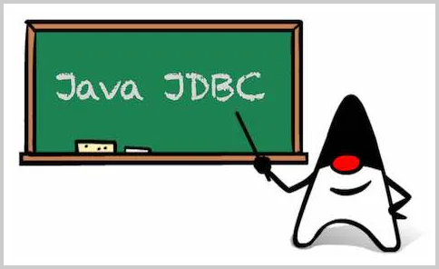

# JDBC编程

程序运行的时候，往往需要存取数据。现代应用程序最基本，也是使**用最广泛的数据存储就是关系数据库。**

Java为关系数据库定义了一套标准的访问接口：**JDBC（Java Database Connectivity）**，本章我们介绍如何在Java程序中使用JDBC。

[JDBC简介](./JDBC简介/index.md "JDBC简介")

[JDBC查询](./JDBC查询/index.md "JDBC查询")

[JDBC更新](./JDBC更新/index.md "JDBC更新")

[JDBC事务](./JDBC事务/index.md "JDBC事务")

[JDBC批处理](./JDBC批处理/index.md "JDBC批处理")

[JDBC连接池](./JDBC连接池/index.md "JDBC连接池")
