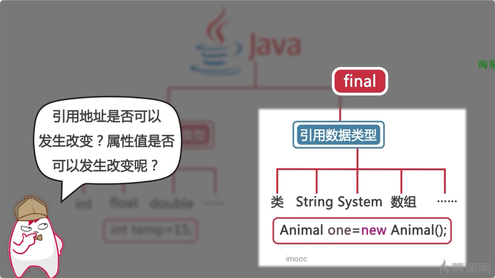
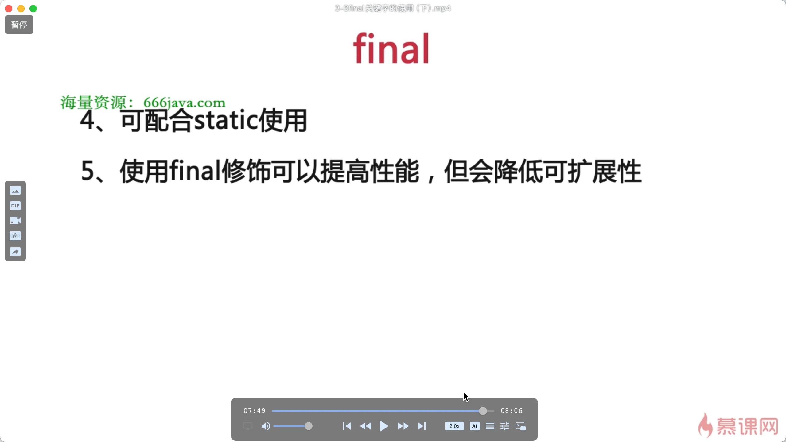

# final

> **类：没有子类；不允许继承**
> 成员方法：**不允许重写；**可以继承使用
> 局部变量：一旦赋值；不允许修改；（基础类型）
> 局部变量：**一旦赋值；引用地址不允许在修改；**
> 成员属性：只允许在**构造方法**或者**构造代码块**里赋值；或者在定义的时候初始化；
> **不允许修饰构造方法**

**不允许往下派生；**

[是什么](./是什么/index.md "是什么")

[解决什么问题](./解决什么问题/index.md "解决什么问题")

[注意细节](./注意细节/index.md "注意细节")

[工具类](./工具类/index.md "工具类")
