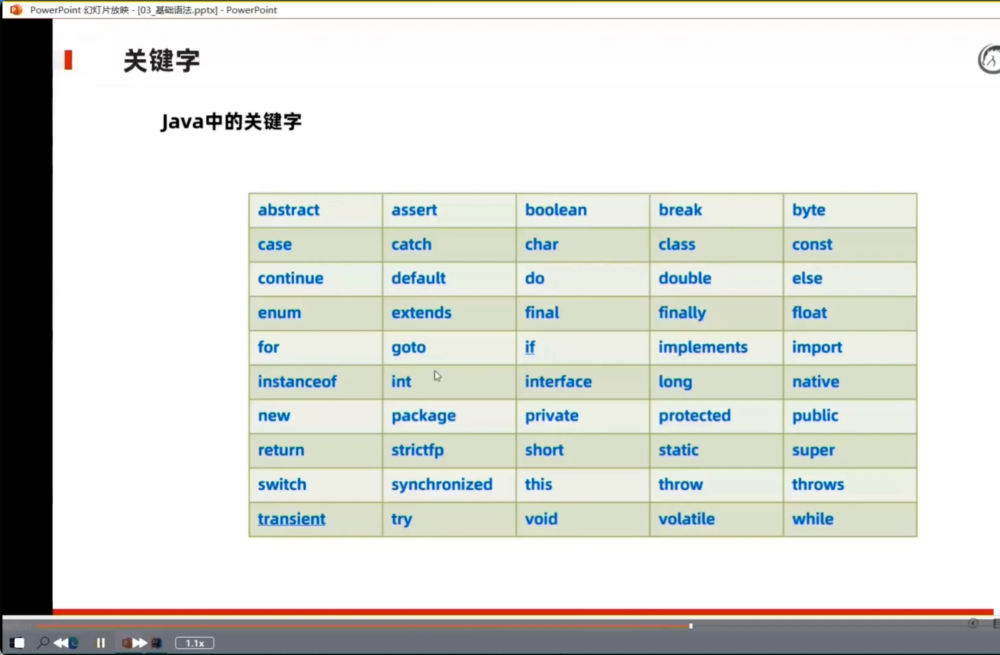

# 关键字&#x20;

[final](./final/index.md "final")

[static](./static/index.md "static")

[instanceof](./instanceof/index.md "instanceof")

[abstract](./abstract/index.md "abstract")

[修饰符权限](./修饰符权限/index.md "修饰符权限")

[接口interface](./接口interface/index.md "接口interface")

[代码块](./代码块/index.md "代码块")
