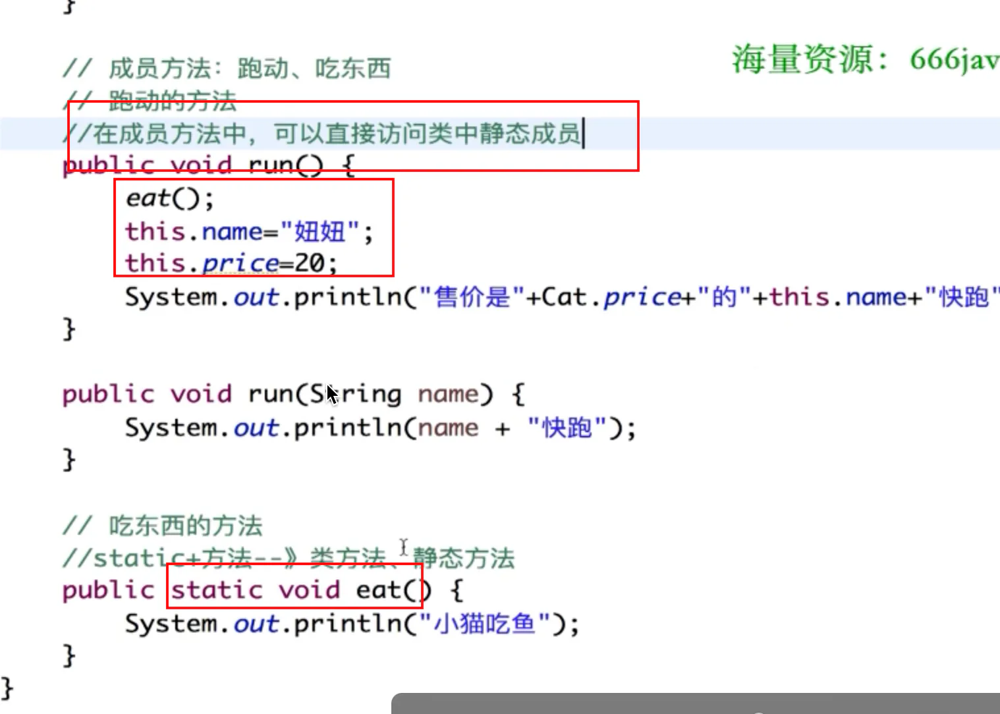
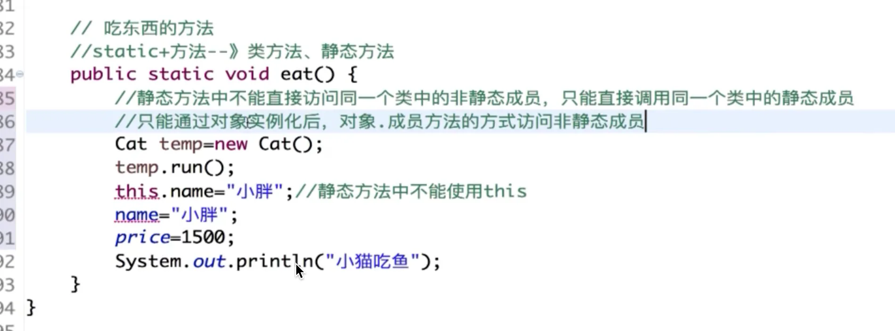

# 赋值和this

## 目录

- [特殊性](#特殊性)
- [静态方法](#静态方法)

#### 特殊性

> 静态代码块中**只能给静态成员赋值**
> 构造代码块中；**给静态成员和  普通成员赋值**

> 代码块有独立的作用域；**里面的局部变量会在代码块结束时销毁；**

#### 静态方法

- **静态方法当中不能访问非静态方法**，只能调用**静态成员方法**；不能用this
- 非静态的方法可以**访问静态的方法和属性**；

