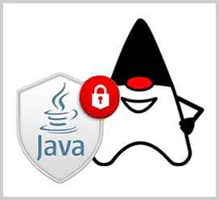

# 加密与安全

在计算机系统中，什么是加密与安全呢？

我们举个栗子：假设Bob要给Alice发一封邮件，在邮件传送的过程中，黑客可能会窃取到邮件的内容，所以需要防窃听。黑客还可能会篡改邮件的内容，Alice必须有能力识别出邮件有没有被篡改。最后，黑客可能假冒Bob给Alice发邮件，Alice必须有能力识别出伪造的邮件。

所以，应对潜在的安全威胁，需要做到三防：

- **防窃听**
- **防篡改**
- **防伪造**

计算机加密技术就是为了实现上述目标，而**现代计算机密码学理论是建立在严格的数学理论基础上的，密码学已经逐渐发展成一门科学。** 对于绝大多数开发者来说，设计一个安全的加密算法非常困难，验证一个加密算法是否安全更加困难，当前被认为安全的加密算法仅仅是迄今为止尚未被攻破。因此，要编写安全的计算机程序，我们要做到：

- **不要自己设计山寨的加密算法；**
- **不要自己实现已有的加密算法；**
- **不要自己修改已有的加密算法。**

本章我们会介绍最常用的加密算法，以及如何通过Java代码实现。

[编码算法](./编码算法/index.md "编码算法")

[哈希算法](./哈希算法/index.md "哈希算法")

[BouncyCastle](./BouncyCastle/index.md "BouncyCastle")

[Hmac算法](./Hmac算法/index.md "Hmac算法")

[对称加密算法](./对称加密算法/index.md "对称加密算法")

[口令加密算法](./口令加密算法/index.md "口令加密算法")

[密钥交换算法](./密钥交换算法/index.md "密钥交换算法")

[非对称加密算法](./非对称加密算法/index.md "非对称加密算法")

[签名算法](./签名算法/index.md "签名算法")

[数字证书](./数字证书/index.md "数字证书")

[新页面](./新页面/index.md "新页面")
