# 使用Stack

## 目录

- [Stack的作用](#Stack的作用)
- [计算中缀表达式](#计算中缀表达式)
- [小结](#小结)

栈（`Stack`）是一种后进先出（`LIFO：Last In First Out`）的数据结构。

什么是`LIFO`呢？我们先回顾一下`Queue`的特点`FIFO`：

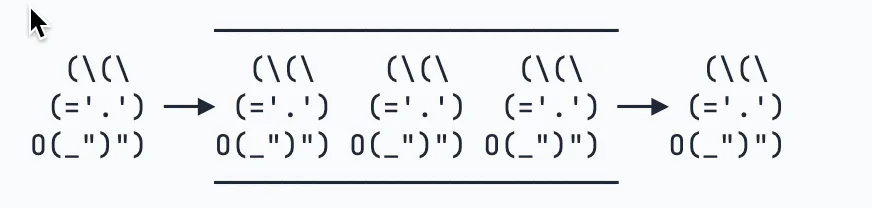

所谓`FIFO`，是最先进队列的元素一定最早出队列，而`LIFO`是最后进`Stack`的元素一定最早出`Stack`。如何做到这一点呢？只需要把队列的一端封死：

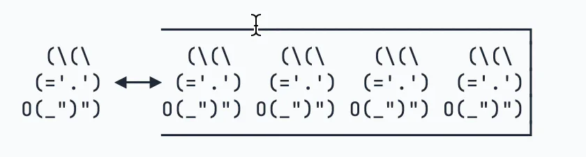

因此，`Stack`是这样一种数据结构：只能不断地往`Stack`中压入（push）元素，**最后进去的必须最早弹出（pop）来**：


`Stack`只有入栈和出栈的操作：

- 把元素压栈：`push(E)`；
- 把栈顶的元素“弹出”：`pop()`；
- 取栈顶元素但不弹出：`peek()`。

在Java中，我们用`Deque`可以实现`Stack`的功能：

- 把元素压栈：`push(E)`/`addFirst(E)`；
- 把栈顶的元素“弹出”：`pop()`/`removeFirst()`；
- 取栈顶元素但不弹出：`peek()`/`peekFirst()`。

为什么Java的集合类没有单独的`Stack`接口呢？因为有个遗留类名字就叫`Stack`，出于兼容性考虑，所以没办法创建`Stack`接口，只能用`Deque`接口来“模拟”一个`Stack`了。

当我们把`Deque`作为`Stack`使用时，注意只调用`push()`/`pop()`/`peek()`方法，不要调用`addFirst()`/`removeFirst()`/`peekFirst()`方法，这样代码更加清晰。

### Stack的作用

Stack在计算机中使用非常广泛，**JVM在处理Java方法调用的**时候就会通过**栈这种数据结构维护方法调用的层次**。例如：

```java 
static void main(String[] args) {
    foo(123);
}

static String foo(x) {
    return "F-" + bar(x + 1);
}

static int bar(int x) {
    return x << 2;
}

```


`JVM`会**创建方法调用栈**，每**调用一个方法时，先将参数压栈，然后执行对应的方法；当方法返回时，返回值压栈**，调用方法通过出栈操作获得方法返回值。

**因为方法调用栈有容量限制，嵌套调用过多会造成栈溢出**，即引发`StackOverflowError`：

```java 
// 测试无限递归调用
public class Main {
    public static void main(String[] args) {
        increase(1);
    }

    static int increase(int x) {
        return increase(x) + 1;
    }
}

```


我们再来看一个`Stack`的用途：对**整数进行进制的转换**就可以利用栈。

例如，我们要把一个`int`整数`12500`转换为十六进制表示的字符串，如何实现这个功能？

首先我们准备一个空栈：

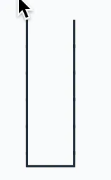

然后计算12500÷16=781…4，余数是`4`，把余数`4`压栈：

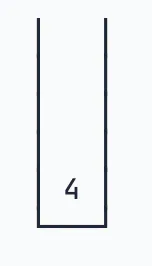

然后计算781÷16=48…13，余数是`13`，`13`的十六进制用字母`D`表示，把余数`D`压栈：

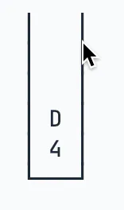

然后计算48÷16=3…0，余数是`0`，把余数`0`压栈：

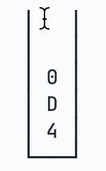

最后计算3÷16=0…3，余数是`3`，把余数`3`压栈：

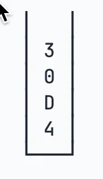

当商是`0`的时候，计算结束，我们把栈的所有元素依次弹出，组成字符串`30D4`，这就是十进制整数`12500`的十六进制表示的字符串。

### 计算中缀表达式

在编写程序的时候，我们使用的**带括号的数学表达式实际上是中缀表达式**，即运算符在中间，例如：`1 + 2 * (9 - 5)`。

但是**计算机执行表达式的时候，它并不能直接计算中缀表达式，而是通过编译器把中缀表达式转换为后缀表达式**，例如：`1 2 9 5 - * +`。

这个编译过程就会用到栈。我们先跳过编译这一步（涉及运算优先级，代码比较复杂），看看如何通过栈计算后缀表达式。

计算后缀表达式不考虑优先级，直接从左到右依次计算，因此计算起来简单。首先准备一个空的栈：

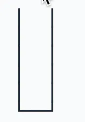

然后我们依次扫描后缀表达式`1 2 9 5 - * +`，遇到数字`1`，就直接扔到栈里：

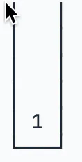

紧接着，遇到数字`2`，`9`，`5`，也扔到栈里：

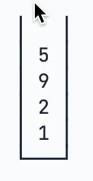

接下来遇到减号时，弹出栈顶的两个元素，并计算`9-5=4`，把结果`4`压栈：

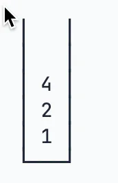

接下来遇到`*`号时，弹出栈顶的两个元素，并计算`2*4=8`，把结果`8`压栈：

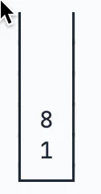

接下来遇到`+`号时，弹出栈顶的两个元素，并计算`1+8=9`，把结果`9`压栈：

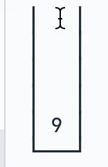

扫描结束后，没有更多的计算了，弹出栈的唯一一个元素，得到计算结果`9`。

### 小结

栈（Stack）是一种后进先出（LIFO）的数据结构，操作栈的元素的方法有：

- 把元素压栈：`push(E)`；
- 把栈顶的元素“弹出”：`pop(E)`；
- 取栈顶元素但不弹出：`peek(E)`。

在Java中，我们用`Deque`可以实现`Stack`的功能，注意只调用`push()`/`pop()`/`peek()`方法，避免调用`Deque`的其他方法；

不要使用遗留类`Stack`。
