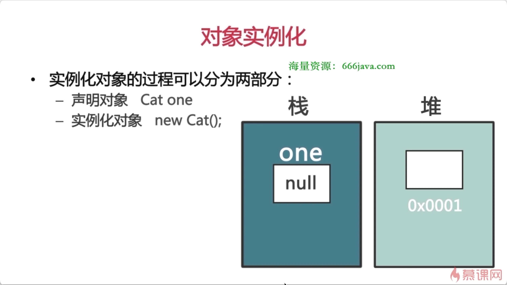
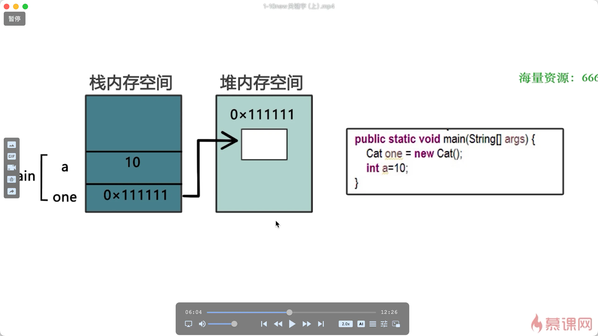

# 实例化过程

## 目录

- [对象实例化分为两部分](#对象实例化分为两部分)

# 对象实例化分为两部分

- 声明对象
  - 声明对象只是在栈中；开辟了一块空间；null ；并不能使用它
- 实例化对象
  - 实例化的时候是在堆里开辟了一块空间；
- 无论是基础性变量还是应用类型变量；都可以报存在栈里； 只不过**基础变量值直接保存在栈里**
- 引用类型的只不过**保存的是地址**；指向**堆里具体的实例；**（引用类型在堆和栈里各占一块内存）；
- **每次new 都会开辟一个新的空间；哪怕内容是完全相同的**
- 可以同时声明多个引用；用逗号分隔；

