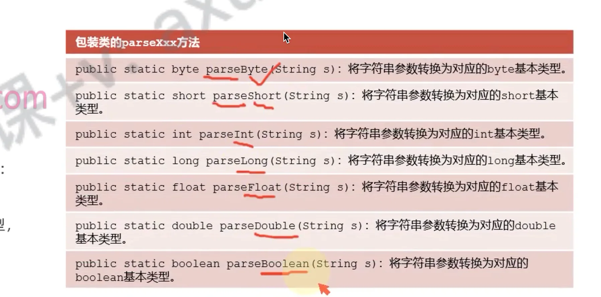

# 转换

## 目录

- [整数和浮点数](#整数和浮点数)
- [字符串和数字](#字符串和数字)
- [字符串](#字符串)

# 整数和浮点数

最后，所有的**整数和浮点数的包装类型都**继承自`Number`，因此，可以非常方便地直接**通过包装类型获取各种基本类型：**

```java 
// 向上转型为Number:
Number num = new Integer(999);
// 获取byte, int, long, float, double:
byte b = num.byteValue();
int n = num.intValue();
long ln = num.longValue();
float f = num.floatValue();
double d = num.doubleValue();

```


# 字符串和数字

```java 
int t1 = 2;
String t2 = Integer.toString(t1);

// 字符串 转 包装类
int t3 = Integer.parseInt(t2);
int t4 = Integer.valueOf(t2)
```


# 字符串

包装类中；**除了**`character` ；都有一个 方法；若字符串参数的内容无法转换到对应的基本类型，则会抛出异常`java.NumberFormatException`

**在转换时；务必保证转换为基本类型的格式；否则会抛错；**


