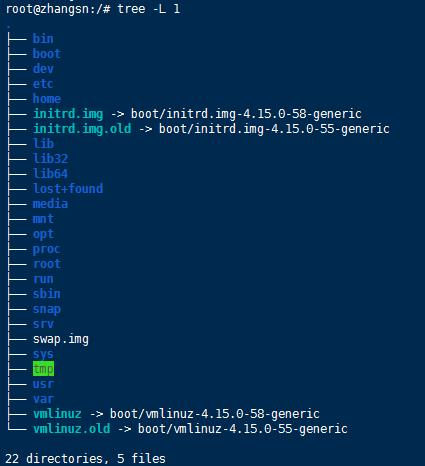

# / – 根目录

首先我们介绍一下Linux下的根目录。Linux的目录结构就像一棵倒着的大树，最底层是树干，然后是分支，层层细分。而根目录是Linux最底层的目录，就像一棵大树的树干一样。

任何内容都位于根目录之下，根目录通过一个路径符号/表示。如果非要找个类比的话，可以将根目录理解为Windows下面的C:\目录。但是严格来说并不一样，Linux下的"/"是所有内容（包括文件目录、设备和文件等）的根，而Windows下的C:\并不是，因为如果有多个磁盘或者多个分区，那Windows下可能还有D:\或者E:\。

我们可以通过执行命令cd /将当前工作路径切换到根目录。并通过命令tree -L 1显示根目录的所有下一级目录。具体如图3所示。本例中只显示了一级子目录，当然也可以通过-L 2显示二级子目录，但结果可能会占满整个屏幕。

图3 根目录示例
