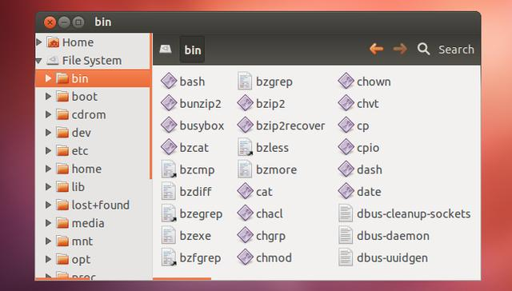

# /bin – 用户基础二进制文件目录

目录/bin是根目录的一级子目录。在该目录中包含着最为基础的用户二进制文件，也就是应用程序。这个目录非常像Windows下的Programs目录。

并非所有的应用程序都存储在这个目录下面，有些不是特别基础的程序会存储在/usr/bin目录下面。比如Chrome浏览器等，或者用户自己安装的一些程序通常会在/usr/bin下面。而系统应用程序则通常会在该目录下面，比如ls、mkdir和cp等等。

如果你使用的桌面版的操作系统，可以通过GUI看到该目录下的内容。下面这张图是一个具体的例子。

图4 二进制目录
