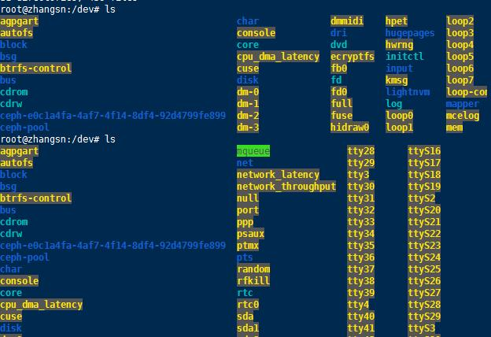
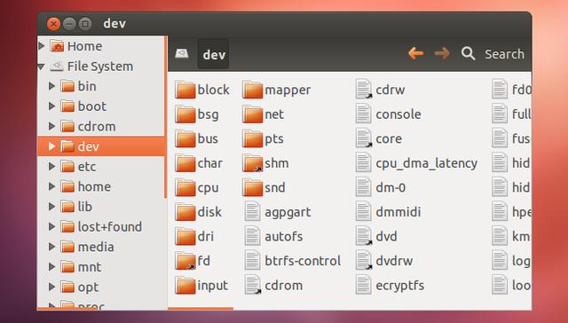

# /dev – 设备文件

在Linux下面，设备也是一个文件，**比如磁盘、优盘或者光盘等。包括无线网卡、摄像头和串口等都是一个文件。而通常这些文件都是在/dev目录下面，大家可以切换到该目录下看看具体的内容。**

图5 设备目录

其中图是/dev目录的一个局部截图。在该目录下面最常见的可能就是/dev/sda这种文件，该文件表示一个SCSI磁盘。

处理实体设备外，在该目录下面还有很多伪设备。比如/dev/random表示一个产生随机数的设备，/dev/loop0则是一个将本地文件映射为磁盘的虚拟设备。这些伪设备有的时候非常用于，我们经常使用这些设备做一些测试。

图6 GUI目录
