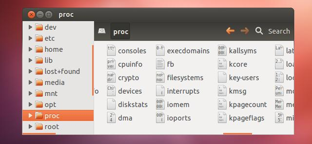
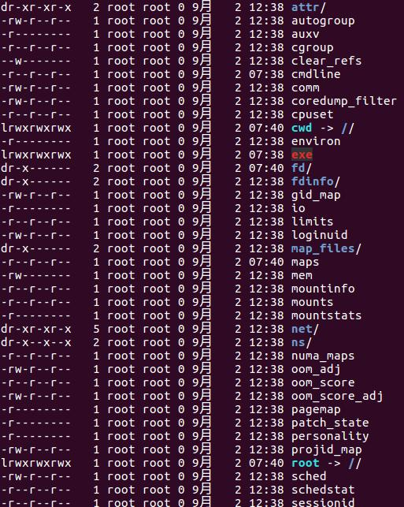

# /proc – Kernel & Process Files

该目录也是一个虚拟目录，也就是并不是存储文件数据的目录。这个目录中存储的文件通常是用来获取操作系统内核内部信息或者进程内部信息的。

图8 proc目录

比如每个进程在该目录下都有一个子目录，而字母的名字就是进程ID。通过cat命令对该目录下的文件进行读取，可以获取进程的详细信息。例如我们进入目录/proc/258下面，这个是进程ID为258的进程的信息，通过ls命令可以看到如下内容。

图8 进程详细信息
