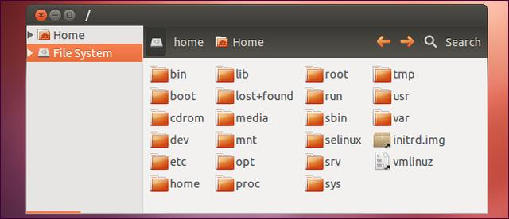

# Linux目录架构

> Linux下的目录结构确实是比较复杂的，特别是对于初学者。如果登录桌面版（比如Ubuntu）会发现其实跟Windows还是很像的。

图2 图形界面目录结构

但是如果通过命令行的方式登陆系统，那么就会显得复杂很多。其实也并不复杂，本质上来说还是树型结构，只不过需要通过命令实现不同目录层级的切换，不行GUI这样直观。

初次使用Linux操作系统是主要是对已有的目录结构树有些顾虑，不清楚每个目录的具体作用，有些手足无措的感觉。这主要是Linux不像Windows那样通常有个系统盘的概念（其实也可以有系统分区）。在Linux操作系统中所有目录都位于根目录下面，只有一颗树。操作系统自己的文件和用户的数据文件都在该树下，所以有些不知所措。

因此，如果想学习Linux操作系统，非常有比较了解一下整个文件系统。其实有一个专门的文档来介绍Linux的目录结构，这个文档名为文件系统层次标准（Filesystem Hierarchy Standard，简称FHS，私信linuxfhs可获得）。但是这个文档非常长， 而且在Linux的目录结构中有些目录并不在该文档中，因此本文简要介绍一下Linux的核心目录。了解了Linux系统的整个目录结构也就会感觉到Linux的文件系统其实没那么复杂了。

登录到Linux系统之后，我们需要先来熟悉一下Linux的目录结构。在Linux系统中，也是存在目录的概念的，但是Linux的目录结构和Windows的目录结构是存在比较多的差异的 。在Windows目录下，是一个一个的盘符(C盘、D盘、E盘)，目录是归属于某一个盘符的。Linux系统中的目录有以下特点：

**A. / 是所有目录的顶点**

**B. 目录结构像一颗倒挂的树**

**Linux 和 Windows的目录结构对比:**

Linux的目录结构，如下：

根目录/ 下各个目录的作用及含义说明:

| 编号 | 目录    | 含义                      |
| -- | ----- | ----------------------- |
| 1  | /bin  | 存放二进制可执行文件              |
| 2  | /boot | 存放系统引导时使用的各种文件          |
| 3  | /dev  | 存放设备文件                  |
| 4  | /etc  | 存放系统配置文件★               |
| 5  | /home | 存放系统用户的文件(普通用户的存储信息位置)★ |
| 6  | /lib  | 存放程序运行所需的共享库和内核模块       |
| 7  | /opt  | 额外安装的可选应用程序包所放置的位置      |
| 8  | /root | 超级用户目录                  |
| 9  | /sbin | 存放二进制可执行文件，只有root用户才能访问 |
| 10 | /tmp  | 存放临时文件                  |
| 11 | /usr  | 存放系统应用程序★               |
| 12 | /var  | 存放运行时需要改变数据的文件，例如日志文件★  |

学习Linux的文件系统，除了学习基本的原理外，对整个文件系统目录树有所了解也是必要的。本文抛砖引玉，希望对大家有所帮助。

[/ – 根目录](<./- – 根目录/index.md> "/ – 根目录")

[/bin – 用户基础二进制文件目录](<./-bin – 用户基础二进制文件目录/index.md> "/bin – 用户基础二进制文件目录")

[/boot – 静态启动文件](<./-boot – 静态启动文件/index.md> "/boot – 静态启动文件")

[/cdrom – 光盘安装点](<./-cdrom – 光盘安装点/index.md> "/cdrom – 光盘安装点")

[/dev – 设备文件](<./-dev – 设备文件/index.md> "/dev – 设备文件")

[/etc – 配置文件](<./-etc – 配置文件/index.md> "/etc – 配置文件")

[/home –主目录](<./-home –主目录/index.md> "/home –主目录")

[/lib – 基础共享库](<./-lib – 基础共享库/index.md> "/lib – 基础共享库")

[/lost+found – 可恢复的文件](<./-lost+found – 可恢复的文件/index.md> "/lost+found – 可恢复的文件")

[/media – Removable Media](<./-media – Removable Media/index.md> "/media – Removable Media")

[/mnt – 临时挂载点目录](<./-mnt – 临时挂载点目录/index.md> "/mnt – 临时挂载点目录")

[/opt – 自选软件包（Optional Packages）](<./-opt – 自选软件包（Optional Packages/index.md> "/opt – 自选软件包（Optional Packages）")

[/proc – Kernel & Process Files](<./-proc – Kernel & Process Files/index.md> "/proc – Kernel & Process Files")

[/root – root主目录](<./-root – root主目录/index.md> "/root – root主目录")

[/run – 应用程序状态文件](<./-run – 应用程序状态文件/index.md> "/run – 应用程序状态文件")

[/sbin – 系统管理二进制文件](<./-sbin – 系统管理二进制文件/index.md> "/sbin – 系统管理二进制文件")

[/selinux – SELinux虚拟文件系统](<./-selinux – SELinux虚拟文件系统/index.md> "/selinux – SELinux虚拟文件系统")

[/srv – 服务数据](<./-srv – 服务数据/index.md> "/srv – 服务数据")

[/tmp – 临时文件](<./-tmp – 临时文件/index.md> "/tmp – 临时文件")

[/usr – User Binaries & Read-Only Data](<./-usr – User Binaries & Read-On/-usr – User Binaries & Read-Only Data.md> "/usr – User Binaries & Read-Only Data")

[/var – 变量数据文件](<./-var – 变量数据文件/index.md> "/var – 变量数据文件")
