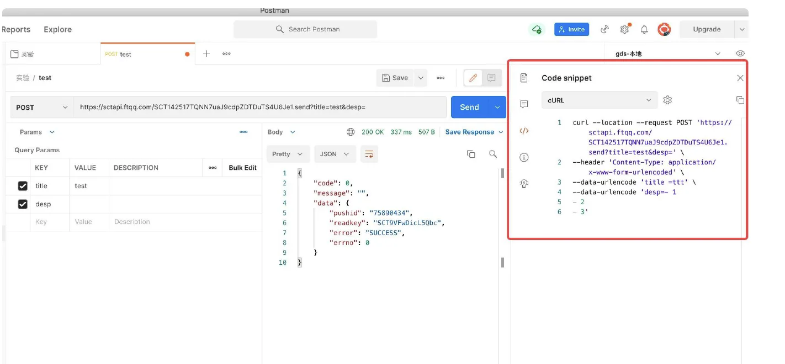
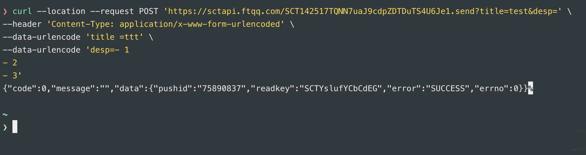
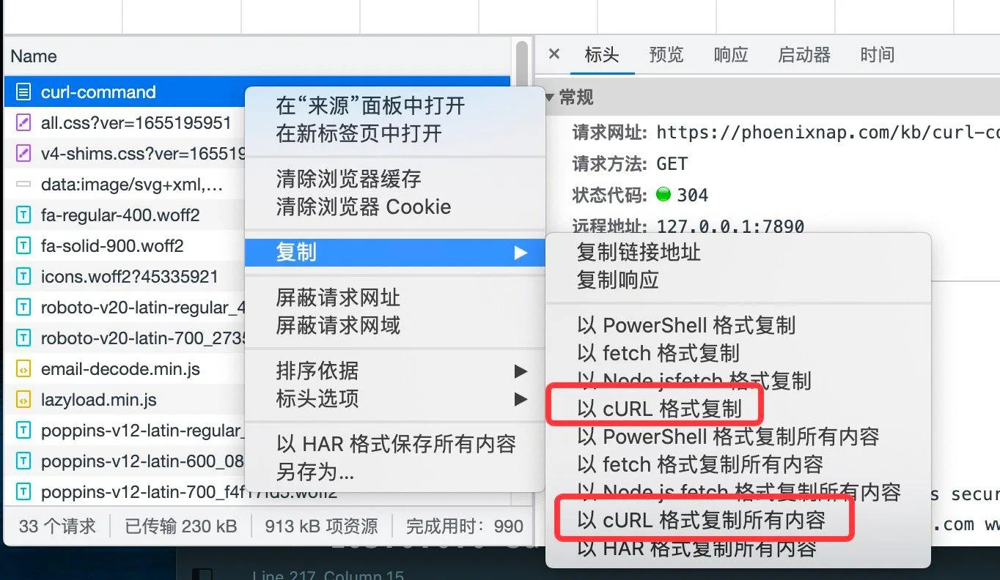
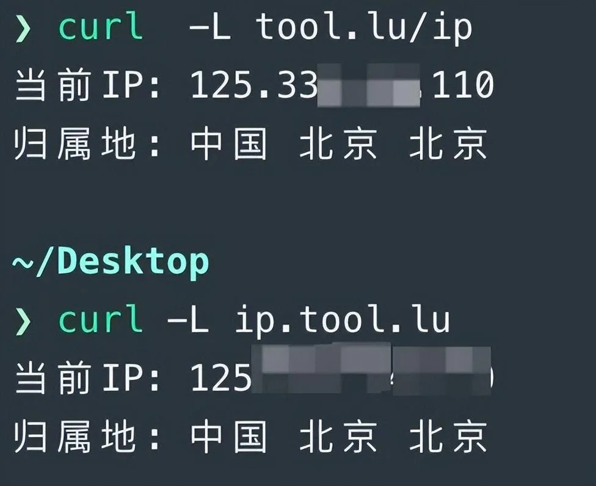
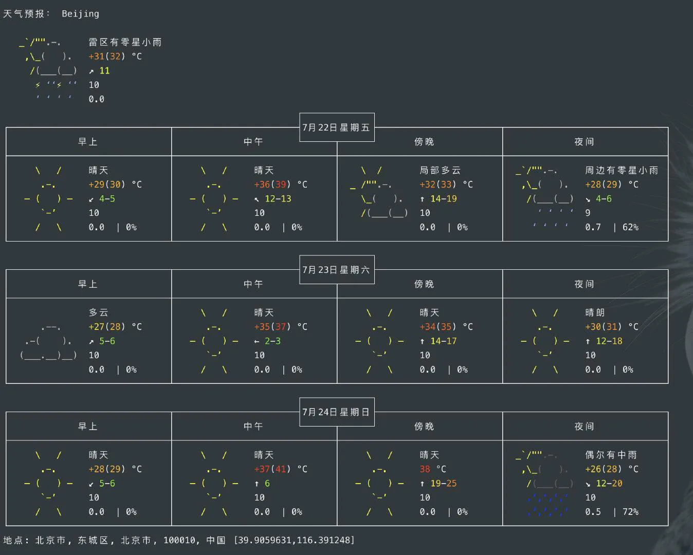

# 妙用curl

## 目录

- [认识 cURL](#认识-cURL)
- [cURL 的使用](#cURL-的使用)
- [代替 Postman ?](#代替-Postman-)
- [小工具了解一下](#小工具了解一下)
- [发送 cookie?](#发送-cookie)
- [上传个文件？](#上传个文件)
- [弱网测试](#弱网测试)
- [保存响应内容 ？](#保存响应内容-)
- [下载文件并显示进度？](#下载文件并显示进度)
- [参数太多，不想拼？](#参数太多不想拼)
- [获取所在地 IP](#获取所在地-IP)
- [获取天气预报？](#获取天气预报)


# 认识 cURL

> **“**
>
> A command line tool and library for transferring data with URL syntax, supporting DICT, FILE, FTP, FTPS, GOPHER, GOPHERS, HTTP, HTTPS, IMAP, IMAPS, LDAP, LDAPS, MQTT, POP3, POP3S, RTMP, RTMPS, RTSP, SCP, SFTP, SMB, SMBS, SMTP, SMTPS, TELNET and TFTP. libcurl offers a myriad of powerful features
>
> **”**

curl 是常用的开源命令行工具，用来请求 Web 服务器。它的名字就是客户端（client）的 URL 工具的意思。它的功能非常强大，命令行参数多达几十种。它支持包括 FTP、HTTP、HTTPS、FTP、SCP，SFTP 数十种协议。如能熟练使用，可以在很多应用场景下，发挥巨大的价值。

# cURL 的使用

# 代替 Postman ?

```javascript 
curl https://www.baidu.com
```


如上命令，不带有任何参数时，curl 就是发出 GET 请求，服务器返回的内容会在命令行输出。当然，你还可以为其添加各种参数（如 -A、-b、-c、-d、-e、-F、-H 等等），使得可以完成更多复杂任务；

其实，如果只是简单的 Post、Get 请求，用 cURL 做像接口测试的工作是非常方便的。

有人说了，**Postman 它不香吗？**

是的，挺香的，但是当你在环境受限的情况下，比如 在 linux 服务器上想测试一下接口通不通没有 Postman 怎么办？

这时候 cURL 就体现出它的价值了。此外贴心的 Postman，还为我们提供了各种语言和 cURL 的 snippet，方便你在 Postman 编辑完成后直接拿走开发和调试使用。



如上图，你直接 copy 内容，然后在命令行执行就可以了。



# 小工具了解一下

jsonplaceholder [http://jsonplaceholder.typicode.com/](http://jsonplaceholder.typicode.com/ "http://jsonplaceholder.typicode.com/")

免费的 HTTP 请求假数据接口，前端同学可以了解一下

- 不需引入外部 js 文件。
- 同时支持 http 和 https 请求。
- 同时支持 post 请求和 get 请求。

# 发送 cookie?

`-b`参数用来向服务器发送 Cookie。 多个cookie用分号间隔

```javascript 
$ curl -b 'foo=bar' https://google.com

```


# 上传个文件？

网站中上传文件功能很普遍，然而你是怎么调试的呢？

打开页面，选择文件后再点击上传按钮？ 然后 F12 看看 Request、Response? 或者打开 Postman 进行类似步骤？

可真够麻烦的。**用 cURL 一行命令搞定**

这里先介绍一下 -v 参数：

**“**

使用 -v 参数使 curl 打印有关请求和响应的详细信息。以 > 为前缀的行是发送给服务器的数据，以 < 为前缀的行是从服务器接收的数据，以 \* 开头的行是杂项信息，如连接信息、SSL 握手信息、协议信息等。

**”**

可以看到，包括握手过程、请求、响应信息一应俱全。

加 -v 参数的作用就是就是为了跟踪（trace）一下请求，看看具体细节，这跟你 F12 的目的是一样的。此外，如果你想看到具体的请求、响应时间点可以加入 --trace-time 参数，最后的命令如下：

```javascript 
curl -v  --trace-time  https://www.baidu.com

```


接下来就是上传的部分了，-F 参数用来向服务器上传二进制文件。

```javascript 
curl -v --trace-time  'https://postman-echo.com/post' -F  'fileName=@"/Users/xiaobox/Desktop/cookies.txt"'
```


解释一下这行命令：

- [https://postman-echo.com/post](https://postman-echo.com/post "https://postman-echo.com/post") 是我找到的一个公共 API，你可以用来测试上传文件
- -v --trace 上面讲过了
- -F 会给 HTTP 请求加上标头 Content-Type: multipart/form-data，然后将我桌面的文件 cookies.txt 作为 file 字段上传。

-F 参数可以指定 MIME 类型，也可以改文件名。

```javascript 
curl -v --trace-time  'https://postman-echo.com/post' -F  'fileName=@/Users/xiaobox/Desktop/cookies.txt;type=text/plain;filename=me.txt'

```


- 上面命令指定 MIME 类型为 text/plain，否则 curl 会把 MIME 类型设为 application/octet-stream
- 上面命令中，原始文件名为 cookies.txt，但是服务器接收到的文件名为 me.txt。

最后总结，如果你想用一条 cURL 命令测试上传接口，可以利用类似下面的参数组合：

```javascript 
curl -v --trace-time  'https://postman-echo.com/post' -F  'fileName=@/Users/xiaobox/Desktop/cookies.txt;type=text/plain;filename=me.txt'
```


# 弱网测试

顾名思义，就是模拟你的客户端用户在网络较差的环境下，比如 网速很低的时候，网络请求的情况。

我们还是拿百度举例子，你可以用以下一组命令在 1k 和 200B 的不同速度下对比看看响应情况：

```javascript 
curl -v --trace-time --limit-rate 1k http://www.baidu.com
curl -v --trace-time --limit-rate 200B http://www.baidu.com

```


注意 limit-rate 是同时限制 request 和 response，也就是 请求、响应都限制成一样的速率了。

# 保存响应内容 ？

可以利用 -o 参数将响应的结果保存到文件中：

```javascript 
 curl -o google.txt https://www.google.com

```


# 下载文件并显示进度？

cURL 可以当 wget 用

-o 参数将服务器的回应保存成文件，等同于 wget 命令

下载文件的同时显示进度可以使用类似下面的命令：

```javascript 
curl -# -o pic.jpg https://w.wallhaven.cc/full/pk/wallhaven-pk6993.png

```


# 参数太多，不想拼？

cURL 是好用，但如果我是个 web 应用，需要拼接一堆参数，那太麻烦了，简直劝退。

是的，所以 浏览器也想到了，你可以在浏览器先正常发出请求，然后利用浏览器的工具将 cURL 的命令复制出来。



可以复制单个请求，也可以是页面的所有请求。然后你就可以粘贴到终端执行了。

是不是很方便 ？

# 获取所在地 IP

```javascript 
curl -L tool.lu/ip
# or
curl -L ip.tool.lu

```




# 获取天气预报？

我们看看北京的：

```javascript 
curl 'wttr.in/Beijing?lang=zh'
```



