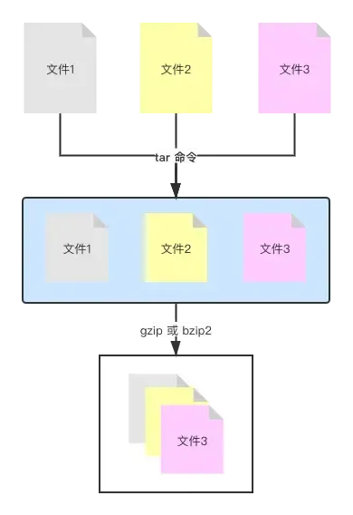

# 文件压缩解压

## 目录

- [tar](#tar)
  - [基础用法](#基础用法)
  - [常用参数](#常用参数)
- [gzip / gunzip](#gzip--gunzip)
- [tar 归档+压缩](#tar-归档压缩)
- [zcat、zless、zmore](#zcatzlesszmore)
- [zip/unzip](#zipunzip)
  - [命令安装](#命令安装)
  - [基础用法](#基础用法)

* 打包：是将**多个文件变成一个总的文件，它的学名叫存档、归档。**
* 压缩：是将一个大文件（通常指归档）压缩变成一个小文件。

*我们常常使用 **`tar`** 将多个文件归档为一个总的文件，称为 **`archive`** 。然后用 **`gzip`** 或 **`bzip2`** 命令将 **`archive`** 压缩为更小的文件。*



### tar

创建一个 `tar` 归档。

#### 基础用法

```bash 
tar -cvf sort.tar sort/ # 将sort文件夹归档为sort.tar
tar -cvf archive.tar file1 file2 file3 # 将 file1 file2 file3 归档为archive.tar

```


#### 常用参数

- `-cvf` 表示 `create`（创建）+ `verbose`（细节）+ `file`（文件），创建归档文件并显示操作细节；
- `-tf` 显示归档里的内容，并不解开归档；
- `-rvf` 追加文件到归档， `tar -rvf archive.tar file.txt` ；
- `-xvf` 解开归档， `tar -xvf archive.tar` 。

### gzip / gunzip

“压缩/解压”归档，默认用 `gzip` 命令，压缩后的文件后缀名为 `.tar.gz` 。

```bash 

gzip archive.tar # 压缩
gunzip archive.tar.gz # 解压

```


### tar 归档+压缩

可以用 `tar` 命令同时完成归档和压缩的操作，就是给 `tar` 命令多加一个选项参数，使之完成归档操作后，还是调用 `gzip` 或 `bzip2` 命令来完成压缩操作。

```bash 

tar -zcvf archive.tar.gz archive/ # 将archive文件夹归档并压缩
tar -zxvf archive.tar.gz # 将archive.tar.gz归档压缩文件解压

```


### zcat、zless、zmore

之前讲过使用 `cat less more` 可以查看文件内容，但是压缩文件的内容是不能使用这些命令进行查看的，而要使用 `zcat、zless、zmore` 进行查看。

```bash 

zcat archive.tar.gz

```


### zip/unzip

“压缩/解压” `zip` 文件（ `zip` 压缩文件一般来自 `windows` 操作系统）。

#### 命令安装

```bash 

# Red Hat 一族中的安装方式
yum install zip 
yum install unzip

```


#### 基础用法

```bash 
unzip archive.zip # 解压 .zip 文件
unzip -l archive.zip # 不解开 .zip 文件，只看其中内容

zip -r sort.zip sort/ # 将sort文件夹压缩为 sort.zip，其中-r表示递归

```
