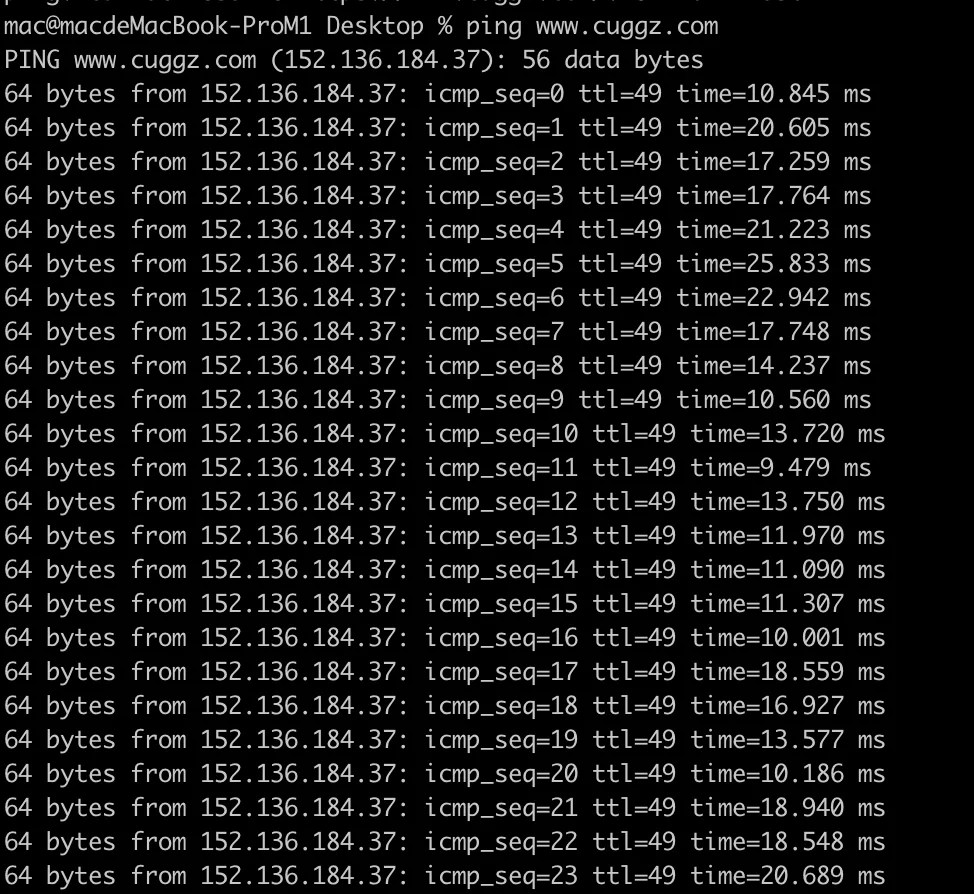
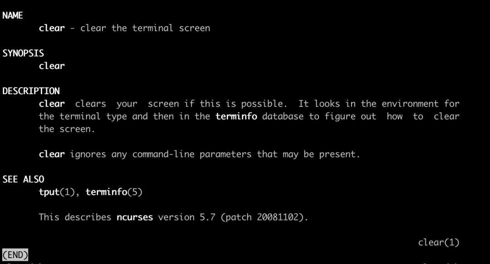

# 其他

## 目录

- [1. ssh](#1-ssh)
- [4. ping](#4-ping)
- [5. man](#5-man)
- [6. wc](#6-wc)

### 1. ssh

ssh 命令用于连接基于 Linux 的远程主机。要使用 root 用户连接远程主机，需要使用以下命令：

```bash 
ssh root@192.168.4.21

```


上面的命令将不支持 GUI，如果想使用 GUI 连接远程主机，需要使用下面的命令：

```bash 
ssh -XY root@192.168.4.21

```


### 4. ping

ping 命令用于检测主机。执行 ping 指令会使用 ICMP 传输协议，发出要求回应的信息，若远端主机的网络功能没有问题，就会回应该信息，因而得知该主机运作正常。



### 5. man

man 命令用来查看Linux命令的使用手册，例如执行 man clear：



### 6. wc

wc 命令用于计算字数。利用wc指令我们可以计算文件的Byte数、字数、或是列数，若不指定文件名称、或是所给予的文件名为"-"，则wc指令会从标准输入设备读取数据。


