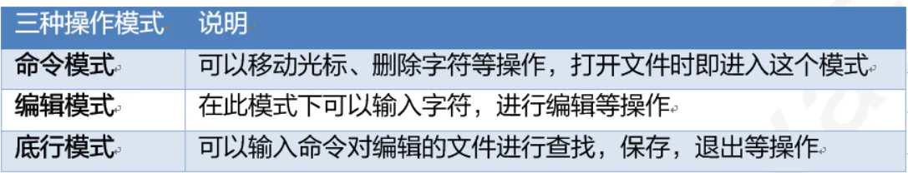
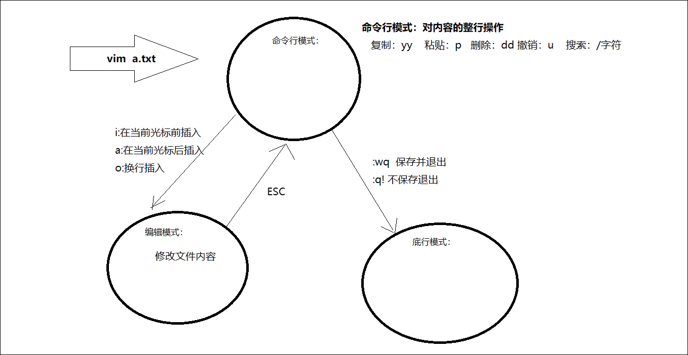

# 常用

## 目录

- [1】vim介绍](#1vim介绍)
- [【2】vim三种模式的切换](#2vim三种模式的切换)
- [【3】vim操作语法](#3vim操作语法)
  - [1）在命令模式下进入编辑模式的按键](#1在命令模式下进入编辑模式的按键)
  - [2）命令模式下常用的编辑命令](#2命令模式下常用的编辑命令)
  - [3）在命令模式下进入底行模式的按键](#3在命令模式下进入底行模式的按键)

#### 1】vim介绍

作用: 对文件内容进行编辑，vim其实就是一个文本编辑器 &#x20;
语法: vim fileName &#x20;
说明: &#x20;
1\). 在使用vim**命令编辑文件时，如果指定的文件存在则直接打开此文件。如果指定的文件不存在则新建文件。** &#x20;
2\). vim在进行文本编辑时共分为三种模式，分别是 **命令模式（Command mode），编辑模式（Insert mode）和底行模式（Last line mode）**。这三种模式之间可以相互切换。我们在使用vim时一定要注意我们当前所处的是哪种模式。

#### 【2】vim三种模式的切换

#### 【3】vim操作语法

##### 1）在命令模式下进入编辑模式的按键

| **命令**​ | **描述**​     |
| ------- | ----------- |
| **i**​  | 在光标的前面插入字符  |
| **a**​  | 在光标的后面添加入字符 |
| **o**​  | 在光标下一行插入字符  |

##### 2）命令模式下常用的编辑命令

| **命令**​   | **描述**​                                   |
| --------- | ----------------------------------------- |
| **yy**​   | 复制当前行                                     |
| **p**​    | 粘贴                                        |
| **dd**​   | 删除当前行                                     |
| **u**​    | 撤销                                        |
| **/字符串**​ | 搜索字符串的内容 \&#x20; n： 查找下一个 \&#x20; N：查找前一个 |

##### 3）在命令模式下进入底行模式的按键

| 命令         | 描述              |
| ---------- | --------------- |
| **:wq**​   | write quit 保存退出 |
| **:q!** ​  | 强制退出，不保存        |
| **:wq!** ​ | 强制保存退出，用于只读文件   |
