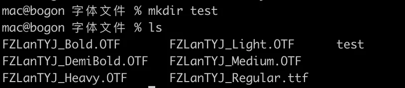
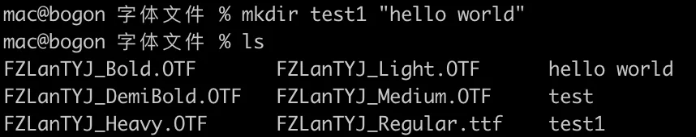
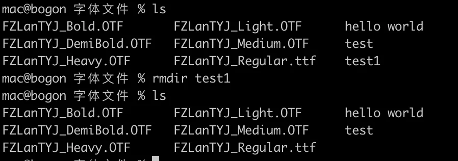
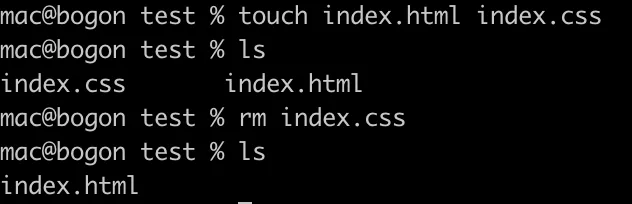

# 创建/删除 文件/目录

## 目录

- [touch](#touch)
- [mkdir](#mkdir)
- [rmdir](#rmdir)
- [rm](#rm)

#### touch

**创建一个文件**

```javascript 
touch new_file

```


### mkdir

mkdir 命令用来在当前位置（当前目录）**新建一个文件夹。** 只需使用该命令加上需要新建文件夹的名称即可：

```bash 
mkdir test

```


【常用参数】

- `-p` 递归的创建目录结构 `mkdir -p one/two/three`

下面是创建的结果，使用ls命令就可以看到刚创建的名为test的文件夹：



我们还可以同时创建多个文件夹，只需在多个文件夹之间添加空格即可。如果**一个文件夹名称中包含空格，就需要使用双引号来写这个**文件夹名字：



# rmdir

rmdir 命令用于删除空的目录。不能删除非空目录

```bash 
作用: 删除空目录 （remove directory）
语法: rmdir [-p] dirName

说明:
    -p: 当子目录被删除后使父目录为空目录的话，则一并删除
        反之，如果父目录不为空，则不删除

举例:
    rmdir itcast   删除名为itcast的空目录
    rmdir -p itcast/test   删除itcast目录中名为test的子目录，若test目录删除后itcast目录变为空目录，则也被删除
    rmdir itcast*   删除名称以itcast开始的空目录
    
    
    
 
*: 是一个通配符，代表任意字符；
rmdir itcast* : 删除以itcast开头的目录
rmdir *itcast : 删除以itcast结尾的目录

    

```




# rm

rm 命令用于删除一个文件或者目录。



我们还可以使用 rm -rf 命令来快速删除文件夹/目录及其内容。

注意：使用此**命令需要非常小心，并仔细检查所在的目录。这个操作将删除所有内容并且无法撤消。**

- -i 删除前逐一询问确认。
- -f 即使原档案属性设为唯读，亦直接删除，无需逐一确认。
- -r 将目录及以下之档案亦逐一删除。
- -v或–verbose 　显示指令执行过程。
- -d或–directory 　直接把欲删除的目录的硬连接数据删成0，删除该目录。

删除文件可以直接使用rm命令，若**删除目录则必须配合选项"-r"，** 例如：

```bash 
# rm test.txt
rm：是否删除 一般文件 "test.txt"? y
# rm homework
rm: 无法删除目录"homework": 是一个目录
# rm -r homework
rm：是否删除 目录 "homework"? y
删除当前目录下的所有文件及目录，命令行为：rm -r *
        rm -rf src/
删除文件夹里的内容，而不删除文件夹本身
        rm -rf src/*

先清空；后压缩
rm -rf build/*
tar -czvf build/test.tar  build/*

rm -rf *.log  删除当前路径下以log结尾的目录或者文件


```
