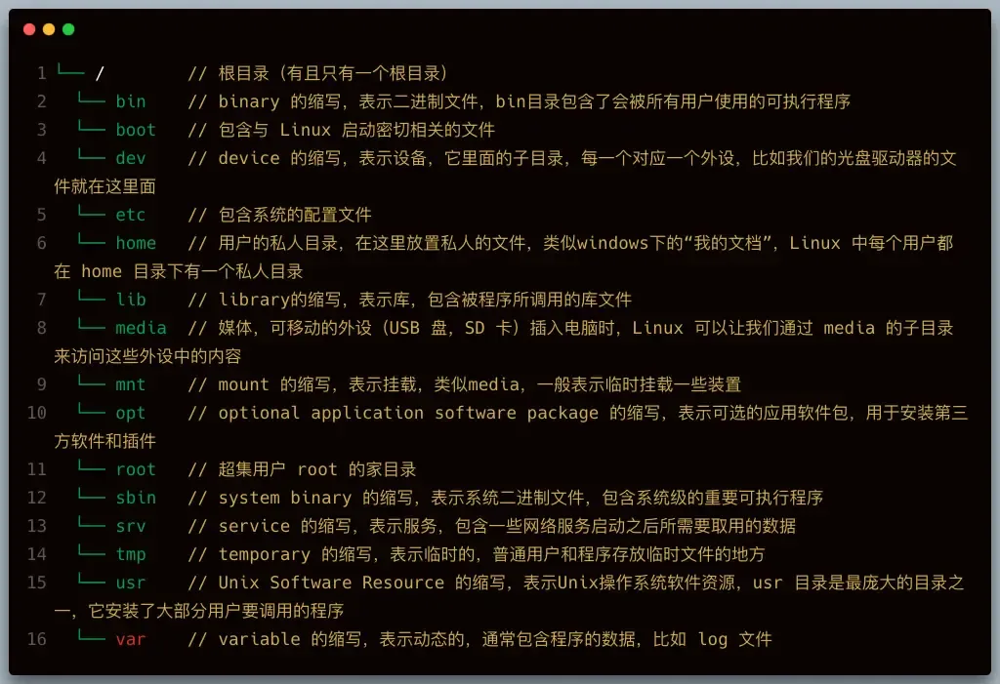
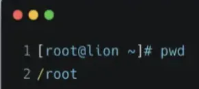
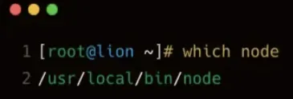
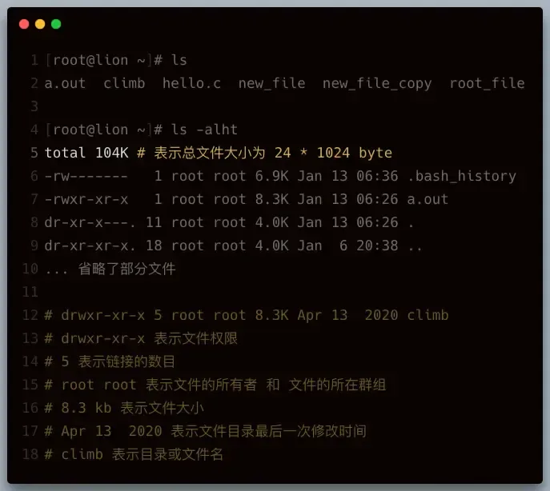
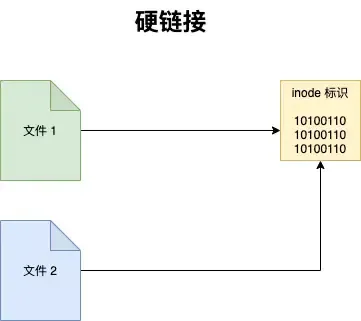
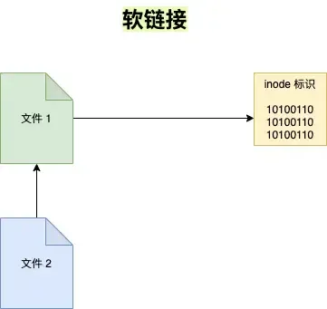

# 文件和目录

## 目录

- [文件的组织](#文件的组织)
- [查看路径](#查看路径)
  - [pwd](#pwd)
  - [which](#which)
- [浏览和切换目录](#浏览和切换目录)
  - [ls](#ls)
  - [cd](#cd)
  - [du](#du)
- [文件的复制和移动](#文件的复制和移动)
  - [cp](#cp)
  - [mv](#mv)
- [文件的删除和链接](#文件的删除和链接)
  - [rm](#rm)
  - [ln](#ln)
    - [硬链接](#硬链接)
    - [软链接](#软链接)

### 文件的组织



### 查看路径

#### pwd

显示当前目录的路径



#### which

**查看命令的可执行文件所在路径**， `Linux` 下，每一条命令其实都对应一个可执行程序，在终端中输入命令，按回车的时候，就是执行了对应的那个程序， `which` 命令本身对应的程序也存在于 `Linux` 中。

总的来说一个命令就是一个可执行程序。



### 浏览和切换目录

#### ls

列出文件和目录，它是 `Linux` 最常用的命令之一。

【常用参数】

- `-a` 显示所有文件和目录包括隐藏的
- `-l` 显示详细列表
- `-h` 适合人类阅读的
- `-t` 按文件最近一次修改时间排序
- `-i` 显示文件的 `inode` （ `inode` 是文件内容的标识）



#### cd

`cd` 是英语 `change directory` 的缩写，表示切换目录。

```javascript 
cd / --> 跳 转到根目录
 cd ~ -->  跳转到家目录
 cd .. --> 跳转 到上级目录
 cd ./home --> 跳转到当前目录的home目录下
cd /home/lion --> 跳转到根目录下的home目录下的lion目录
cd --> 不添加任何参数，也是回到家目录
```


> \[注意] 输入`cd /ho` + 单次 `tab` 键会自动补全路径 + 两次 `tab` 键会列出所有可能的目录列表。

#### du

列举**目录大小信息。**

【常用参数】

- `-h` 适合人类阅读的；
- `-a` 同时列举出目录下文件的大小信息；
- `-s` 只显示总计大小，不显示具体信息。

### 文件的复制和移动

#### cp

拷贝文件和目录

```bash 
cp file file_copy --> file 是目标文件，file_copy 是拷贝出来的文件
cp file one --> 把 file 文件拷贝到 one 目录下，并且文件名依然为 file
cp file one/file_copy --> 把 file 文件拷贝到 one 目录下，文件名为file_copy
cp *.txt folder --> 把当前目录下所有 txt 文件拷贝到 folder 目录下

```


【常用参数】

- `-r` 递归的拷贝，常用来拷贝一整个目录

#### mv

移动（重命名）文件或目录，与cp命令用法相似。

```bash 

mv file one --> 将 file 文件移动到 one 目录下
mv new_folder one --> 将 new_folder 文件夹移动到one目录下
mv *.txt folder --> 把当前目录下所有 txt 文件移动到 folder 目录下
mv file new_file --> file 文件重命名为 new_file

```


### 文件的删除和链接

#### rm

删除文件和目录，由于 `Linux` 下没有回收站，一旦删除非常难恢复，因此需要谨慎操作

```bash 

rm new_file  --> 删除 new_file 文件
rm f1 f2 f3  --> 同时删除 f1 f2 f3 3个文件
```


【常用参数】

- `-i` 向用户确认是否删除；
- `-f` 文件强制删除；
- `-r` 递归删除文件夹，著名的删除操作 `rm -rf` 。

#### ln

英文 `Link` 的缩写，表示创建链接。

学习创建链接之前，首先要理解链接是什么，我们先来看看 `Linux` 的文件是如何存储的：

`Linux` 文件的存储方式分为3个部分，**文件名、文件内容以及权限**，其中**文件名的列表是存储在硬盘的其它地方**和**文件内容是分开存放**的，每**个文件名通过 ****`inode`**** 标识绑定到文件内容**。

Linux 下有两种链接类型：硬链接和软链接。

##### 硬链接

使链接的**两个文件共享同样文件内容**，**就是同样的** `inode` ，一旦文件1和文件2之间有了硬链接，那么修改任何一个文件，修改的都是同一块内容，它的缺点是，只能创建指向文件的硬链接，不能创建指向目录的（其实也可以，但比较复杂）而软链接都可以，因此软链接使用更加广泛。

```bash 
ln file1 file2  --> 创建 file2 为 file1 的硬链接

```




如果我们用 `rm file1` 来删除 `file1` ，对 `file2` 没有什么影响，**对于硬链接来说，删除任意一方的文件，共同指向的文件内容并不会从硬盘上删除。只有同时删除**了 `file1` 与`file2` 后，**它们共同指向的文件内容才会消失。**

##### 软链接

软链接就类似 `windows` 下快捷方式。

```bash 
ln -s file1 file2

```




执行 `ls -l` 命名查看当前目录下文件的具体信息

```bash 
total 0
-rw-r--r-- 1 root root 0 Jan 14 06:29 file1
lrwxrwxrwx 1 root root 5 Jan 14 06:42 file2 -> file1  # 表示file2 指向 file

```


其实 `file2` 只是 `file1` 的一个快捷方式，它指向的是 `file1` ，所以显示的是 `file1` 的内容，但其实 `file2` 的 `inode` 与 `file1` 并不相同。如果我们删除了 `file2` 的话， `file1`是不会受影响的，但如果删除 `file1` 的话， `file2` 就会变成死链接，因为指向的文件不见了。
