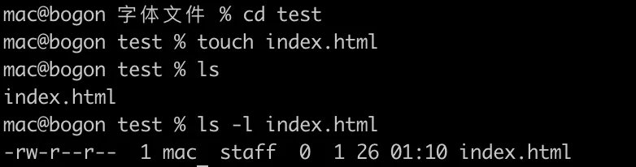
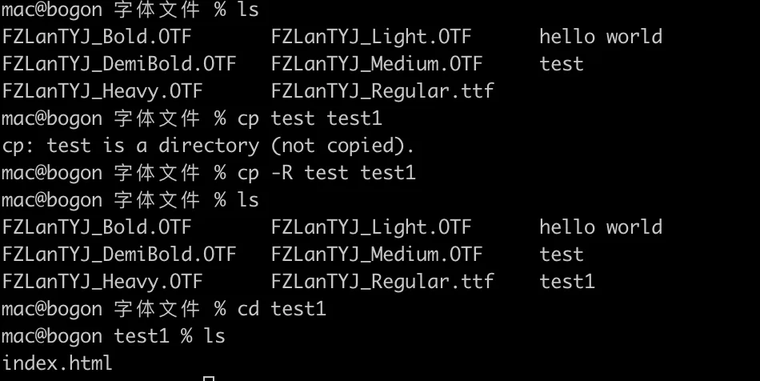
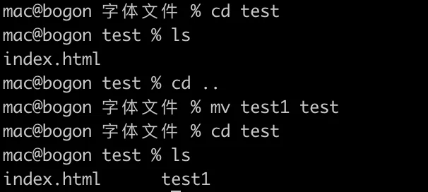

# 文件管理

## 目录

- [1. cat](#1-cat)
- [4. touch](#4-touch)
- [5. cp](#5-cp)
- [6. mv](#6-mv)
- [7. locate](#7-locate)

### 1. cat

cat 命令用于连接文件并打印到标准输出设备上。

```bash 
cat index.html

```


使用 cat > filename c可以创建一个新文件：

```bash 
cat > style.css
```


使用 cat filename1 filename2 >> filename3 可以连接两个文件（1 和 2）并将它们的输出内容存储在一个新文件3中。

```bash 
cat filename1 filename2 >> filename3
```


### 4. touch

touch 命令用于修改文件或者目录的时间属性，包括存取时间和更改时间。若文件不存在，系统会建立一个新的文件。



如果不添加任何参数，就会将文件的修改时间改为当前的系统时间。

### 5. cp

cp 命令主要用于复制文件或目录。使用该指令复制目录时，必须使用参数 -r 或者 -R 。



这里复制了test目录，并重命名为了test1，test1目录中也包含test目录中所有的内容

### 6. mv

mv 命令用来为文件或目录改名（如果目录名称不存在）、或将文件或目录移入其它位置。



这里将 test1 文件移动到了 test 文件中。

### 7. locate

locate命令用于查找符合条件的文档，他会去保存文档和目录名称的数据库内，查找合乎范本样式条件的文档或目录。一般情况下，只需要输入 locate file\_name 即可查找指定文件。
