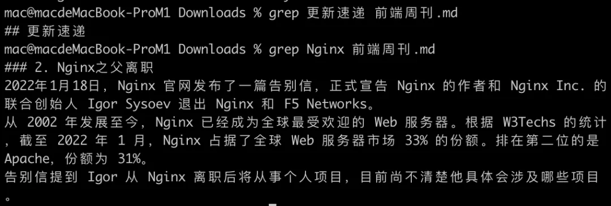
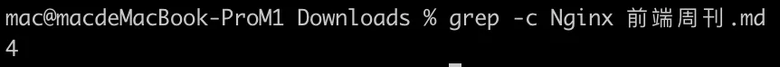

# 查找文件

## 目录

- [locate](#locate)
  - [安装 locate](#安装-locate)
- [find](#find)
  - [根据文件名查找](#根据文件名查找)
  - [根据文件大小查找](#根据文件大小查找)
  - [根据文件最近访问时间查找](#根据文件最近访问时间查找)
  - [仅查找目录或文件](#仅查找目录或文件)
  - [操作查找结果](#操作查找结果)
- [grep](#grep)

# locate

搜索包含关键字的所有文件和目录。后接需要查找的文件名，也可以用正则表达式。

#### 安装 locate

```bash 
yum -y install mlocate  --> 安装包
updatedb  --> 更新数据库

```


> \[注意] `locate` 命令会去文件数据库中查找命令，而不是全磁盘查找，因此刚创建的文件并不会更新到数据库中，所以无法被查找到，可以执行 `updatedb` 命令去更新数据库。

# find

```bash 
find . -type f | wc -l
find [dirname] -type f | wc -l  
#[dirname]代表文件夹名字，-type f 代表要找的是文件，wc -l表示输出个数 

sudo find ~ -name '*webstorm*'
 
```


用于查找文件，它会去遍历你的实际硬盘进行查找，而且它允许我们对每个找到的文件进行后续操作，功能非常强大。

```bash 
find <何处> <何物> <做什么>

```


- 何处：指定在哪个目录查找，**此目录的所有子目录也会被查找。**
- 何物：查找什么，可以根据文件的名字来查找，也可以根据其大小来查找，还可以根据其最近访问时间来查找。
- 做什么：找到文件后，可以进行后续处理，如果不指定这个参数， `find` 命令只会显示找到的文件。

#### 根据文件名查找

```bash 
find -name "file.txt" --> 当前目录以及子目录下通过名称查找文件
find . -name "syslog" --> 当前目录以及子目录下通过名称查找文件
find / -name "syslog" --> 整个硬盘下查找syslog
find /var/log -name "syslog" --> 在指定的目录/var/log下查找syslog文件
find /var/log -name "syslog*" --> 查找syslog1、syslog2 ... 等文件，通配符表示所有
find /var/log -name "*syslog*" --> 查找包含syslog的文件

```


> \[注意] `find` 命令只会查找**完全符合** “何物” 字符串的文件，而 `locate` 会查找所有**包含**关键字的文件。

作用: 在指定目录下根据文件的名称递归查找文件

| \`find \[目录名]\[-name '查询字符串']\` | 功能                    |
| ------------------------------- | --------------------- |
| **无参名**​                        | 搜索当前目录下所有的文件和子目录      |
| **目录名**​                        | 搜索指定目录下所有的文件和子目录      |
| **-name '查询字符串'** ​             | 指定要搜索的字符串; \\\*匹配多个字符 |

#### 根据文件大小查找

```bash 
find /var -size +10M --> /var 目录下查找文件大小超过 10M 的文件
find /var -size -50k --> /var 目录下查找文件大小小于 50k 的文件
find /var -size +1G --> /var 目录下查找文件大小查过 1G 的文件
find /var -size 1M --> /var 目录下查找文件大小等于 1M 的文件

```


#### 根据文件最近访问时间查找

```bash 
find -name "*.txt" -atime -7  --> 近 7天内访问过的.txt结尾的文件

```


#### 仅查找目录或文件

```bash 

find . -name "file" -type f  --> 只查找当前目录下的file文件
find . -name "file" -type d  --> 只查找当前目录下的file目录

```


#### 操作查找结果

```bash 
find -name "*.txt" -printf "%p - %u\n" --> 找出所有后缀为txt的文件，并按照 %p - %u\n 格式打印，其中%p=文件名，%u=文件所有者
find -name "*.jpg" -delete --> 删除当前目录以及子目录下所有.jpg为后缀的文件，不会有删除提示，因此要慎用
find -name "*.c" -exec chmod 600 {} \; --> 对每个.c结尾的文件，都进行 -exec 参数指定的操作，{} 会被查找到的文件替代，\; 是必须的结尾
find -name "*.c" -ok chmod 600 {} \; --> 和上面的功能一直，会多一个确认提示

```


# grep

grep是一种强大的文本搜索工具，它能**使用字符串搜索文本，并把匹配的行和行号打印出来。**

- find命令：查找文件或目录(搜索文件夹和整个文件)
- grep命令：搜索文件内容的字符串

**语法格式**

| \*\*grep \\\[参数]字符串\*\*文件名 | 参数说明                                             |
| -------------------------- | ------------------------------------------------ |
| **作用**​                    | 从指定的文件中搜索指定的字符串                                  |
| **-n**​                    | **显示行号**​                                        |
| **-v**​                    | 显示不匹配的行                                          |
| **-i**​                    | **忽略大小写查找**​                                     |
| -C n                       | Context - 显示匹配行\*\*前后\*\*各 n 行（等价于\`-A n -B n\`） |
| -B n                       | Before - 显示匹配行\*\*之前\*\*的 n 行                    |
| -A n                       | After - 显示匹配行\*\*之后\*\*的 n 行                     |

**操作演示**

`grep` 命令用于**查找文件里符合条件的字符串**。如果发现某文件的内容符合所指定的范本样式，预设 `grep` 指令会把含有范本样式的**那一列显示**出来。若不指定任何文件名称，或是所给予的文件名为 -，则 grep 指令会从标准输入设备读取数据。



&#x20;



```bash 
cat /var/log/mysqld.log | grep password

```


-C n
