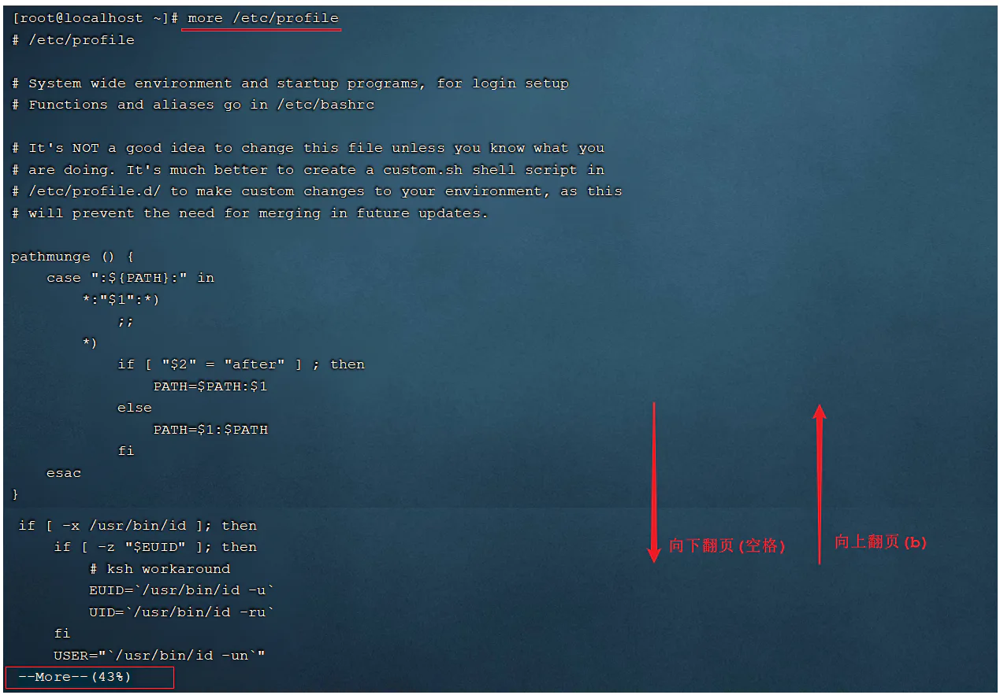

# 查看文件

## 目录

- [du ](#du-)
  - [语法](#语法)
  - [参数说明：](#参数说明)
  - [实例](#实例)
- [cat](#cat)
- [tail](#tail)
  - [参数：](#参数)
  - [实例](#实例)
- [more](#more)
- [less](#less)
- [head](#head)

# du&#x20;

du 会**显示指定的目录或文件所占用的磁盘空间。**

```bash 
du -d 1 -h     

1.2G  ./node_modules
 16M  ./business
 23M  ./bundle
  0B  ./ios
4.1M  ./react-common
4.0K  ./hooks
  0B  ./android
 56K  ./lib
 36K  ./flow-typed
912K  ./react-modern
1.2G  ./build
184M  ./.git
 28K  ./.idea
 13M  ./src
2.7G  .
```


### 语法

```bash 
du [-abcDhHklmsSx][-L <符号连接>][-X <文件>][--block-size][--exclude=<目录或文件>][--max-depth=<目录层数>][--help][--version][目录或文件]
```


## **参数说明**：

- -a或-all 显示目录中个别文件的大小。
- -b或-bytes 显示目录或文件大小时，以byte为单位。
- -c或--total 除了显示个别目录或文件的大小外，同时也显示所有目录或文件的总和。
- -D或--dereference-args 显示指定符号连接的源文件大小。
- -h或--human-readable 以K，M，G为单位，提高信息的可读性。
- -H或--si 与-h参数相同，但是K，M，G是以1000为换算单位。
- -k或--kilobytes 以1024 bytes为单位。
- -l或--count-links 重复计算硬件连接的文件。
- -L<符号连接>或--dereference<符号连接> 显示选项中所指定符号连接的源文件大小。
- -m或--megabytes 以1MB为单位。
- -s或--summarize 仅显示总计。
- -S或--separate-dirs 显示个别目录的大小时，并不含其子目录的大小。
- -x或--one-file-xystem 以一开始处理时的文件系统为准，若遇上其它不同的文件系统目录则略过。
- -X<文件>或--exclude-from=<文件> 在<文件>指定目录或文件。
- \--exclude=<目录或文件> 略过指定的目录或文件。
- \--max-depth=<目录层数> 超过指定层数的目录后，予以忽略。
- \--help 显示帮助。
- \--version 显示版本信息。

## 实例

```bash 
显示目录或者文件所占空间:  只显示当前目录下面的子目录的目录大小和当前目录的总的大小，最下面的1288为当前目录的总大小

# du
608     ./test6
308     ./test4
4       ./scf/lib
4       ./scf/service/deploy/product
4       ./scf/service/deploy/info
12      ./scf/service/deploy
16      ./scf/service
4       ./scf/doc
4       ./scf/bin
32      ./scf
8       ./test3
1288    .

显示指定文件所占空间
# du log2012.log 
300     log2012.log

方便阅读的格式显示test目录所占空间情况：
# du -h test
608K    test/test6
308K    test/test4
4.0K    test/scf/lib
4.0K    test/scf/service/deploy/product
4.0K    test/scf/service/deploy/info
12K     test/scf/service/deploy
16K     test/scf/service
4.0K    test/scf/doc
4.0K    test/scf/bin
32K     test/scf
8.0K    test/test3
1.3M    test


```


# cat

一次性显示文件所有内容，更适合查看小的文件。

```javascript 
cat cloud-init.log
```


【常用参数】

- `-n` 显示行号。

# tail

显示文件的**结尾几行（默认是10行）**

```javascript 
tail cloud-init.log

```


【参数】

- `-n` 指定行数 `tail cloud-init.log -n 2`
- `-f` 会每过1秒检查下文件是否有更新内容， **-f 常用于查阅正在改变的日志文件**；也可以用 `-s` 参数指定间隔时间 `tail -f -s 4 xxx.log`

**`tail -f filename`** 会把 `filename` 文件里的最尾部的内容显示在屏幕上，并且不断刷新，只要 `filename` 更新就可以看到最新的文件内容。

##### 参数：

- -f 循环读取
- -q 不显示处理信息
- -v 显示详细的处理信息
- -c<数目> 显示的字节数
- -n<行数> 显示文件的尾部 n 行内容
- \--pid=PID 与-f合用,表示在进程ID,PID死掉之后结束
- -q, --quiet, --silent 从不输出给出文件名的首部
- -s, --sleep-interval=S 与-f合用,表示在每次反复的间隔休眠S秒

##### **实例**

要显示 notes.log 文件的最后 10 行，请输入以下命令：
&#x20;   `tail notes.log`
要跟踪名为 notes.log 的文件的增长情况，请输入以下命令：
&#x20;   `tail -f notes.log
`此命令显示 notes.log 文件的最后 10 行。当将某些行添加至 notes.log 文件时，tail 命令会继续显示这些行。 显示一直继续，直到您按下（Ctrl-C）组合键停止显示。
显示文件 notes.log 的内容，从第 20 行至文件末尾:
&#x20;   `tail -n +20 notes.log`
显示文件 notes.log 的最后 10 个字符:
&#x20;   `tail -c 10 notes.log`
查看tomocat日志
&#x20;   `tail -f ../logs/catalina.out`

# more

```markdown 
作用: 以分页的形式显示文件内容
语法: more fileName
特点：独 占一个命令终端窗口，并且适合读取大的文件内容，且按照百分比加载展示； 
使用场景：读取一些大文件，且从头开始读取的场景
操作说明:
     回车键     向下滚动一行
    空格键     向下滚动一屏
    b         返回上一屏
    q或者Ctrl+C    退出more
 
举例：
    more /etc/profile        以分页方式显示/etc目录下的profile文件内容
```


**操作示例：**

> 1.使用more命令查看 /etc/profile 文件内容



当我们在查看一些比较大的文件时，我们可能需要经常查询文件尾部的数据信息，那这个时候如果文件很大，我们要一直向下翻页，直到最后一页，去看最新添加的数据，这种方式就比较繁琐了，此时，我们可以借助于tail指令。

思考问题：

- 如果某个文本比较大，而查询的内容比较靠前，则使用more比较合适，但是如果要查询的内容在文件的末尾，使用tail比较合适
- 如果是小文件查询，则使用cat比较合适

# less

分页显示文件内容，更适合查看大的文件。

```javascript 
less cloud-init.log

```


【快捷操作】

- 空格键：前进一页（一个屏幕）；
- `b` 键：后退一页；
- 回车键：前进一行；
- `y` 键：后退一行；
- 上下键：回退或前进一行；
- `d` 键：前进半页；
- `u` 键：后退半页；
- `q` 键：停止读取文件，中止 `less` 命令；
- `=` 键：显示当前页面的内容是文件中的第几行到第几行以及一些其它关于本页内容的详细信息；
- `h` 键：显示帮助文档；
- `/` 键：进入搜索模式后，按 `n` 键跳到一个符合项目，按 `N` 键跳到上一个符合项目，同时也可以输入正则表达式匹配。

# head

显示文件的开头几行（默认是10行）

```javascript 
head cloud-init.log

```


【参数】

- `-n` 指定行数 `head -n 2 cloud-init.log`
