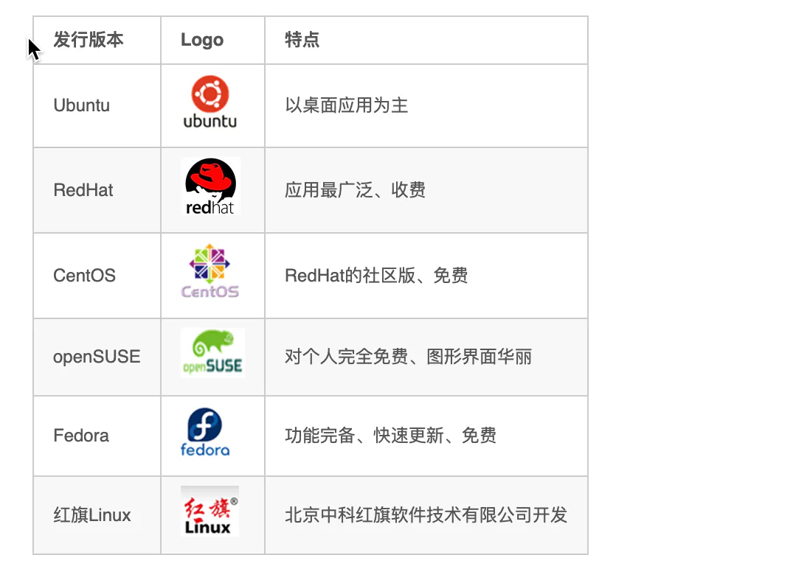

# 发展历史

## 目录

- [2.2 Linux发展历史](#22-Linux发展历史)
- [2.3 Linux系统版本](#23-Linux系统版本)

### 2.2 Linux发展历史

时间：1991年

地点：芬兰赫尔辛基大学

人物：Linus Torvalds（21岁）

语言：C语言、汇编语言

logo：企鹅

特点：免费、开源(源代码开放)、多用户(同时允许多个用户操作同一个Linux系统)、多任务(同时允许多个任务执行)

### 2.3 Linux系统版本

Linux系统的版本分为两种，分别是： 内核版 和 发行版。

**1). 内核版**

- 由Linus Torvalds及其团队开发、维护
- 免费、开源
- 负责控制硬件

**2). 发行版**

- 基于Linux内核版进行扩展
- 由各个Linux厂商开发、维护
- 有收费版本和免费版本

我们使用Linux操作系统，实际上选择的是Linux的发行版本。在linux系统中，有各种各样的发行版本，具体如下：

除了上述罗列出来的发行版，还有很多Linux发行版，这里，我们就不再一一列举了。&#x20;
