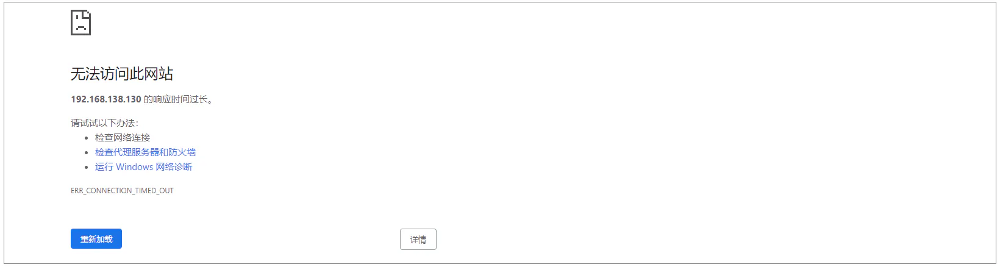
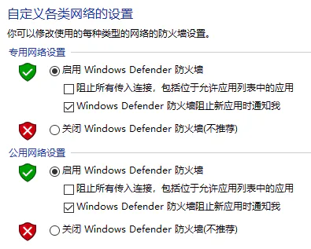
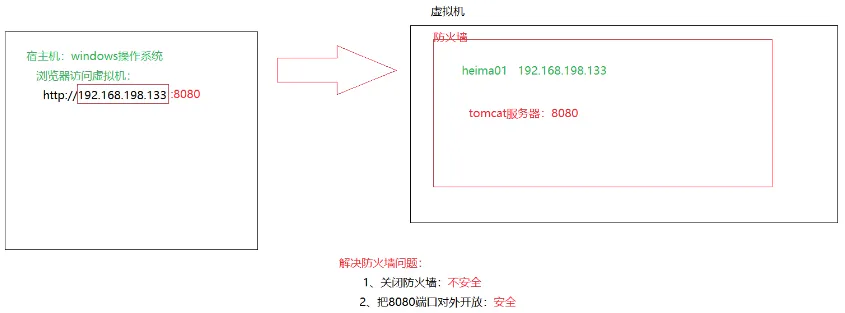
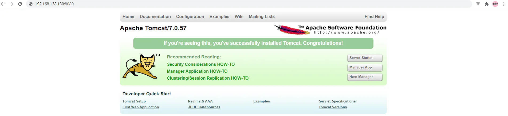

# 防火墙操作

## 目录

- [1.3.3 防火墙操作](#133-防火墙操作)
  - [A. 关闭防火墙](#A-关闭防火墙)
  - [B. 开放Tomcat的端口号8080](#B-开放Tomcat的端口号8080)

#### 1.3.3 防火墙操作

前面我们已经验证了Tomcat服务已经正常启动，接下来我们就可以尝试访问一下。访问地址：`http://192.168.138.130:8080`，我们发现是访问不到的。



那为什么tomcat启动成功了，但就是访问不到呢？原因就在于`Linux`**系统的防火墙，系统安装完毕后，系统启动时，防火墙自动启动，防火墙拦截了所有端口的访问。**

防火墙类似于一个关卡检查人员，当你访问其他人的电脑，或者其他人访问你的电脑，都要进行拦截并进行处理，有的阻止，有的放行。默认情况下防火墙在开机以后就自动启动了。例如下面就是windows的防火墙：



防火墙引发的问题



接下来我们就需要学习一下，如何操作防火墙，具体指令如下：

| 操作              | 指令                                                            | 备注             |
| --------------- | ------------------------------------------------------------- | -------------- |
| 查看防火墙状态         | \\==systemctl status firewalld== / firewall-cmd --state       |                |
| 关闭防火墙           | systemctl stop firewalld                                      |                |
| 永久关闭防火墙(禁用开机自启) | systemctl disable firewalld                                   | \\==下次启动,才生效== |
| 暂时开启防火墙         | systemctl start firewalld                                     |                |
| 永久开启防火墙(启用开机自启) | systemctl enable firewalld                                    | \\==下次启动,才生效== |
| 重启防火墙           | systemctl restart firewalld                                   |                |
| 开放指定端口          | firewall-cmd --zone=public --add-port=8080/tcp --permanent    | \\==需要重新加载生效== |
| 关闭指定端口          | firewall-cmd --zone=public --remove-port=8080/tcp --permanent | \\==需要重新加载生效== |
| 立即生效(重新加载)      | firewall-cmd --reload                                         |                |
| 查看开放端口          | firewall-cmd --zone=public --list-ports                       |                |

> 注意：
>
> A. systemctl是管理Linux中服务的命令，可以对服务进行启动、停止、重启、查看状态等操作
>
> B. firewall-cmd是Linux中专门用于控制防火墙的命令
>
> C. 为了保证系统安全，服务器的防火墙不建议关闭

那么我们要想访问到Tomcat，就可以采取两种类型的操作：

##### **A. 关闭防火墙**

执行指令 :

```bash 
systemctl stop firewalld

```


关闭之后，再次访问Tomcat，就可以访问到了。



注意: 上面我们也提到了，**直接关闭系统的防火墙，是不建议的，因为这样会造成系统不安全。**

##### **B. 开放Tomcat的端口号8080**

执行指令:

```bash 
①. 先开启系统防火墙
systemctl start firewalld

②. 再开放8080端口号
firewall-cmd --zone=public --add-port=8080/tcp --permanent

③. 重新加载防火墙
firewall-cmd --reload

```


| **firewall-cmd**​      | **向防火墙中添加或删除指定端口号**​                                                                                          |
| ---------------------- | ------------------------------------------------------------------------------------------------------------- |
| **--zone=public**​     | 将端口号添加到防火墙中哪个区域\&#x20;  public: 公共区域，默认值。可以让互联网上所有的机器访问这个端口号  internal: 内部区域，让局域网中，内部中机器来访问这个端口号 是public的一个子集 |
| **--add-port=端口/tcp**​ | 添加指定的端口号，使用TCP协议                                                                                              |
| \\--remove-port=端口/tcp | 删除指定的端口号，使用TCP协议                                                                                              |
| **--permanent**​       | 永久的添加，主机重启了也是起作用的                                                                                             |
| \\--list-all           | 显示所有已经添加的端口号                                                                                                  |
| **--reload**​          | 重启加载端口的规则，让新的端口号起作用                                                                                           |

执行上述的操作之后，就开放了当前系统中的8080端口号，再次访问Tomcat。


