# 1.2 安装JDK

## 目录

- [1.2 安装JDK](#12-安装JDK)
- [JDK安装小结](#JDK安装小结)

### 1.2 安装JDK

在linux系统中我们一般将软件安装到根目录下的/usr/local 目录下，我们在这个目录下可以创建一个自定义的目录，然后将jdk tomcat等软件放到这个目录下。

```bash 
操作步骤：
1、在/usr/local目录下创建自定义soft目录
2、使用FinalShell自带的上传工具将jdk的二进制发布包上传到Linux
3、切换到soft目录下
4、解压安装包，命令为tar -zxvf jdk-8u171-linux-x64.tar.gz
5、配置环境变量，使用vim命令修改/etc/profile文件，在文件末尾加入如下配置 按字母G跳转到文件尾部
    # 注意：/usr/local/soft/jdk1.8.0_171 路径不固定，是你的jdk路径位置，复制下面的路径到配置文件/etc/profile
    JAVA_HOME=/usr/local/soft/jdk1.8.0_171
    CLASSPATH=.:$JAVA_HOME/lib
    PATH=$JAVA_HOME/bin:$PATH
    export JAVA_HOME CLASSPATH PATH
6、重新加载profile文件，使更改的配置立即生效，命令为source /etc/profile
7、检查安装是否成功，命令为java -version

```


1.进入到根目录下的/usr/local目录，并创建目录soft

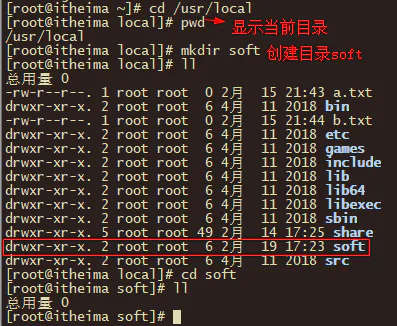

​ 2.将windows系统的jdk软件传递到linux下的soft目录下，并查看soft目录。

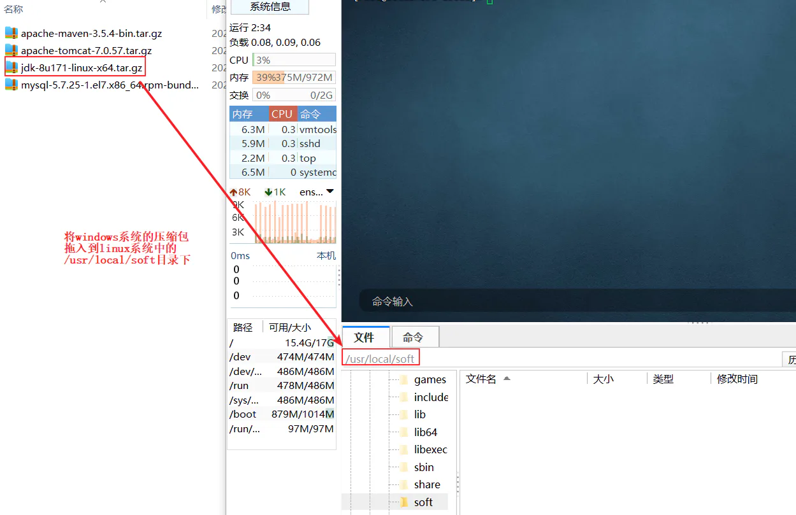

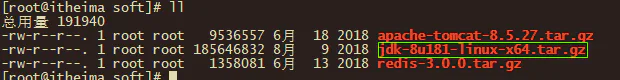

3.**进入“/soft”目录，解压jdk到该目录下**

```bash 
tar-zxvf jdk-8u181-linux-x64.tar.gz
```


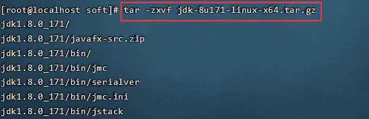

**查看解压后的目录,目录中有jdk1.8.0\_181为jdk解压的目录**

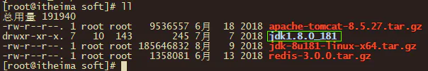

​ 4.到目录jdk1.8.0\_181下查看jdk的安装目录结构

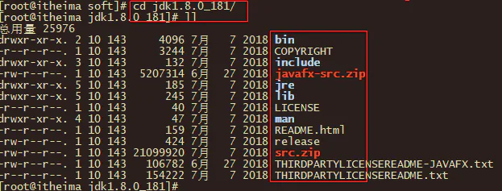

说明：目录结构和在windows系统上安装的目录结构差不多，但是我们发现输入java或者javac命令报错：

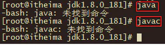

报上述错误的原因是没有配置环境变量，接下来我们需要配置环境变量path.类似于windows系统中配置环境变量一样。

5.**配置jdk环境变量，打开/etc/profile配置文件，将下面配置拷贝进去。export命令用于将shell变量输出为环境变量**

```bash 
#set java environment
# /usr/local/soft/jdk1.8.0_181  文件夹soft是上面你自己创建的文件夹
JAVA_HOME=/usr/local/soft/jdk1.8.0_171
CLASSPATH=.:$JAVA_HOME/lib
PATH=$JAVA_HOME/bin:$PATH
export JAVA_HOME CLASSPATH PATH

```


说明：

1）#表示注释的意思

2）JAVA\_HOME后面的值是bin目录的上一级目录

3）\$表示引用的意思。类似于windows系统中的%JAVA\_HOME%

4）profile是系统的配置文件

**具体操作如下：**

**命令1：vim /etc/profile**

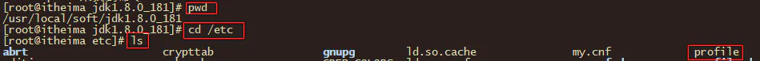


**命令2：输入G跳转到文件末尾处，输入o(表示在光标下插入新行)，复制上面的环境变量配置粘贴如图位置，并写入保存**

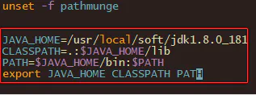

***

6.**重新加载/etc/profile配置文件，并测试**

```bash 
source/etc/profile
```


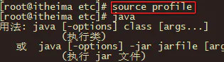

​ 7.**判断JDK是否安装成功**

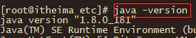

# **JDK安装小结**

1. **解压到压缩包到：/usr/local/soft(自己创建的)**
2. **配置环境变量：/etc/profile**

```bash 
#set java environment
# /usr/local/soft/jdk1.8.0_181  文件夹soft是上面你自己创建的文件夹
JAVA_HOME=/usr/local/soft/jdk1.8.0_171
CLASSPATH=.:$JAVA_HOME/lib
PATH=$JAVA_HOME/bin:$PATH
export JAVA_HOME CLASSPATH PATH

```


3.**重新加载配置: source /etc/profile**

4.检查是否已安装jdk：

```bash 
# 查看安装jdk的软件
[root@192 local]# rpm -qa | grep openjdk
    java-1.8.0-openjdk-headless-1.8.0.312.b07-1.el7_9.x86_64
    java-1.8.0-openjdk-1.8.0.312.b07-1.el7_9.x86_64
# 卸载默认已经安装的openjdk    
[root@192 local]# rpm -qa | grep openjdk |xargs rpm -e --nodeps

```
