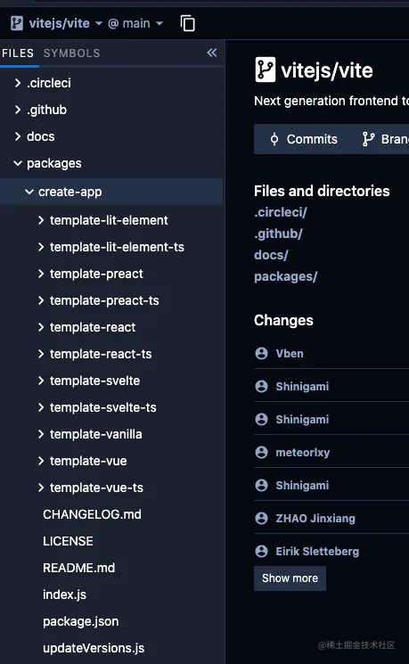

# init

## 目录

- [创建一个新的或者已经存在的 npm 包](#创建一个新的或者已经存在的-npm-包)
- [npm init VS vue create](#npm-init-VS-vue-create)
- [加深 package.json 认识](#加深-packagejson-认识)
- [创建一个 package.json 文件](#创建一个-packagejson-文件)

### **创建一个新的或者已经存在的 npm 包**

> **npm init \<initializer> 通常被用于创建一个新的或者已经存在的 npm 包。**

initializer 在这里是一个名为 `create-<initializer>` 的 npm 软件包，该软件包将由 npx 来安装，然后执行其 package.json 中 bin 属性对应的脚本，会创建或更新 package.json 并运行一些与初始化相关的操作。

官方说明也给出了命令相对应的一些示例：

| 命令                  | 等同                    |
| ------------------- | --------------------- |
| `npm init foo`      | `npx create-foo`      |
| `npm init @usr/foo` | `npx @usr/create-foo` |
| `npm init @usr`     | `npx @usr/create`     |

文章开头的命令 `npm init @vitejs/app` 正好匹配到了第二条示例，对应起来应该是这样：

```typescript 
npm init @vitejs/app --> npx @vitejs/create-app
npm init foo --hello --> npx create-foo --hello。

```


从上面的解释可以看出，在命令行中运行 `npm init @vitejs/app`，实际上是通过了 npx 运行了名为 @vitejs/create-app 这个包，那么我们就去 Vite 官方仓库找一找有没有叫 create-app 的文件？



### npm init VS vue create

我们使用 `vue create` 来创建项目时，背后是 **Vue-CLI 给予我们**的能力。所以我们**得首先安装 Vue-Cli**，然后才可以使用它来创建项目。\*\*而 ****`npm init`**** 则跳过了 CLI 这部分，\*\*它基于指定脚本来实现，所以与 `vue create` 对比，它的优点：

- **项目即工具，更加简单直接**；
- **不用安装额外的 CLI 工具，多**一个工具就多一个使用成本；
- 更新方便，无需同时维护模板和 CLI 工具；

### 加深 package.json 认识

不难发现，create-app 入口文件关键是 package.json 文件的 bin 属性，那么 bin 和 main 有什么区别呢？

| main                                              | bin                                                                                                                                                                                                                                                                    |
| ------------------------------------------------- | ---------------------------------------------------------------------------------------------------------------------------------------------------------------------------------------------------------------------------------------------------------------------- |
| 属性是一个 module ID，是程序的主要的入口点，当然如果不设置，默认值就是 index.js | 如果此 npm 包带有 bin 属性，那么此 npm 包的可执行文件就会被链接到当前项目的 ./node\_modules/.bin 中，此后在命令行中就很方便的执行这个包，比如：node node\_modules/.bin/myapp，更加详细的解释可参照 [package.json bin](https://link.juejin.cn?target=https://docs.npmjs.com/cli/v7/configuring-npm/package-json#bin "package.json bin") |

### 创建一个 package.json 文件

直接以默认配置初始化项目：

```typescript 
 npm init -y
```
