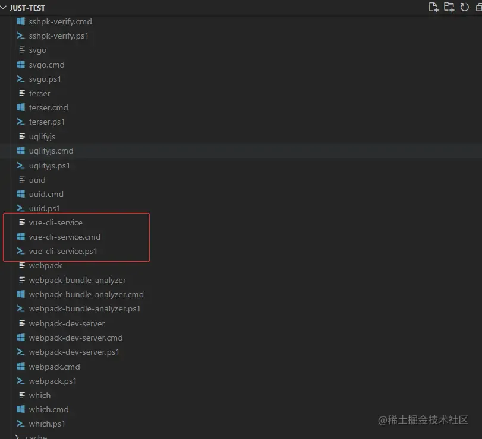
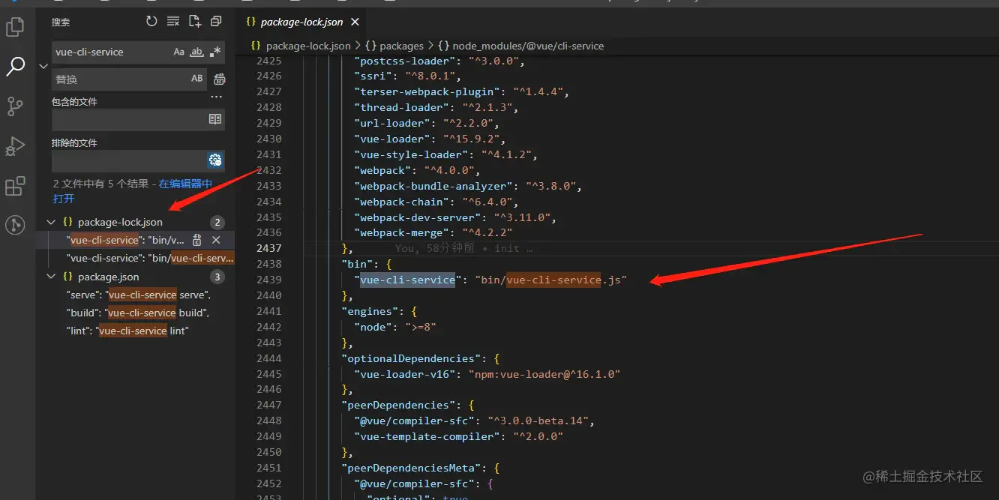

# run

## 目录

- [发生了什么](#发生了什么)
- [为什么](#为什么)
- [bin哪里来](#bin哪里来)
- [总结](#总结)

# 发生了什么

运行 npm run xxx 的时候发生了什么

npm run xxx的时候，首先会去项目的package.json文件里找scripts 里找对应的xxx，然后执行 xxx的命令，例如启动vue项目 npm run serve的时候，实际上就是执行了vue-cli-service serve 这条命令

```typescript 
{
  "name": "h5",
  "version": "1.0.7",
  "private": true,
  "scripts": {
    "serve": "vue-cli-service serve"
   },
}

```


那 为什么 不直接执行`vue-cli-service serve`而要执行`npm run serve` 呢？

- 因为 `npm run serve` 比较简短，比较好写
- 操作系统中没有存在`vue-cli-service`这一条指令；会报错，

# 为什么

那既然`vue-cli-service`这条指令不存在操作系统中，为什么执行`npm run serve`的时候，也就是相当于执行了`vue-cli-service serve` ，为什么这样它就能成功，而且不报指令不存在的错误呢？

我们在安装依赖的时候，是通过`npm i xxx` 来执行的，例如 `npm i @vue/cli-service`，`npm` 在 安装这个依赖的时候，**就会node\_modules/.bin/ 目录中创建 好vue-cli-service 为名的几个可执行文件了。**



.bin 目录，这个**目录不是任何一个 npm 包。**目录下的文件，表示这是**一个个软链接**，打开文件可以看到文件顶部写着 `#!/bin/sh` **，表示这是一个脚本。**

由此我们可以知道，当使用 `npm run serve` 执行 `vue-cli-service  serve` 时，虽然没有安装 vue-cli-service的全局命令，但是 **npm 会到 ./node\_modules/.bin 中找到 vue-cli-service 文件作为  脚本来执行**，则相当于执行了 ./node\_modules/.bin/vue-cli-service serve（最后的 serve 作为参数传入）。

# bin哪里来

你说.bin 目录下的文件表示软连接，那**这个bin目录下的那些软连接文件是哪里来的呢**？它又是怎么知道**这条软连接是执行哪里的呢**？



可以看到，它存在项目最外层的**package-lock.json**文件中

从 package-lock.json 中可知，当我们npm i 整个新建的vue项目的时候，`npm` 将 `bin/vue-cli-service.js `**作为 bin 声明了。**

所以在\*\* npm install 时，npm 读到该配置后\*\*，就将**该文件软链接到 ./node\_modules/.bin 目录**下，而 npm 还会自动把**node\_modules/.bin加入\$PATH**，这样就可以直接作为**命令运行依赖程序和开发依赖程序**，不用全局安装了。

假如我们在安装包时，使用 `npm install -g xxx` 来安装，那么会**将其中的 bin 文件加入到全局**，比如 create-react-app 和 vue-cli ，在全局安装后，就可以直接使用如 vue-cli projectName 这样的命令来创建项目了

也就是说，**npm i 的时候，npm 就帮我们把这种软连接配置好了，其实这种软连接相当于一种映射，** 执行npm run xxx 的时候，就会到 node\_modules/bin中找对应的映射文件，然后再找到相应的js文件来执行

我有点好奇。刚刚看到在node\_modules/bin中 有三个vue-cli-service文件。**为什么会有三个文件呢？**

```typescript 
#  unix 系默认的可执行文件， 必须输入完整文件名
vue-cli-service

#  windows cmd 中默认的可执行文件， 当我们不添加后缀名时，自动根据 pathext 查找文件
vue-cli-service.cmd

#  Windows PowerShell 中可执行文件 ，可以跨平台
vue-cli-service.ps1
```


# 总结

1. 运行 npm run xxx的时候，npm 会先**在当前目录的 node\_modules/.bin 查找要执行的程序**，如果找到则运行；
2. 没有找到则**从全局的 node\_modules/.bin 中查找**，npm i -g xxx就是安装到到全局目录；
3. 如果全局目录还是没找到，那么**就从 path 环境变量中查找有没有其他同名的可执行程序**。
