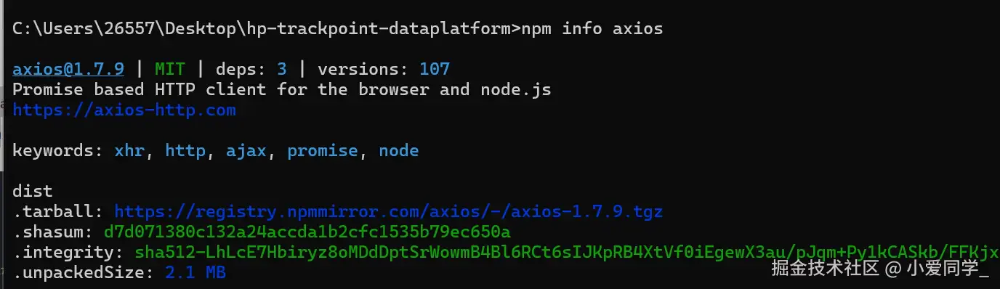

# npm install

## 目录

- [npm缓存](#npm缓存)
- [依赖完整性](#依赖完整性)
  - [下载包](#下载包)
- [整体流程](#整体流程)

## npm缓存

在执行`npm install`或`npm update`命令下载依赖后，除了将依赖包安装在`node_modules`目录下外，还会在本地的缓存目录缓存一份。我们可以通过以下命令获取缓存位置：

```bash 
npm config get cache

```


打开目录有以下文件夹


content-v2存放的是依赖实际的内容，而index-v5则是存放依赖的索引信息

## 依赖完整性

在下载依赖包之前，我们一般就能拿到`npm`对该依赖包计算的`hash`值，例如我们执行`npm info`命令，**紧跟**\*\*`tarball`****(下载链接) 的就是****`shasum`****(****`hash`)\*\*​



在下载依赖包之前，npm 会获取其 shasum 哈希值。**下载完成后，npm 会在本地重新计算哈希值，并与远程的哈希值对比。如果两者一致，则依赖包完整；否则，npm 会重新下载。**

#### 下载包

如果检查**到本地缓存中不存在对应的依赖包,便会通过发送网络请求去下载包。** 具体是通过package-lock.json文件中的resolved字段,当我们尝试通过该字段中的值从浏览器中输入,发现会直接给我们下载了一个文件,例如,我们使用`axios`中的`resolved`中的值,具体值是:

```markdown 
https://registry.npmjs.org/axios/-/axios-1.3.1.tgz

```


## 整体流程


1. 首先，`npm install`需要**检查是否有附加的命令参数**，如`--save`、`--save-dev`，以决定依赖的类型（例如：生产依赖或开发依赖）。如果没有指定，则之后会安装`package.json`中列出的所有依赖。
2. 接着，`npm install`会按**优先级查找配置文件**：项目级`.npmrc`> 用户级`.npmrc`> 全局级`.npmrc`> npm 内置`.npmrc`，并根据配置调整安装行为。
3. 如果项目定义了`preinstall`钩子（例如：`npm run preinstall`），它会在**依赖安装前被执行。可以在此步骤进行一些初始化操作，如检查版本、清理缓存等。**
4. 然后检查是否有lock文件，有的话会检查package.json中的依赖版本是否和package-lock.json中的依赖有冲突。\*\*如果没有冲突，直接在缓存中查找包信息。  \*\*

   如果没有lock文件，会先从npm远程仓库去获取包信息，之后根据package.json构建依赖树，具体过程：
   - 构建依赖树时，不管其是直接依赖还是子依赖的依赖，**优先将其放置**在`node_modules`根目录。
   - **当遇到相同模块时**，判断已放置在依赖树的模块版本是否符合新模块的版本范围，**如果符合则跳过，不符合则在当前模块的**\*\*`node_modules`\*\***下放置该模块。**
5. 之后再在缓存中依次查找依赖树的每个包：
   - **不存在缓存：从npm远程仓库下载包，检验包的完整性，检验不通过就重新下载，检验通过会将下载的包复制到npm缓存目录并按照扁平化的依赖结构解压到node-modules中**
   - 存在依赖：**将缓存按照扁平化的依赖结构解压到node-modules中**
6. **生成lock文件**
