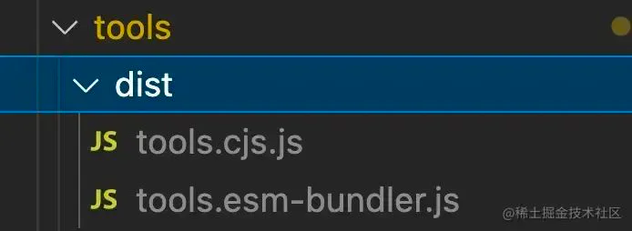
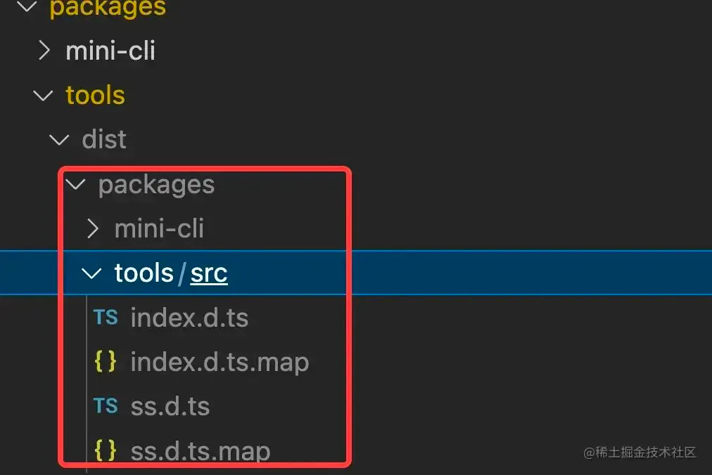
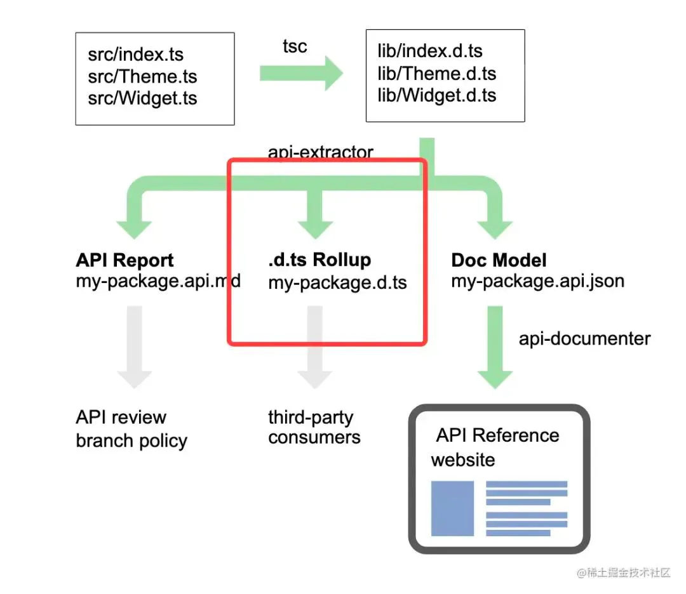
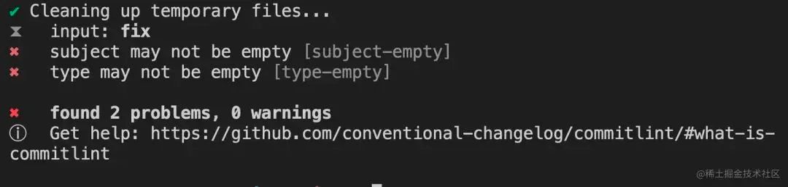

# pnpm workspace实践

## 目录

- [1. 新建仓库并初始化](#1-新建仓库并初始化)
- [2. 指定项目运行的Node、pnpm版本](#2-指定项目运行的Nodepnpm版本)
- [3. 安全性设置](#3-安全性设置)
- [4. 安装包](#4-安装包)
  - [4.1 安装全局依赖包](#41-安装全局依赖包)
  - [4.2 安装子包的依赖](#42-安装子包的依赖)
  - [4.3 打包输出包内容](#43-打包输出包内容)
  - [基础编译配置](#基础编译配置)
  - [多包同时编译](#多包同时编译)
  - [子包自定义编译输出格式](#子包自定义编译输出格式)
  - [命令行自定义打包并指定其格式](#命令行自定义打包并指定其格式)
  - [TS打包](#TS打包)
  - [将生成的声明文件整理到指定文件](#将生成的声明文件整理到指定文件)
- [changesets的使用](#changesets的使用)
  - [1. 安装](#1-安装)
  - [2. 初始化changeset配置](#2-初始化changeset配置)
  - [3. 生成发布包版本信息](#3-生成发布包版本信息)
  - [4. 更新包版本并生成changelog](#4-更新包版本并生成changelog)
  - [5. 版本发布](#5-版本发布)
  - [预发布版本](#预发布版本)
- [代码格式校验](#代码格式校验)
- [代码规范提交](#代码规范提交)
  - [1. Commitizen的使用](#1-Commitizen的使用)
  - [2.Commitlint如何配置](#2Commitlint如何配置)

### 1. 新建仓库并初始化

新建目录`pnpm-workspace-demo`，执行`npm init / pnpm init`初始化项目，生成 **package.json**

### 2. 指定项目运行的Node、pnpm版本

为了减少因`node`或`pnpm`的版本的差异而产生开发环境错误，我们在package.json中增加`engines`字段来限制版本。

```javascript 
{
    "engines": {
        "node": ">=16",
        "pnpm": ">=7"
    }
}

```


### 3. 安全性设置

为了防止我们的根目录被当作包发布，我们需要在package.json加入如下设置：

```javascript 
{
    "private": true
}

```


`pnpm`本身支持monorepo，不用额外安装包，真是太棒了！ 但是每个monorepo的根目录下必须包含`pnpm-workspace.yaml`文件。 目录下新建`pnpm-workspace.yaml`文件，内容如下：

```yaml 
packages:  
# all packages in direct subdirs of packages/  
- 'packages/*'

```


### 4. 安装包

#### 4.1 安装全局依赖包

有些依赖包需要全局安装，也就是安装到根目录，比如我们常用的编译依赖包`rollup、execa、chalk、enquirer、fs-extra、minimist、npm-run-all、typescript`等 运行如下命令：

`-w` 表示在workspace的根目录下安装而不是当前的目录

```sql 
pnpm add rollup chalk minimist npm-run-all typescript -Dw

```


与安装命令`pnpm add pkgname`相反的的删除依赖包`pnpm rm/remove pkgname`或`pnpm un/uninstall pkgname`

#### 4.2 安装子包的依赖

除了**进入子包目录直接安装**`pnpm add pkgname`之外，还**可以通过过滤参数 `--filter`****或****`-F`指定命令作用范围。格式**如下：

`pnpm --filter/-F 具体包目录名/包的name/正则匹配包名/匹配目录 command`

比如：我在packages目录下新建两个子包，分别为`tools`和`mini-cli`，假如我要在`min-cli`包下安装`react`，那么，我们可以执行以下命令：

```sql 
pnpm --filter mini-cli add react
pnpm add react --filter mini-cli
```


#### 4.3 打包输出包内容

这里选用rollup\[5]作为打包工具，由于其打包具有**更小的体积**及**tree-shaking**的特性，可以说是作为工具库打包的最佳选择。

先安装打包常用的一些插件：

```sql 
pnpm add rollup-plugin-typescript2 @rollup/plugin-json @rollup/plugin-terser -Dw

```


#### 基础编译配置

目录下新建rollup的配置文件`rollup.config.mjs`，考虑到多个包同时打包的情况，预留`input`为通过`rollup`通过参数传入。这里用`process.env.TARGET`表示不同包目录。

以下为编译的基础配置，主要包括:

- 支持的输出包格式，即`format`种类，预定义好输出配置，方便后面使用
- 根据`rollup`动态传入包名获取`input`
- 对浏览器端使用的format进行压缩处理
- 将rollup配置导出为数组，每种format都有一组配置，每个包可能需要导出多种format

```javascript 
import { createRequire } from 'module'
import { fileURLToPath } from 'url'
import path from 'path'
import json from '@rollup/plugin-json'
import terser from '@rollup/plugin-terser'

const require = createRequire(import.meta.url)
const __dirname = fileURLToPath(new URL('.', import.meta.url))
const packagesDir = path.resolve(__dirname, 'packages')
const packageDir = path.resolve(packagesDir, process.env.TARGET)

const resolve = p => path.resolve(packageDir, p)
const pkg = require(resolve(`package.json`))
const packageOptions = pkg.buildOptions || {}
const name = packageOptions.filename || path.basename(packageDir)

// 定义输出类型对应的编译项
const outputConfigs = {
'esm-bundler': {
    file: resolve(`dist/${name}.esm-bundler.js`),
    format: `es`
  },
  'esm-browser': {
    file: resolve(`dist/${name}.esm-browser.js`),
    format: `es`
  },
  cjs: {
    file: resolve(`dist/${name}.cjs.js`),
    format: `cjs`
  },
  global: {
    name: name,
    file: resolve(`dist/${name}.global.js`),
    format: `iife`
  }
}

const packageFormats = ['esm-bundler', 'cjs']
const packageConfigs = packageFormats.map(format => createConfig(format, outputConfigs[format]))

export default packageConfigs

function createConfig(format, output, plugins = []) {
  // 是否输出声明文件
  const shouldEmitDeclarations = !!pkg.types
  
  const minifyPlugin = format === 'global' && format === 'esm-browser' ? [terser()] : []
  return {
      input: resolve('src/index.ts'),
  // Global and Browser ESM builds inlines everything so that they can be
  // used alone.
  external: [
      ...['path', 'fs', 'os', 'http'],
      ...Object.keys(pkg.dependencies||{}),
      ...Object.keys(pkg.peerDependencies || {}),
      ...Object.keys(pkg.devDependencies||{}),
    ],
  plugins: [
    json({
      namedExports: false
    }),
    ...minifyPlugin,
    ...plugins
  ],
  output,
  onwarn: (msg, warn) => {
    if (!/Circular/.test(msg)) {
      warn(msg)
    }
  },
  treeshake: {
    moduleSideEffects: false
  }
  }
}

```


#### 多包同时编译

根目录下新建`scripts`目录，并新建`build.js`用于打包编译执行。为了实现多包同时进行打包操作，我们首先需要获取`packages`下的所有子包

```javascript 
const fs = require('fs')
const {rm} = require('fs/promises')
const path = require('path')
const allTargets = (fs.readdirSync('packages').filter(f => {
    // 过滤掉非目录文件
    if (!fs.statSync(`packages/${f}`).isDirectory()) {
      return false
    }
    const pkg = require(`../packages/${f}/package.json`)
    // 过滤掉私有包和不带编译配置的包
    if (pkg.private && !pkg.buildOptions) {
      return false
    }
    return true
  }))

```


获取到子包之后就可以执行build操作，这里我们借助 execa\[6] 来执行`rollup`命令。代码如下：

```javascript 
const build = async function (target) { 
    const pkgDir = path.resolve(`packages/${target}`)
    const pkg = require(`${pkgDir}/package.json`)

    // 编译前移除之前生成的产物
    await rm(`${pkgDir}/dist`,{ recursive: true, force: true })
    
    // -c 指使用配置文件 默认为rollup.config.js
    // --environment 向配置文件传递环境变量 配置文件通过proccess.env.获取
    await execa(
        'rollup',
        [
          '-c',
          '--environment',
          [
            `TARGET:${target}`
          ]
            .filter(Boolean)
            .join(',')
        ],
        { stdio: 'inherit' }
    )
}

```


同步编译多个包时，为了不影响编译性能，我们需要控制并发的个数，这里我们暂定并发数为`4`，编译入口大概长这样：

```javascript 
const targets = allTargets // 上面的获取的子包
const maxConcurrency = 4 // 并发编译个数

const buildAll = async function () {
  const ret = []
  const executing = []
  for (const item of targets) {
  // 依次对子包执行build()操作
    const p = Promise.resolve().then(() => build(item))
    ret.push(p)

    if (maxConcurrency <= targets.length) {
      const e = p.then(() => executing.splice(executing.indexOf(e), 1))
      executing.push(e)
      if (executing.length >= maxConcurrency) {
        await Promise.race(executing)
      }
    }
  }
  return Promise.all(ret)
}
// 执行编译操作
buildAll()

```


最后，我们将脚本添加到根目录的package.json中即可。

```javascript 
{
    "scripts": {
    "build": "node scripts/build.js"
  },
}

```


现在我们简单运行`pnpm run build`即可完成所有包的编译工作。（注：还需要添加后面的`TS`插件才能工作）。

此时，在每个包下面会生成`dist`目录，因为我们默认的是`esm-bundler`和`cjs`两种format，所以目录下生成的文件是这样的



那么，如果我们想自定义生成文件的格式该怎么办呢？

#### 子包自定义编译输出格式

最简单的方法其实就是在package.json里做配置，在打包的时候我们直接取这里的配置即可，比如我们在包`tools`里做如下配置：

```javascript 
{
"buildOptions": {
    "name": "tools", // 定义global时全局变量的名称
    "filename": "tools", // 定义输出的文件名 比如tools.esm-browser.js 生成的文件为[filename].[format].js
    "formats": [ // 定义输出
      "esm-bundler",
      "esm-browser",
      "cjs",
      "global"
    ]
  },

```


这里我们只需要在基础配置文件`rollup.config.mjs`里去做些改动即可：

```javascript 
const defaultFormats = ['esm-bundler', 'cjs']
const packageFormats = packageOptions.formats || defaultFormats // 优先使用每个包里自定义的formats
const packageConfigs = packageFormats.map(format => createConfig(format, outputConfigs[format]))

```


#### 命令行自定义打包并指定其格式

比如我想单独打包`tools`并指定输出的文件为`global`类型，大概可以这么写：

```javascript 
pnpm run build tools --formats global

```


这里其实就是将**命令行参数接入到打包脚本里即可**。 大概分为以下几步：

1. 使用minimist\[7]取得命令行参数

```javascript 
const args = require('minimist')(process.argv.slice(2))
const targets = args._.length ? args._ : allTargets
const formats = args.formats || args.f

```


1. 将取得的参数传递到`rollup`的环境变量中，修改`execa`部分

```javascript 
await execa(
        'rollup',
        [
          '-c',
          '--environment', // 传递环境变量  配置文件可通过proccess.env.获取
          [
            `TARGET:${target}`,
            formats ? `FORMATS:${formats}` : `` // 将参数继续传递 
          ]
            .filter(Boolean)
            .join(',')
        ],
        { stdio: 'inherit' }
    )

```


1. 在`rollup.config.mjs`中获取环境变量并应用

```javascript 
const defaultFormats = ['esm-bundler', 'cjs']
const inlineFormats = process.env.FORMATS && process.env.FORMATS.split(',') // 获取rollup传递过来的环境变量process.env.FORMATS
const packageFormats = inlineFormats || packageOptions.formats || defaultFormats

```


#### TS打包

对于ts编写的项目通常也会发布声明文件，只需要在`package.json`添加`types`字段来指定声明文件即可。那么，我们其实在做打包时就可以利用这个字段来判断是否要生成声明文件。对于rollup，我们利用其插件`rollup-plugin-typescript2`来解析ts文件并生成声明文件。 在rollup.config.mjs中添加如下配置：

```javascript 
// 是否输出声明文件 取每个包的package.json的types字段
  const shouldEmitDeclarations = !!pkg.types

  const tsPlugin = ts({
    tsconfig: path.resolve(__dirname, 'tsconfig.json'),
    tsconfigOverride: {
      compilerOptions: {
        target: format === 'cjs' ? 'es2019' : 'es2015',
        sourceMap: true,
        declaration: shouldEmitDeclarations,
        declarationMap: shouldEmitDeclarations
      }
    }
  })
  
  return {
      ...
      plugins: [
        json({
          namedExports: false
        }),
        tsPlugin,
        ...minifyPlugin,
        ...plugins
      ],
    }

```


#### 将生成的声明文件整理到指定文件

以上配置运行后会在每个包下面生成所有包的声明文件，如图：



这并不是我们想要的，我们期望在dist目录下仅生成一个 **.d.ts**文件就好了，使用起来也方便。这里我们借助api-extractor\[8]来做这个工作。这个工具主要有三大功能，我们要使用的是红框部分的功能，如图：



关键实现步骤：

1. 根目录下生成`api-extractor.json`并将`dtsRollup`设置为开启
2. 子包下添加`api-extractor.json`并定义声明文件入口及导出项，如下所示：

```javascript 
{
  "extends": "../../api-extractor.json",
  "mainEntryPointFilePath": "./dist/packages/<unscopedPackageName>/src/index.d.ts", // rollup生成的声明文件
  "dtsRollup": {
    "publicTrimmedFilePath": "./dist/<unscopedPackageName>.d.ts" // 抽离为一个声明文件到dist目录下
  }
}

```


1. 在rollup执行完成后做触发`API Extractor`操作，在build方法中增加以下操作：

```javascript 
build(target) {
    await execa('rollup')
    // 执行完rollup生成声明文件后
    // package.json中定义此字段时执行
    if (pkg.types) { 
        console.log(
          chalk.bold(chalk.yellow(`Rolling up type definitions for ${target}...`))
        )
        // 执行API Extractor操作 重新生成声明文件
        const { Extractor, ExtractorConfig } = require('@microsoft/api-extractor')
        const extractorConfigPath = path.resolve(pkgDir, `api-extractor.json`)
        const extractorConfig =
         ExtractorConfig.loadFileAndPrepare(extractorConfigPath)
         const extractorResult = Extractor.invoke(extractorConfig, {
          localBuild: true,
          showVerboseMessages: true
        })
        if (extractorResult.succeeded) {
          console.log(`API Extractor completed successfully`);
          process.exitCode = 0;
        } else {
          console.error(`API Extractor completed with ${extractorResult.errorCount} errors`
            + ` and ${extractorResult.warningCount} warnings`);
          process.exitCode = 1;
        }
        
        // 删除ts生成的声明文件
        await rm(`${pkgDir}/dist/packages`,{ recursive: true, force: true })
      }
}

```


1. 删除`rollup`生成的声明文件

那么，到这里，整个打包流程就比较完备了。

# changesets的使用

对于pnpm workspace实现的monorepo，如果要管理包版本并发布，需要借助一些工具，官方推荐使用如下工具：

- changesets\[9]
- rush\[10]

我们这里主要学习一下`changesets`的使用，它的主要作用有两个：

- **管理包版本**
- **生成changelog**

对于`monorepo`项目使用它会更加方便，当然单包也可以使用。主要区别在于项目下有没有`pnpm-workspace.yaml`，如果未指定多包，那么会当作普通包进行处理。 那么，我们来看一下具体的步骤：

## 1. 安装

```javascript 
pnpm add @changesets/cli -Dw
```


## 2. 初始化changeset配置

```javascript 
npx changeset init

```


这个命令会在根目录下生成`.changeset`文件夹，文件夹下包含一个config文件和一个readme文件。生成的config文件长这样：

```javascript 
{
  "$schema": "https://unpkg.com/@changesets/config@2.3.0/schema.json",
  "changelog": "@changesets/cli/changelog",
  "commit": false, // 是否提交因changeset和changeset version引起的文件修改
  "fixed": [], // 设置一组共享版本的包 一个组里的包，无论有没有修改、是否有依赖，都会同步修改到相同的版本
  "linked": [], // 设置一组需要关联版本的包 有依赖关系或有修改的包会同步更新到相同版本 未修改且无依赖关系的包则版本不做变化
  "access": "public", // 发布为私有包/公共包
  "baseBranch": "main",
  "updateInternalDependencies": "patch", // 确保依赖包是否更新、更新版本的衡量单位
  "ignore": [] // 忽略掉的不需要发布的包
}

```


关于每个配置项的详细含义参考：config.json\[11] 这里有几点需要注意的：

- `access` 默认`restricted`发布为私有包，需要改为`public`公共包，否则发布时会报错
- 对于依赖包版本的控制，我们需要重点理解一下 **fixed**\[12] 和 **linked**\[13] 的区别
- `fixed`和`linked`的值为二维数组，元素为具体的包名或匹配表达式，但是这些包必须在`pnpm-workspace.yaml`添加过

## 3. 生成发布包版本信息

运行`npx changeset`，会出现一系列确认问题，包括：

- 需要为哪些包更新版本
- 哪些包更新为major版本
- 哪些包更新为minor版本
- 修改信息（会添加到最终生成的changelog.md中） 所有问题回答完成之后，会在`.changeset`下生成一个`Markdown`文件，这个文件的内容就是刚才问题的答案集合，大概长这样:

```javascript 
---
'@scope/mini-cli': major
'@scope/tools': minor
---

update packages
```


—-- 中间为要更新版本的包列表 以及包对应的更新版本，最下面是修改信息

## 4. 更新包版本并生成changelog

运行`npx changeset version` 这个命令会做以下操作

- 依据上一步生成的md文件和changeset的config文件更新相关包版本
- 为版本更新的包生成`CHANGELOG.md`文件 填入上一步填写的修改信息
- 删除上一步生成的`Markdown`文件，保证只使用一次

**建议执行此操作后，** \*\*​`pulish`\*\***之前将改动合并到主分支**

## 5. 版本发布

这个没啥好说的，直接执行命令`npx changeset publish`即可

为了保证发布功能，添加如下脚本：

```javascript 
{
    "scripts": {
        "release": "run-s build releaseOnly",
        "releaseOnly": "changeset publish"
    }
}

```


## 预发布版本

changeset提供了带tag的预发布版本的模式，这个模式使用时候需要注意：

- 通过`pre enter/exit`进入或退出预发布模式，在这个模式下可以执行正常模式下的所有命令，比如`version`、`publish`
- 为了不影响正式版本，预发布模式最好**在单独分支进行操作**，以免带来不好修复的问题
- 预发布模式下，版本号为正常模式下应该生成的版本号加`-<tag>.<num>`结尾。`tag`为pre命令接的tag名，`num`每次发布都会递增 从0开始
- **预发布的版本并不符合语义化版本的范围**，比如我的依赖包版本为"^1.0.0"，那么，预发布版本是不满足这个版本的，所以依赖包版本会保持不变

一个完整的预发布包大概要执行以下操作：

1. `changeset pre enter <tag>` 进入预发布模式
2. `changeset` 确认发布包版本信息
3. `changeset version` 生成预发布版本号和changelog
4. `changeset publish` 发布预发布版本

这里的`tag`可以是我们常用的几种类型：

| 名称    | 功能                                               |
| ----- | ------------------------------------------------ |
| alpha | 是内部测试版，一般不向外部发布，会有很多Bug，一般只有测试人员使用               |
| beta  | 也是测试版，这个阶段的版本会一直加入新的功能。在Alpha版之后推出               |
| rc    | (Release　Candidate) 发行候选版本。RC版不会再加入新的功能了，主要着重于除错 |

**每次需要更新版本时从第二步往后再次执行即可**

如果需要发布正式版本，退出预发布模式`changeset pre exit`，然后切换到主分支操作即可

# 代码格式校验

这里主要对代码风格进行校验， 校验工具为`eslint` （主要对js、ts等js语言的文件）和 `prettier`（js、css等多种类型的文件）

辅助工具为

- **lint-stage**\[14] 检查暂存区中的文件
- **simple-git-hooks**\[15] 一个git钩子管理工具，优点是使用简单，缺点是每个钩子只能执行一个命令，如果需要执行多个命令可以选择`husky`

配置如下：

```javascript 
{
    "simple-git-hooks": {
        "pre-commit": "pnpm lint-staged" // 注册提交前操作 即进行代码格式校验
      },
    "lint-staged": {
        "*.{js,json}": [
          "prettier --write"
        ],
        "*.ts?(x)": [
          "eslint",
          "prettier --parser=typescript --write"
        ]
    },
}

```


对于钩子函数的注册通过`simple-git-hooks`来实现，在项目安装依赖之后触发钩子注册。可以添加以下脚本。（如果钩子操作改变，则需要重新执行安装依赖操作来更新）

```javascript 
"scripts": {
    "postinstall": "simple-git-hooks",
  },

```


# 代码规范提交

这里主要用到以下三个工具：

- **Commitizen**\[16]：**是一个命令行提示工具，它主要用于帮助我们更快地写出规范的commit message**
- **Commitlint**\[17]：**用于校验填写的commit message是否符合设定的规范**
- **simple-git-hooks**\[18]

## 1. Commitizen的使用

1. 安装`Commitizen`

```javascript 
npm install -g commitizen

```


1. 安装`Commitizen`的适配器，确定使用的规范，这里使用cz-conventional-changelog\[19]，也可以选择其他的适配器

```javascript 
npm install -g cz-conventional-changelog

```


1. 全局指定适配器

```javascript 
echo '{ "path": "cz-conventional-changelog" }' > ~/.czrc

```


这个时候执行命令git cz会自动进入交互式生成commit message的询问中，如图：

## 2.Commitlint如何配置

我们可以通过配置的`git cz`命令进行规范的代码提交，那么，如果其他同事依然使用的是`git commit`来提交代码的话，那么，提交信息就会比较乱。这时候就需要对`commit mesaage`进行校验了，如果不通过则中断提交。这个校验就可以通过`Commitlint`来完成。

对于按照何种规则来校验，我们就需要单独安装检验规则的包来进行检验，比如@commitlint/config-conventional\[20]

如果想定义自己的规则可以参考cz-customizable\[21]

1. 首先安装这两个包：

```javascript 
pnpm add @commitlint/config-conventional @commitlint/cli -Dw

```


1. 根目录下写入`commitlint`配置，指定规则包

```javascript 
echo "module.exports = {extends: ['@commitlint/config-conventional']}" > commitlint.config.js

```


1. 配置git钩子执行校验操作 （执行`pnpm install`更新钩子）

```javascript 
"simple-git-hooks": {
    "commit-msg": "npx --no -- commitlint --edit ${1}"
  },

```


这个时候再提交会对commit message进行校验，不符合规范则会出现以下提示：


