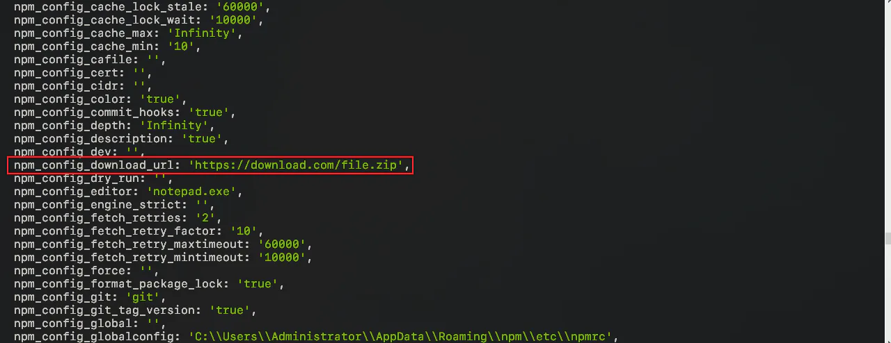

# npm scripts 使用指南

## 目录

- [二、原理](#二原理)
- [四、传参](#四传参)
- [五、执行顺序](#五执行顺序)
- [六、默认值](#六默认值)
- [七、钩子](#七钩子)
- [九、变量](#九变量)
- [十、常用脚本示例](#十常用脚本示例)
- [自定义 npm 包读取外部 npm install 时传入的命令行参数](#自定义-npm-包读取外部-npm-install-时传入的命令行参数)
  - [使用 .npmrc 配置文件](#使用-npmrc-配置文件)
- [传参](#传参)
- [获取参数](#获取参数)

[ npm scripts 使用指南 - 阮一峰的网络日志  https://www.ruanyifeng.com/blog/2016/10/npm\_scripts.html](https://www.ruanyifeng.com/blog/2016/10/npm_scripts.html " npm scripts 使用指南 - 阮一峰的网络日志  https://www.ruanyifeng.com/blog/2016/10/npm_scripts.html")

## 二、原理

npm 脚本的原理非常简单。每当执行`npm run`，就会自动新建一个 Shell，在这个 Shell 里面执行指定的脚本命令。因此，只要是 Shell（一般是 Bash）可以运行的命令，就可以写在 npm 脚本里面。

比较特别的是，`npm run`新建的这个 Shell，**会将当前目录的**\*\*`node_modules/.bin`****子目录加入****`PATH`****变量，执行结束后，再将****`PATH`\*\***变量恢复原样。**

这意味着，当前目录的`node_modules/.bin`子目录里面的所有脚本，都可以直接用脚本名调用，而不必加上路径。比如，当前项目的依赖里面有 Mocha，只要直接写`mocha test`就可以了。

```json 
"test": "mocha test"

```


而不用写成下面这样。

```json 
"test": "./node_modules/.bin/mocha test"

```


由于 npm 脚本的唯一要求就是可以在 Shell 执行，因此它不一定是 Node 脚本，任何可执行文件都可以写在里面。

npm 脚本的退出码，**也遵守 Shell 脚本规则。如果退出码不是**\*\*`0`，npm 就认为这个脚本执行失败。\*\*​

## 四、传参

向 npm 脚本传入参数，要使用`--`标明。

```javascript 
"lint": "jshint **.js"

```


向上面的`npm run lint`命令传入参数，必须写成下面这样。

```bash 
$ npm run lint --  --reporter checkstyle > checkstyle.xml

```


也可以在`package.json`里面再封装一个命令。

```javascript 

"lint": "jshint **.js",
"lint:checkstyle": "npm run lint -- --reporter checkstyle > checkstyle.xml"

```


## 五、执行顺序

如果 npm 脚本里面需要执行多个任务，那么需要明确它们的执行顺序。

如果是并行执行（即同时的平行执行），可以使用`&`符号。

```javascript 
$ npm run script1.js & npm run script2.js

```


如果是继发执行（即只有前一个任务成功，才执行下一个任务），可以使用&&符号。

```javascript 
$ npm run script1.js && npm run script2.js

```


这两个符号是 Bash 的功能。此外，还可以使用 node 的任务管理模块：[script-runner](https://github.com/paulpflug/script-runner "script-runner")`、`[npm-run-all](https://github.com/mysticatea/npm-run-all "npm-run-all")`、`[redrun](https://github.com/coderaiser/redrun "redrun")`。`

## 六、默认值

一般来说，npm 脚本由用户提供。但是，npm 对两个脚本提供了默认值。也就是说，这两个脚本不用定义，就可以直接使用。

```json 
"start": "node server.js"，
"install": "node-gyp rebuild"

```


上面代码中，`npm run start`的默认值是`node server.js`，前提是项目根目录下有`server.js`这个脚本；`npm run install`的默认值是`node-gyp rebuild`，前提是项目根目录下有`binding.gyp`文件。

## 七、钩子

npm 脚本有`pre`和`post`两个钩子。举例来说，`build`脚本命令的钩子就是`prebuild`和`postbuild`。

```json 
"prebuild": "echo I run before the build script",
"build": "cross-env NODE_ENV=production webpack",
"postbuild": "echo I run after the build script"

```


用户执行`npm run build`的时候，会自动按照下面的顺序执行。

```bash 
npm run prebuild && npm run build && npm run postbuild

```


因此，可以在这两个钩子里面，完成一些准备工作和清理工作。下面是一个例子。

```json 

"clean": "rimraf ./dist && mkdir dist",
"prebuild": "npm run clean",
"build": "cross-env NODE_ENV=production webpack"

```


npm 默认提供下面这些钩子。

- prepublish，postpublish
- &#x20;preinstall，postinstall
- &#x20;  preuninstall，postuninstall
- &#x20;  preversion，postversion
- &#x20;  pretest，posttest
- &#x20;  prestop，poststop
- &#x20;  prestart，poststart
- &#x20;  prerestart，postrestart

**自定义的脚本命令也可以加上**\*\*`pre`****和****`post`\*\***钩子**。比如，`myscript`这个脚本命令，也有`premyscript`和`postmyscript`钩子。不过，双重的`pre`和`post`无效，比如`prepretest`和`postposttest`是无效的。

npm 提供一个`npm_lifecycle_event`**变量，返回当前正在运行的脚本名称**，比如`pretest`、`test`、`posttest`等等。所以，可以利用这个变量，在同一个脚本文件里面，为不同的`npm scripts`命令编写代码。请看下面的例子。

```typescript 
const TARGET = process.env.npm_lifecycle_event;
 
if (TARGET === 'test') {
  console.log(`Running the test task!`);
}

if (TARGET === 'pretest') {
  console.log(`Running the pretest task!`);
}

if (TARGET === 'posttest') {
  console.log(`Running the posttest task!`);
}
```


注意，`prepublish`这个钩子不仅会在`npm publish`命令之前运行，还会在`npm install`（不带任何参数）命令之前运行。这种行为很容易让用户感到困惑，所以 npm 4 引入了一个新的钩子`prepare`，行为等同于`prepublish`，而从 npm 5 开始，`prepublish`将只在`npm publish`命令之前运行。

## 九、变量

npm 脚本有一个非常强大的功能，就是可以使用 npm 的内部变量。

首先，通过`npm_package_`前缀，npm 脚本可以拿到`package.json`里面的字段。比如，下面是一个`package.json`。

```json 
{
  "name": "foo", 
  "version": "1.2.5",
  "scripts": {
    "view": "node view.js"
  }
}

```


那么，变量`npm_package_name`返回`foo`，变量`npm_package_version`返回`1.2.5`。

```javascript 
// view.js
console.log(process.env.npm_package_name); // foo
console.log(process.env.npm_package_version); // 1.2.5
```


上面代码中，我们通过环境变量`process.env`对象，拿到`package.json`的字段值。如果是 Bash 脚本，可以用`$npm_package_name`和`$npm_package_version`取到这两个值。

`npm_package_`**前缀也支持嵌套的**`package.json`字段。

```json 

  "repository": {
    "type": "git",
    "url": "xxx"
  },
  scripts: {
    "view": "echo $npm_package_repository_type"
  }

```


上面代码中，`repository`字段的`type`属性，可以通过`npm_package_repository_type`取到。

下面是另外一个例子。

```json 
"scripts": {
  "install": "foo.js"
}
```


上面代码中，`npm_package_scripts_install`变量的值等于`foo.js`。

然后 \*\*，npm 脚本还可以通过`npm_config_`前缀，拿到 npm 的配置变量，**即`npm config get xxx`命令返回的值。比如，当前模块的发行标签，可以通过`npm_config_tag`取到。（**`.npmrc 配置的变量也可以`\*\*）

```bash 
"view": "echo $npm_config_tag",

```


注意，package.json里面的config对象，可以被环境变量覆盖。

```json 
{ 
  "name" : "foo",
  "config" : { "port" : "8080" },
  "scripts" : { "start" : "node server.js" }
}

```


上面代码中，`npm_package_config_port`变量返回的是`8080`。这个值可以用下面的方法覆盖。

```bash 
$ npm config set foo:port 80

```


最后，`env`**命令可以列出所有环境变量。**

```json 
"env": "env"

```


## 十、常用脚本示例

```json 

// 删除目录
"clean": "rimraf dist/*",

// 本地搭建一个 HTTP 服务
"serve": "http-server -p 9090 dist/",

// 打开浏览器
"open:dev": "opener http://localhost:9090",

// 实时刷新
 "livereload": "live-reload --port 9091 dist/",

// 构建 HTML 文件
"build:html": "jade index.jade > dist/index.html",

// 只要 CSS 文件有变动，就重新执行构建
"watch:css": "watch 'npm run build:css' assets/styles/",

// 只要 HTML 文件有变动，就重新执行构建
"watch:html": "watch 'npm run build:html' assets/html",

// 部署到 Amazon S3
"deploy:prod": "s3-cli sync ./dist/ s3://example-com/prod-site/",

// 构建 favicon
"build:favicon": "node scripts/favicon.js",

```


# 自定义 npm 包读取外部 npm install 时传入的命令行参数

```bash 
npm install --download-url=https://download.com/file.zip
```


当我们在 npm install 后面增加了一个 `--download-url` 参数时，此参数会将参数和值设置到进程的环境变量中，[logger.info](http://logger.info "logger.info") 再次打印 `process.env` 时就会打印出此变量：



仔细看会发现，我们加的参数前被增加了 `npm_config_` 前缀，**并且中横线也被替换为下划线。所以读取的时候要注意一下：**

```javascript 
if (process.env.npm_config_download_url) {
  // ...
}
```


### 使用 .npmrc 配置文件

通过命令行配置是一种方式，但有时我们希望不需要敲繁琐的命令就一直让 download-url 参数为一个固定值，我们也可以在项目根目录下新建一个名为 `.npmrc` 的配置文件，将变量储存进去：

```yaml title=".npmrc"
download_url=https://download.com/file_new.zip
```


这样就不需要每次在 `npm install` 的时候去指定参数了。需要注意的是，`.npmrc` 配置的**优先级要高于命令行参数**，所以如果你添加了 `.npmrc` 又在**命令行使用了同样的参数列表**，那么始终以 `.npmrc` 为准。

# 传参

```typescript 
1.用命令行给 scripts 传参
npm run dev --q.js

"scripts": {
    "test": "echo \"Error: no test specified\" && exit 1",
    "dev": "nodemon"
  },

上面等价于 nodemon q.js

2.scripts 固定传参数
"scripts": {
    "test": "echo \"Error: no test specified\" && exit 1",
    "dev": "nodemon q.js"
},

```


# 获取参数

webpack打包配置，因为sit和生产环境host不同，区别sit环境；nodejs npm命令需要自定义参数。

```typescript 

  "scripts": {
    "start": "webpack-dev-server",
    "build": "webpack -p=PRODUCT --display-error-details",
    "sit": "webpack -p=SIT --display-error-details",
  },

```


但是，这些参数如何获取呢？

```typescript 
第一：process.argv 
 第二：process.env.npm_config_argv 


运行npm run sit，
console.log('process.env.npm_config_argv')
 console.log(process.env.npm_config_argv) 
 console.log("process.argv") 
console.log(process.argv)


 process.env.npm_config_argv 
 {"remain":[],"cooked":["run","sit"],"original":["run","sit"]} 

 process.argv 
 [ '/usr/local/bin/node', 
   '/www/sfapp/cod-1201/node_modules/.bin/webpack', 
   '-p=SIT', 
   '--display-error-details' ] 

如此，在工作中，根据需求解决 sit和product发布问题。


```
