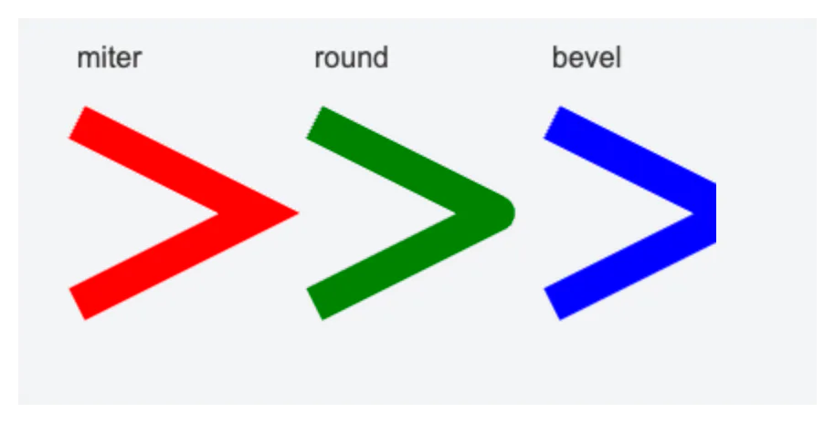
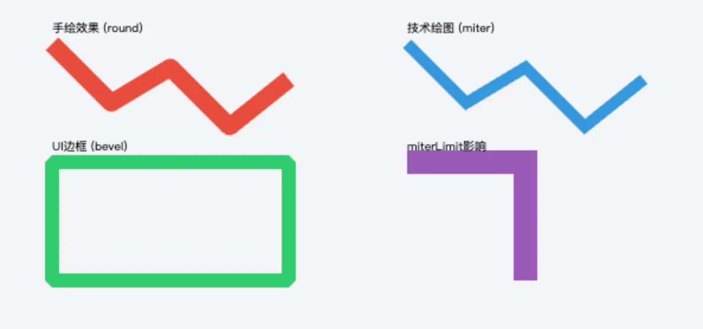

#  接洽点样式lineJoin

## 目录

- [一、基本概念](#一基本概念)
- [二、示例代码](#二示例代码)
- [三、效果对比](#三效果对比)
- [四、与其他属性的关系](#四与其他属性的关系)
- [八、miterLimit 属性的作用](#八miterLimit-属性的作用)

`lineJoin`属性用于定义两条线段连接处的渲染方式。当你绘制包含多条线段的路径时，线段之间的连接点会根据`lineJoin`的值呈现不同的形状。这个属性对于创建平滑的绘图工具、精确的技术图表和美观的 UI 元素非常重要。

### 一、基本概念

`lineJoin`属性有三种可能的值：

1. **`miter`**（默认值）：线段连接处会延伸形成一个锐角，通过延长外侧边缘直到它们相交形成尖角。
2. **`round`**：线段连接处使用圆角连接，形成平滑的过渡。
3. **`bevel`**：线段连接处被削平，形成一个斜角。

### 二、示例代码

下面的代码演示了三种`lineJoin`值的效果：



```html 
<canvas id="canvas" width="400" height="200"></canvas>
<script>
  const canvas = document.getElementById('canvas');
  const ctx = canvas.getContext('2d');
  
  // 设置粗线宽度以便观察效果
  ctx.lineWidth = 20;
  
  // 1. miter 效果（默认）
  ctx.lineJoin = 'miter';
  ctx.strokeStyle = 'red';
  ctx.beginPath();
  ctx.moveTo(50, 50);
  ctx.lineTo(150, 100);
  ctx.lineTo(50, 150);
  ctx.stroke();
  
  // 2. round 效果
  ctx.lineJoin = 'round';
  ctx.strokeStyle = 'green';
  ctx.beginPath();
  ctx.moveTo(180, 50);
  ctx.lineTo(280, 100);
  ctx.lineTo(180, 150);
  ctx.stroke();
  
  // 3. bevel 效果
  ctx.lineJoin = 'bevel';
  ctx.strokeStyle = 'blue';
  ctx.beginPath();
  ctx.moveTo(310, 50);
  ctx.lineTo(410, 100);
  ctx.lineTo(310, 150);
  ctx.stroke();
  
  // 添加标签
  ctx.fillStyle = '#333';
  ctx.font = '16px Arial';
  ctx.fillText('miter', 50, 20);
  ctx.fillText('round', 180, 20);
  ctx.fillText('bevel', 310, 20);
</script>
```


### 三、效果对比

| 值         | 效果描述                   | 视觉差异                                |
| --------- | ---------------------- | ----------------------------------- |
| \`miter\` | 线段连接处通过延长外侧边缘直到相交形成尖角。 | 线条连接处有明显的尖角，适合需要锐利边缘的场景（如技术绘图）。     |
| \`round\` | 线段连接处使用圆角连接，半径为线宽的一半。  | 线条连接处平滑过渡，适合需要柔和外观的场景（如手绘效果、UI 元素）。 |
| \`bevel\` | 线段连接处被削平，形成一个斜角。       | 线条连接处是平的，适合需要简洁外观的场景（如界面边框）。        |

### 四、与其他属性的关系

1. **`lineWidth`**：线宽越大，`round`和`bevel`的效果越明显，`miter`可能导致过长的尖角。
2. **`miterLimit`**：控制`miter`连接的最大长度。当尖角过长（超过`miterLimit`× 线宽）时，会自动转换为`bevel`效果。
3. **`lineCap`**：控制线条端点的样式，与`lineJoin`共同影响线条的整体外观。



```javascript 
<canvas id="canvas" width="600" height="300"></canvas>
<script>
  const canvas = document.getElementById('canvas');
  const ctx = canvas.getContext('2d');
  
  // 示例1：手绘效果（使用round）
  ctx.lineJoin = 'round';
  ctx.lineWidth = 15;
  ctx.strokeStyle = '#e74c3c';
  
  ctx.beginPath();
  ctx.moveTo(50, 50);
  ctx.lineTo(100, 100);
  ctx.lineTo(150, 70);
  ctx.lineTo(200, 120);
  ctx.lineTo(250, 80);
  ctx.stroke();
  
  ctx.fillText('手绘效果 (round)', 50, 40);
  
  // 示例2：技术绘图（使用miter）
  ctx.lineJoin = 'miter';
  ctx.lineWidth = 10;
  ctx.strokeStyle = '#3498db';
  
  ctx.beginPath();
  ctx.moveTo(350, 50);
  ctx.lineTo(400, 100);
  ctx.lineTo(450, 70);
  ctx.lineTo(500, 120);
  ctx.lineTo(550, 80);
  ctx.stroke();
  
  ctx.fillText('技术绘图 (miter)', 350, 40);
  
  // 示例3：UI边框（使用bevel）
  ctx.lineJoin = 'bevel';
  ctx.lineWidth = 12;
  ctx.strokeStyle = '#2ecc71';
  
  ctx.beginPath();
  ctx.rect(50, 150, 200, 100);
  ctx.stroke();
  
  ctx.fillText('UI边框 (bevel)', 50, 140);
  
  // 示例4：大角度连接
  ctx.lineJoin = 'miter';
  ctx.lineWidth = 20;
  ctx.strokeStyle = '#9b59b6';
  
  ctx.beginPath();
  ctx.moveTo(350, 150);
  ctx.lineTo(450, 150);
  ctx.lineTo(450, 250);
  ctx.stroke();
  
  ctx.fillText('miterLimit影响', 350, 140);
</script>
```


### 八、miterLimit 属性的作用

当使用`miter`连接时，如果角度过小，尖角会变得很长。`miterLimit`属性用于控制这个尖角的最大长度，防止出现过长的尖角：

```javascript 
ctx.lineJoin = 'miter';
ctx.miterLimit = 2; // 当尖角长度超过线宽的2倍时，自动转换为bevel效果
```
