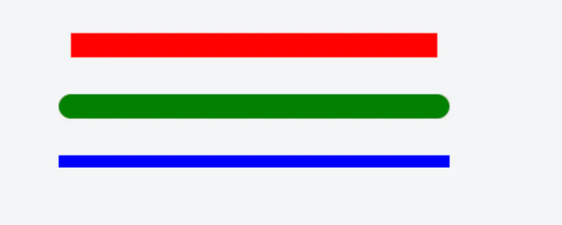

# 端点样式lineCap

## 目录

- [一、基本概念](#一基本概念)
- [二、示例代码](#二示例代码)
- [三、效果对比](#三效果对比)

`lineCap`属性用于定义线条**端点的样式**。它控制着**线条在结束时的形状**，影响着线条的视觉表现。这个属性对于创建专业的绘图工具、数据可视化和图形设计非常重要。

### 一、基本概念

`lineCap`属性有三种可能的值：

1. **`butt`**（默认值）：线条端点是平直的，与路径终点齐平，不超出路径范围。
2. **`round`**：线条端点是圆角的，在路径终点外添加一个半圆，半圆的半径等于线条宽度的一半。
3. **`square`**：线条端点是方形的，在路径终点外添加一个矩形，矩形的长度等于线条宽度的一半，宽度等于线条宽度。

### 二、示例代码

下面的代码演示了三种`lineCap`值的效果：



```html 
<canvas id="canvas" width="400" height="150"></canvas>
<script>
  const canvas = document.getElementById('canvas');
  const ctx = canvas.getContext('2d');
  
  // 绘制参考线（灰色）
  ctx.strokeStyle = '#999';
  ctx.lineWidth = 1;
  ctx.beginPath();
  ctx.moveTo(50, 50);
  ctx.lineTo(350, 50);
  ctx.moveTo(50, 100);
  ctx.lineTo(350, 100);
  ctx.moveTo(50, 150);
  ctx.lineTo(350, 150);
  ctx.stroke();
  
  // 设置粗线宽度以便观察效果
  ctx.lineWidth = 20;
  
  // 1. butt 效果（默认）
  ctx.lineCap = 'butt';
  ctx.strokeStyle = 'red';
  ctx.beginPath();
  ctx.moveTo(50, 50);
  ctx.lineTo(350, 50);
  ctx.stroke();
  
  // 2. round 效果
  ctx.lineCap = 'round';
  ctx.strokeStyle = 'green';
  ctx.beginPath();
  ctx.moveTo(50, 100);
  ctx.lineTo(350, 100);
  ctx.stroke();
  
  // 3. square 效果
  ctx.lineCap = 'square';
  ctx.strokeStyle = 'blue';
  ctx.beginPath();
  ctx.moveTo(50, 150);
  ctx.lineTo(350, 150);
  ctx.stroke();
</script>
```


### 三、效果对比

| 值          | 效果描述             | 视觉差异                                 |
| ---------- | ---------------- | ------------------------------------ |
| \`butt\`   | 线条端点与路径终点齐平，不超出。 | 线条看起来更短，端点是平的。                       |
| \`round\`  | 端点添加半圆，半径为线宽的一半。 | 线条看起来更长，端点是圆形的，适合需要柔和效果的场景。          |
| \`square\` | 端点添加方形，长度为线宽的一半。 | 线条看起来比\`butt\`略长，端点是方形的，适合需要清晰边缘的场景。 |
