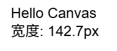
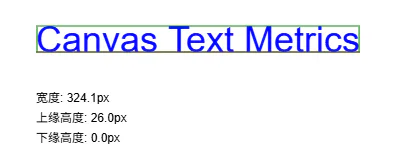
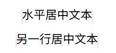
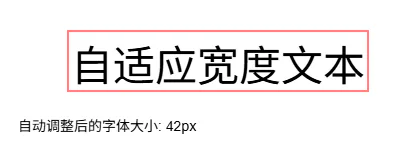
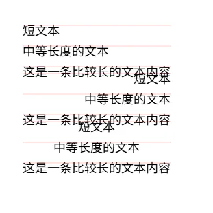

# `measureText`

## 目录

- [measureText 方法基础](#measureText-方法基础)
  - [基本使用示例](#基本使用示例)
- [TextMetrics 对象属性](#TextMetrics-对象属性)
  - [高级测量示例](#高级测量示例)
- [实际应用场景](#实际应用场景)
  - [1. 文本居中显示](#1-文本居中显示)
  - [2. 文本自动缩放以适应宽度](#2-文本自动缩放以适应宽度)
  - [3. 多行文本对齐](#3-多行文本对齐)
- [性能考虑](#性能考虑)
- [最佳实践建议](#最佳实践建议)
- [完整示例：文本测量仪表板](#完整示例文本测量仪表板)

`measureText()`是 Canvas 2D API 中用于测量文本宽度的关键方法，它返回一个包含文本度量信息的`TextMetrics`对象。下面我将全面介绍这个方法的使用和特性。

## measureText 方法基础

`measureText(text)`方法参数：

- `text`: 需要测量的文本字符串

返回值：`TextMetrics`对象，包含文本的度量信息

### 基本使用示例



```html 
<canvas id="canvas" width="500" height="200"></canvas>
<script>
const canvas = document.getElementById('canvas');
const ctx = canvas.getContext('2d');

// 设置字体样式
ctx.font = '24px Arial';

// 测量文本
const text = 'Hello Canvas';
const metrics = ctx.measureText(text);

// 获取文本宽度
console.log(`"${text}" 的宽度是: ${metrics.width}px`);

// 在Canvas上显示结果
ctx.fillStyle = 'black';
ctx.fillText(text, 50, 50);
ctx.fillText(`宽度: ${metrics.width.toFixed(1)}px`, 50, 80);
</script>
```


## TextMetrics 对象属性

现代浏览器支持的`TextMetrics`属性包括：

| 属性                       | 描述             | 兼容性   |
| ------------------------ | -------------- | ----- |
| width                    | 文本的宽度（以像素计）    | 所有浏览器 |
| actualBoundingBoxLeft    | 文本左边到基线的距离     | 较新浏览器 |
| actualBoundingBoxRight   | 文本右边到基线的距离     | 较新浏览器 |
| fontBoundingBoxAscent    | 字体整体的上缘高度      | 较新浏览器 |
| fontBoundingBoxDescent   | 字体整体的下缘高度      | 较新浏览器 |
| actualBoundingBoxAscent  | 文本实际上缘高度       | 较新浏览器 |
| actualBoundingBoxDescent | 文本实际下缘高度       | 较新浏览器 |
| emHeightAscent           | em square 上缘高度 | 部分浏览器 |
| emHeightDescent          | em square 下缘高度 | 部分浏览器 |
| hangingBaseline          | hanging 基线位置   | 部分浏览器 |
| alphabeticBaseline       | 字母基线位置         | 部分浏览器 |
| ideographicBaseline      | 表意文字基线位置       | 部分浏览器 |

### 高级测量示例



```html 
<canvas id="canvas" width="600" height="300"></canvas>
<script>
const canvas = document.getElementById('canvas');
const ctx = canvas.getContext('2d');

// 设置字体样式
ctx.font = '36px Arial';
const text = 'Canvas Text Metrics';

// 测量文本
const metrics = ctx.measureText(text);
const x = 50, y = 100;

// 绘制文本
ctx.fillStyle = 'blue';
ctx.fillText(text, x, y);

// 绘制基线
ctx.strokeStyle = 'red';
ctx.beginPath();
ctx.moveTo(x, y);
ctx.lineTo(x + metrics.width, y);
ctx.stroke();

// 绘制文本边界框（如果浏览器支持）
if ('actualBoundingBoxAscent' in metrics) {
    const left = x - metrics.actualBoundingBoxLeft;
    const top = y - metrics.actualBoundingBoxAscent;
    const right = x + metrics.actualBoundingBoxRight;
    const bottom = y + metrics.actualBoundingBoxDescent;
    
    ctx.strokeStyle = 'green';
    ctx.strokeRect(left, top, right - left, bottom - top);
    
    // 显示度量信息
    ctx.font = '12px Arial';
    ctx.fillStyle = 'black';
    ctx.fillText(`宽度: ${metrics.width.toFixed(1)}px`, x, y + 50);
    ctx.fillText(`上缘高度: ${metrics.actualBoundingBoxAscent.toFixed(1)}px`, x, y + 70);
    ctx.fillText(`下缘高度: ${metrics.actualBoundingBoxDescent.toFixed(1)}px`, x, y + 90);
}
</script>
```


## 实际应用场景

### 1. 文本居中显示



```javascript 
<canvas id="canvas" width="500" height="200"></canvas>
<script>
const canvas = document.getElementById('canvas');
const ctx = canvas.getContext('2d');

function drawCenteredText(text, y) {
    ctx.font = '24px Arial';
    const metrics = ctx.measureText(text);
    const x = (canvas.width - metrics.width) / 2;
    
    ctx.fillStyle = 'black';
    ctx.fillText(text, x, y);
    
    // 绘制参考线
    ctx.strokeStyle = 'rgba(255,0,0,0.3)';
    ctx.beginPath();
    ctx.moveTo(x, y - 20);
    ctx.lineTo(x, y + 10);
    ctx.moveTo(x + metrics.width, y - 20);
    ctx.lineTo(x + metrics.width, y + 10);
    ctx.stroke();
}

drawCenteredText('水平居中文本', 50);
drawCenteredText('另一行居中文本', 100);
</script>
```


### 2. 文本自动缩放以适应宽度



```javascript 
<canvas id="canvas" width="500" height="200"></canvas>
<script>
const canvas = document.getElementById('canvas');
const ctx = canvas.getContext('2d');

function fitText(text, maxWidth) {
    let fontSize = 100; // 从大字体开始
    ctx.font = `${fontSize}px Arial`;
    let metrics = ctx.measureText(text);
    
    // 逐步减小字体大小直到适合
    while (metrics.width > maxWidth && fontSize > 10) {
        fontSize--;
        ctx.font = `${fontSize}px Arial`;
        metrics = ctx.measureText(text);
    }
    
    return fontSize;
}

const text = '自适应宽度文本';
const maxWidth = 300;
const optimalSize = fitText(text, maxWidth);

// 绘制结果
ctx.fillStyle = 'black';
ctx.fillText(text, (canvas.width - ctx.measureText(text).width)/2, 100);

// 绘制参考框
ctx.strokeStyle = 'red';
ctx.strokeRect((canvas.width - maxWidth)/2, 50, maxWidth, 60);

// 显示信息
ctx.font = '14px Arial';
ctx.fillText(`自动调整后的字体大小: ${optimalSize}px`, 50, 150);
</script>
```


### 3. 多行文本对齐



```javascript 
<canvas id="canvas" width="500" height="300"></canvas>
<script>
const canvas = document.getElementById('canvas');
const ctx = canvas.getContext('2d');

function drawAlignedText(texts, x, y, lineHeight, alignment) {
    ctx.save();
    ctx.textBaseline = 'top';
    
    // 先测量所有文本获取最大宽度
    let maxWidth = 0;
    const metricsList = [];
    
    for (const text of texts) {
        const metrics = ctx.measureText(text);
        metricsList.push(metrics);
        if (metrics.width > maxWidth) {
            maxWidth = metrics.width;
        }
    }
    
    // 绘制每行文本
    for (let i = 0; i < texts.length; i++) {
        let drawX = x;
        
        // 根据对齐方式计算x坐标
        if (alignment === 'right') {
            drawX = x + maxWidth - metricsList[i].width;
        } else if (alignment === 'center') {
            drawX = x + (maxWidth - metricsList[i].width) / 2;
        }
        
        ctx.fillText(texts[i], drawX, y + i * lineHeight);
        
        // 绘制参考线
        ctx.strokeStyle = 'rgba(255,0,0,0.2)';
        ctx.beginPath();
        ctx.moveTo(x, y + i * lineHeight);
        ctx.lineTo(x + maxWidth, y + i * lineHeight);
        ctx.stroke();
    }
    
    ctx.restore();
}

// 设置字体
ctx.font = '18px Arial';
ctx.fillStyle = 'black';

// 左对齐
drawAlignedText(
    ['短文本', '中等长度的文本', '这是一条比较长的文本内容'], 
    50, 50, 30, 'left'
);

// 右对齐
drawAlignedText(
    ['短文本', '中等长度的文本', '这是一条比较长的文本内容'], 
    50, 120, 30, 'right'
);

// 居中对齐
drawAlignedText(
    ['短文本', '中等长度的文本', '这是一条比较长的文本内容'], 
    50, 190, 30, 'center'
);
</script>
```


## 性能考虑

1. **测量开销**：`measureText`是一个**相对昂贵的操作，特别是在循环中频繁调用时**
2. **缓存策略**：对**于静态文本，应该缓存测量结果**
3. **批量测量**：**避免在动画循环中重复测量相同文本**
4. **字体加载**：确保**字体已加载完成后再进行测量，否则结果不准确**

## 最佳实践建议

1. 在需要精确布局时总是先测量文本
2. 对于动态内容，考虑限制测量频率或使用防抖技术
3. 使用`textAlign`和`textBaseline`属性简化布局
4. 对于复杂文本布局，考虑使用离屏 canvas 预渲染
5. 检查浏览器支持的高级`TextMetrics`属性时要有回退方案

## 完整示例：文本测量仪表板

```javascript 
<canvas id="canvas" width="700" height="500"></canvas>
<script>
const canvas = document.getElementById('canvas');
const ctx = canvas.getContext('2d');

// 绘制背景
ctx.fillStyle = '#f5f5f5';
ctx.fillRect(0, 0, canvas.width, canvas.height);

// 标题
ctx.font = 'bold 28px Arial';
ctx.fillStyle = '#333';
ctx.fillText('Canvas 文本测量仪表板', 50, 40);

// 测量函数
function measureAndDisplay(text, x, y) {
    const metrics = ctx.measureText(text);
    const boxHeight = 120;
    
    // 绘制文本
    ctx.fillStyle = '#0066cc';
    ctx.fillText(text, x, y);
    
    // 绘制宽度指示
    ctx.strokeStyle = '#ff5500';
    ctx.beginPath();
    ctx.moveTo(x, y + 5);
    ctx.lineTo(x + metrics.width, y + 5);
    ctx.stroke();
    
    // 绘制测量信息框
    ctx.fillStyle = 'white';
    ctx.strokeStyle = '#ccc';
    ctx.fillRect(x, y + 15, metrics.width, boxHeight);
    ctx.strokeRect(x, y + 15, metrics.width, boxHeight);
    
    // 显示基本信息
    ctx.font = '12px Arial';
    ctx.fillStyle = '#333';
    ctx.fillText(`文本: "${text}"`, x + 5, y + 30);
    ctx.fillText(`宽度: ${metrics.width.toFixed(1)}px`, x + 5, y + 50);
    
    // 显示高级信息（如果支持）
    if ('actualBoundingBoxAscent' in metrics) {
        ctx.fillText(`实际上缘: ${metrics.actualBoundingBoxAscent.toFixed(1)}px`, x + 5, y + 70);
        ctx.fillText(`实际下缘: ${metrics.actualBoundingBoxDescent.toFixed(1)}px`, x + 5, y + 90);
        ctx.fillText(`总高度: ${(metrics.actualBoundingBoxAscent + metrics.actualBoundingBoxDescent).toFixed(1)}px`, x + 5, y + 110);
    }
    
    // 返回总高度
    return boxHeight + 30;
}

// 设置不同字体
ctx.font = '20px Arial';
let currentY = 80;
currentY += measureAndDisplay('标准Arial字体', 50, currentY);

ctx.font = 'italic 24px Times New Roman';
currentY += measureAndDisplay('斜体Times New Roman', 50, currentY);

ctx.font = 'bold 18px Courier New';
currentY += measureAndDisplay('等宽Courier New字体', 50, currentY);

ctx.font = '30px Impact';
currentY += measureAndDisplay('大号Impact字体', 50, currentY);

// 字体加载检测
document.fonts.ready.then(() => {
    ctx.font = '28px "Open Sans"';
    measureAndDisplay('加载后的自定义字体', 50, currentY);
}).catch(() => {
    ctx.font = '28px Arial';
    measureAndDisplay('自定义字体加载失败', 50, currentY);
});
</script>
```
