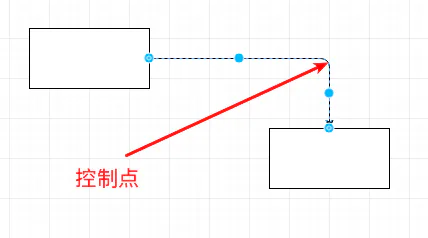
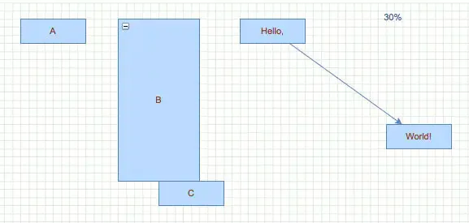
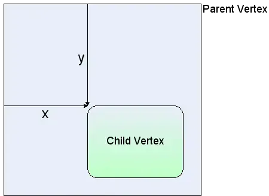
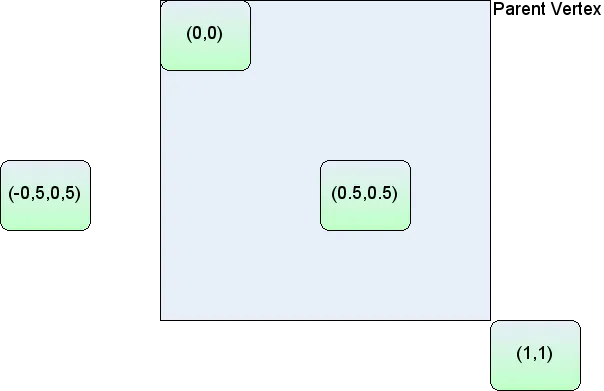
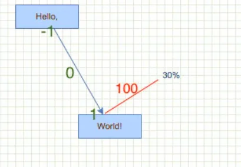

# cell和mxGeometry

## 目录

- [cell](#cell)
- [mxGeometry](#mxGeometry)

### cell

Cell在mxGraph中可以**代表组(Group)、节点(Vertex)和边(Edge)**，mxCell 这个类封装了Cell的操作。

```javascript 
mxGraph.prototype.insertVertex = function(parent, id, value,
                                          x, y, width, height, style, relative) {

  // 设置 Cell 尺寸及位置信息
  var geometry = new mxGeometry(x, y, width, height);
  geometry.relative = (relative != null) ? relative : false;

  // 创建一个 Cell
  var vertex = new mxCell(value, geometry, style);
  // ...
  // 标识这个 Cell 是一个节点
  vertex.setVertex(true);
  // ...

  // 在画布上添加这个 Cell
  return this.addCell(vertex, parent);
};
```


### mxGeometry

[mxGeometry](https://link.segmentfault.com/?enc=S6hjvnGiq9guVY4wnsxjhQ==.1aEgkJ0HCpwyb0yDbzmDglyrQZrvJ2KJyYT2DSLVF80htwv0QSL04jd5VKxFjE99CVhgt/uKwYqkoFcE92dLhstYtLA1qBGqn24ruB96KCjuMCl/vzOwBxdwlSvyKQS8ccT+NBSEH5ItHLnYmmPOSA== "mxGeometry")类**表示`Cell`（****一个点或者边的控制点****）的几何信息**，**宽高比较好理解，只对节点有意义，对边没意义。**

```javascript 
function mxGeometry(x,y,width,height){}

```


所谓边的控制点是指某些非直线比如折线的中间点，比如下图所示。当然对于控制点来说，width和height就没有意义了。另外边是没有位置信息的，它由起点和终点确定(当然边可以有线宽等属性，用于控制线的粗细)。





`mxGeometry`有一个**很重要的布尔属性**`relative`，它用来说明**位置是绝对坐标**(左边原点是屏幕的最左上角)还是相对位置(相对其parent)。

- **`relative`****为****`false`****的节点，****表示以画布左上角为基点进行定位****，****`x、y`****使用的是****`绝对单位`**

上一小节提到`insertVertex`内部会创建`mxGeometry`类。使用`mxGraph.insertVertex`会创建一个`mxGeometry.relative`为 false 的节点，如 A 节点



- **`relative`****为****`true`****的节点，表示以****父节点左上角为基点进行定位****，** \*\*​`x、y`****使用的是****`相对单位`\*\*

  使用`mxGraph.insertVertex`会创建一个 relative 为 false 的节点。如果你要将一个节点添加到另一个节点中需要在该方法调用的第9个参数传入`true`，将`relative`设置为`true`。这时子节点**使用相对坐标系，以父节点左上角作为基点**，x、y 取值范围都是`[-1,1]`。如 C节点 相对 B节点定位。



如果是相对位置，那么点(0.5, 0.5)的左上角(注意不是中心)位于父节点的中心。(1, 1)的左上角位于父节点的最右下角；(-0.5, 0.5)的位置如上图所示。

- \*\*`relative`****为****`true`****的边，****`x、y`\*\***用于定位 label**

使用`mxGraph.insertEdge`会创建一条 relative 为 true 的边。x、y 用于定位线条上的 label，x 取值范围是`[-1,1]`，`-1 为起点，0 为中点，1 为终点`。y 表示 label 在边的正交线上移到的距离。第三个例子能帮忙大家理解这种情况。

前面说了边并没有自己的位置，但是边有一个标签(label)，它显示出来就是一个长方形(rect)。下面我们来说一下label的相对定位。

mxGraph通过(x, y)来相对定位边的label。我们先看直线(线段)的边，x=0表示label位于线段的中间，而x=-1表示label位于线段的左端，x=1表示label位于右端。y表示垂直于直线的方向的位置。如下图所示：



上图是通过如下代码画出来的：

```javascript 
const e1 = graph.insertEdge(parent, null, '30%', v1, v2);
e1.geometry.x = 1;
e1.geometry.y = 100;

```
