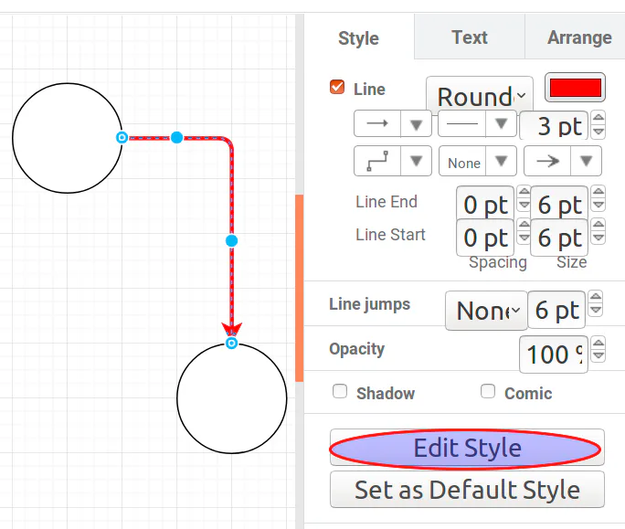
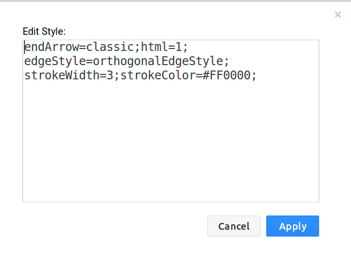

# 查看样式的小技巧

## 目录

- [查看样式的小技巧](#查看样式的小技巧)

#### 查看样式的小技巧

mxGraph 所有样式在[这里](https://jgraph.github.io/mxgraph/docs/js-api/files/util/mxConstants-js.html#mxConstants.STYLE_STROKECOLOR "这里")可以查看，打开网站后可以看到以 `STYLE_`开头的是样式常量。但是这些样式常量并不能展示样式的效果。下面教大家一个查看样式效果的小技巧，使用[draw.io](https://www.draw.io/ "draw.io")或[GraphEditor](https://jgraph.github.io/mxgraph/javascript/examples/grapheditor/www/index.html "GraphEditor")(它们都是使用 mxGraph 进行开发的) 的\*\*`Edit Style功能可以查看当前Cell样式。`\*\*

比如现在我想将边的样式设置成：红色、折线、粗3pt。在 Style 面板手动修改样式后，再点击 Edit Style 就可以看到对应的样式代码。

