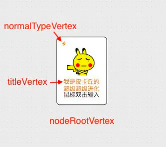

# 写一个节点组合

下面以项目的这个节点为例，讲解如何组合节点


```javascript 
const insertVertex = (dom) => {
  // ...
  const nodeRootVertex = new mxCell('鼠标双击输入', new mxGeometry(0, 0, 100, 135), `node;image=${src}`);
  nodeRootVertex.vertex = true;
  // ...
  
  const title = dom.getAttribute('alt');
  const titleVertex = graph.insertVertex(nodeRootVertex, null, title,
    0.1, 0.65, 80, 16,
    'constituent=1;whiteSpace=wrap;strokeColor=none;fillColor=none;fontColor=#e6a23c',
    true);
  titleVertex.setConnectable(false);

  const normalTypeVertex = graph.insertVertex(nodeRootVertex, null, null,
    0.05, 0.05, 19, 14,
    `normalType;constituent=1;fillColor=none;image=/static/images/normal-type/forest.png`,
    true);
  normalTypeVertex.setConnectable(false);
  // .....
};
```


单单`nodeRootVertex`就是长这个样子。通过设置自定义的`node`样式(见[Graph](https://link.segmentfault.com/?enc=+KSOojtan8yFk7uos/NtBg==.1Spbyo6lLXqRuJojLynTjb5uvdfAUlG9THUAlgD7sAk90BfY6uDPSURQ10F0tlBH4KUGhkk5mRi4d8QDUiEWLZ5U1vG26dERZXN3rP/g5TY= "Graph")类 \_putVertexStyle 方法)与`image`属性设置图片路径配合完成。


因为**默认情况下一个节点只能有一个文本区和一个图片区**，要增加额外的文本和图片就需要组合节点。在`nodeRootVertex`上加上`titleVertex`文本节点和`normalTypeVertex`图片节点，最终达到这个效果。



有时需要为不同子节点设置不同的鼠标悬浮图标，如本项目鼠标悬浮到`normalTypeVertex`时鼠标变为手形，参考 AppCanvas.vue 的 setCursor 方法，重写`mxGraph.prototype.getCursorForCell`可以实现这个功能。

```javascript 
const setCursor = () => {
  const oldGetCursorForCell = mxGraph.prototype.getCursorForCell;
  graph.getCursorForCell = function (...args) {
    const [cell] = args;
    return cell.style.includes('normalType') ?
      'pointer' :
      oldGetCursorForCell.apply(this, args);
  };
};
```
