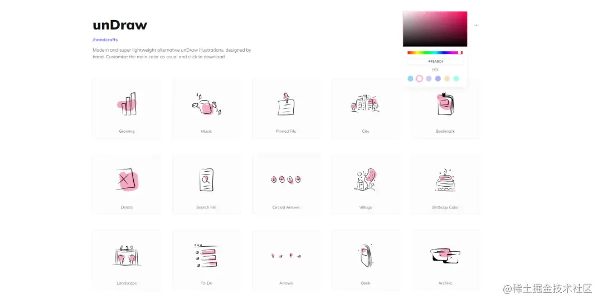

# 免费的SVG插图

[ Illustrations | unDraw The design project with open-source illustrations for any idea you can imagine and create. Create beautiful websites, products and applications with your color, for free. https://undraw.co/illustrations](https://undraw.co/illustrations " Illustrations | unDraw The design project with open-source illustrations for any idea you can imagine and create. Create beautiful websites, products and applications with your color, for free. https://undraw.co/illustrations")

在开发过程中，如果需要免费的SVG插图，那你一定错过undraw！

在这里，上千张插画你可以尽情挑选，扁平化风格和手绘风格的插画可以适用多种场景，都毫无违和感。

最有意思的是，插画的颜色可以根据你页面的主题色进行统一修改，系统预设了6种配色方案，你也可以自定义颜色，下载支持PNG和SVG两种格式，支持免费商用，用户体验超好der！

