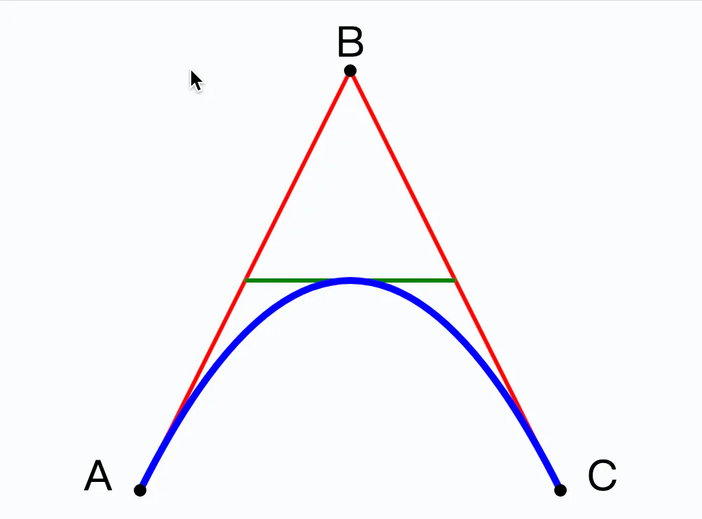
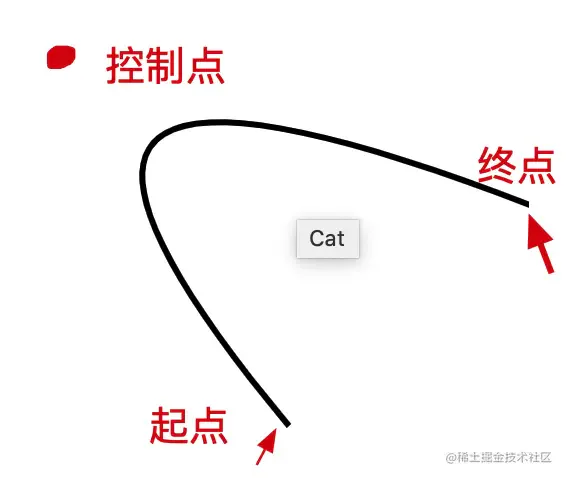
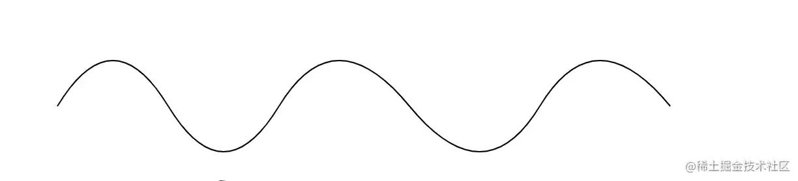
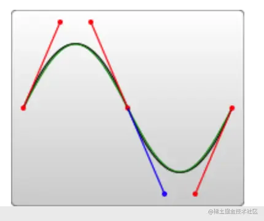

# 贝塞尔曲线

## 目录

- [Q](#Q)
- [T](#T)
- [C](#C)
- [S](#S)

下面的例子创建了一个二次方贝塞尔曲线，A 和 C 分别是起点和终点，B 是控制点：



```svg 
<svg xmlns="http://www.w3.org/2000/svg" version="1.1">
  <path id="lineAB" d="M 100 350 l 150 -300" stroke="red"
  stroke-width="3" fill="none" />
  <path id="lineBC" d="M 250 50 l 150 300" stroke="red"
  stroke-width="3" fill="none" />
  <path d="M 175 200 l 150 0" stroke="green" stroke-width="3"
  fill="none" />
  <path d="M 100 350 q 150 -300 300 0" stroke="blue"
  stroke-width="5" fill="none" />
  <!-- Mark relevant points -->
  <g stroke="black" stroke-width="3" fill="black">
    <circle id="pointA" cx="100" cy="350" r="3" />
    <circle id="pointB" cx="250" cy="50" r="3" />
    <circle id="pointC" cx="400" cy="350" r="3" />
  </g>
  <!-- Label the points -->
  <g font-size="30" font="sans-serif" fill="black" stroke="none"
  text-anchor="middle">
    <text x="100" y="350" dx="-30">A</text>
    <text x="250" y="50" dy="-10">B</text>
    <text x="400" y="350" dx="30">C</text>
  </g>
</svg>
```


# Q

```latex 
Q x1 y1, x y

```


Q**表示二阶贝塞尔曲线**  x1 y1, 就是二阶贝塞尔曲线的控制点， x, y是曲线的终点，曲线的起点是由画笔的上一个点构成， 这就形成了二阶贝塞尔曲线。



代码如下：

```svg 
<path d="M100 100 Q 25 10 180 80" stroke="black" fill="transparent"/>

```


这时候有人就要问了？ 如果我想画连续的二阶贝塞尔曲线呢？ 我该怎么去做呢这就要引入我们的参数T 了&#x20;

# T

```text 
T x y

```


- T  的这个属性 **必须跟在 Q 的后面 如果单独使用 直接画多个T 就是一条直线**
- T x y **表示下一段贝塞尔曲线的终点**。他会**自动根据前一个控制点， 去推断**。

有了这个参数 连续的波浪线了



```svg 
    <path d="M10 80 Q 52.5 10, 95 80 T 180 80 T 280 80 T 380 80 T 480 80" stroke="black" fill="transparent"/>

```


看完二阶贝塞尔曲线，我们来看下三阶贝塞尔曲线

# C

```markdown 
 C x1 y1, x2 y2, x y
 

```


三阶贝塞尔曲线 用C表示 x1 y1 , x2, y2  表示**两个端点 x，y表示贝赛尔曲线的终点**， 同样的我如果想要画出连续的曲线呢， 这时候就需要用到 S这个参数了

# S

```text 
 S x2 y2, x y

```


S x2, y2 表示第二个控制点 。x,y 表示 终点 \*\*。那么它的**第一个控制点会被假设成前一个命令曲线的第二个控制点的中心对称点。**\*\*


