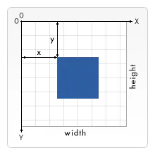

# 坐标定位

## 目录

- [网格](#网格)
  - [什么是 "像素"?](#什么是-像素)

## [网格](https://developer.mozilla.org/zh-CN/docs/Web/SVG/Tutorial/Positions#网格 "网格")

对于所有元素，SVG 使用的坐标系统或者说网格系统，和[Canvas](https://developer.mozilla.org/zh-CN/docs/Web/API/Canvas_API "Canvas")用的差不多（所有计算机绘图都差不多）。这种坐标系统是：以页面的左上角为 (0,0) 坐标点，坐标以像素为单位，**x 轴正方向是向右，y 轴正方向是向下。** 注意，这和你小时候所教的绘图方式是相反的。**但是在 HTML 文档中，元素都是用这种方式定位的。**



### [什么是 "像素"?](https://developer.mozilla.org/zh-CN/docs/Web/SVG/Tutorial/Positions#什么是_像素 "什么是 \"像素\"?")

基本上，在 SVG 文档中的 1 个像素对应输出设备（比如显示屏）上的 1 个像素。但是这种情况是可以改变的，否则 SVG 的名字里也不至于会有“Scalable”（可缩放）这个词。如同 CSS 可以定义字体的绝对大小和相对大小，SVG 也可以定义绝对大小（比如使用“pt”或“cm”标识维度）同时 SVG 也能使用相对大小，只需给出数字，不标明单位，输出时就会采用用户的单位。

在没有进一步规范说明的情况下，1 个用户单位等同于 1 个屏幕单位。要明确改变这种设定，SVG 里有多种方法。我们从`svg`根元素开始：

```svg 
<svg width="100" height="100">…</svg>

```


上面的元素定义了一个 100\*100px 的 SVG 画布，这里 1 用户单位等同于 1 屏幕单位。

```svg 
<svg width="200" height="200" viewBox="0 0 100 100">…</svg>

```


这里定义的**画布尺寸是 200\******200px**\*\*。但是，viewBox 属性定义了****画布上可以显示的区域**\*\*：从 (0,0) 点开始，100 宽*100 高的区域。**这个 100\* *****100 的区域，会放到 200*****\*200 的画布上显示。于是就形成了放大两倍的效果。**

用户单位和屏幕单位的映射关系被称为**用户坐标系统**。除了缩放之外，坐标系统还可以旋转、倾斜、翻转。默认的用户坐标系统 1 用户像素等于设备上的 1 像素（但是设备上可能会自己定义 1 像素到底是多大）。在定义了具体尺寸单位的 SVG 中，比如单位是“cm”或“in”，最终图形会以实际大小的 1 比 1 比例呈现。

下面是引自 SVG1.1 规范的一段说明：

> \[…] 假设在用户的设备环境里，1px 等于 0.2822222 毫米（即分辨率是 90dpi），那么所有的 SVG 内容都会按照这种比例处理： \[…] "1cm" 等于 "35.43307px"（即 35.43307 用户单位）；
