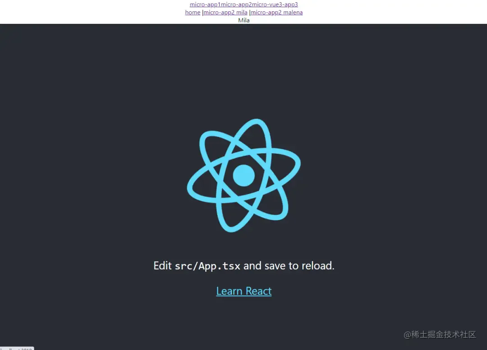

# qiankun 接入 react&#x20;

## 目录

- [react子应用接入路由](#react子应用接入路由)

## react子应用接入路由

首先，当然要安装路由 react-router-dom

```javascript 
npm install react-router-dom --save

```


在子应用 index.tsx 入口文件中，引入路由

```javascript 
import { BrowserRouter } from "react-router-dom";

```


```javascript 
import "./public-path";
import React from "react";
import ReactDOM from "react-dom/client";
import "./index.css";
import App from "./App";
import reportWebVitals from "./reportWebVitals";
import { BrowserRouter } from "react-router-dom";

const root = ReactDOM.createRoot(
  document.getElementById("root") as HTMLElement
);
root.render(
  <BrowserRouter>
    <React.StrictMode>
      <App />
    </React.StrictMode>
  </BrowserRouter>
);

// @ts-ignore
function render(props) {
  const { container } = props;
  // @ts-ignore
  ReactDOM.render(
    <BrowserRouter
      basename={window.__POWERED_BY_QIANKUN__ ? "/micro-app2" : "/"}
    >
      <App />
    </BrowserRouter>,
    container
      ? container.querySelector("#root")
      : document.querySelector("#root")
  );
}
// @ts-ignore
if (!window.__POWERED_BY_QIANKUN__) {
  // render({});
}
// @ts-ignore
export async function bootstrap() {
  console.log("[react16] react app bootstraped");
}
// @ts-ignore
export async function mount(props) {
  console.log("[react16] props from main framework", props);
  render(props);
}
// @ts-ignore
export async function unmount(props) {
  const { container } = props;
  // @ts-ignore
  ReactDOM.unmountComponentAtNode(
    container
      ? container.querySelector("#root")
      : document.querySelector("#root")
  );
}

// If you want to start measuring performance in your app, pass a function
// to log results (for example: reportWebVitals(console.log))
// or send to an analytics endpoint. Learn more: https://bit.ly/CRA-vitals
reportWebVitals();


```


在 /src/pages 文件夹下，新建两个页面，命名随意。

修改 App.tsx 文件，配置这两个页面的路由。

```javascript 
import React from 'react';
import logo from './logo.svg';
import './App.css';
import { Routes, Route, Link } from "react-router-dom";
import Mila from './pages/Mila';
import Malena from './pages/Malena';

function App() {
  return (
    <div className="App">
      <Link to={"/"}>home</Link> | 
      <Link to={"/mila"}>micro-app2 mila</Link> | 
      <Link to={"/malena"}>micro-app2 malena</Link>
      <Routes>
        <Route path="/mila" element={<Mila/>} />
        <Route path="/malena" element={<Malena/>} />
      </Routes>
      <header className="App-header">
        
        <p>
          Edit <code>src/App.tsx</code> and save to reload.
        </p>
        <a
          className="App-link"
          href="https://reactjs.org"
          target="_blank"
          rel="noopener noreferrer"
        >
          Learn React
        </a>
      </header>
    </div>
  );
}

export default App;

```


正如你所看到的，成功接入路由。


