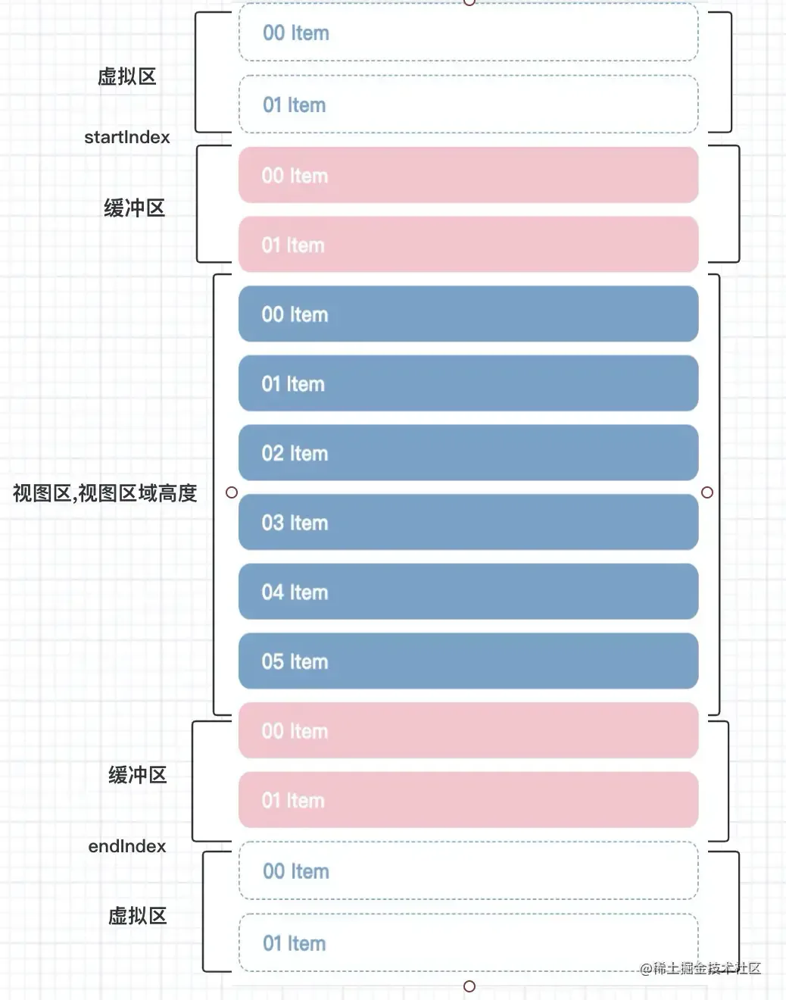
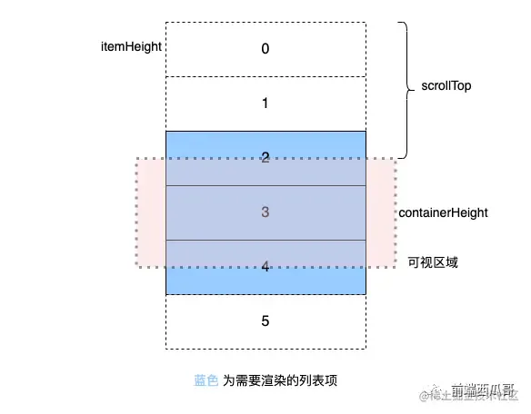

# 虚拟列表

## 目录

- [长列表渲染- 时间分片 ](#长列表渲染--时间分片-)
- [长列表渲染- 虚拟列表](#长列表渲染--虚拟列表)
  - [简单分析](#简单分析)
  - [列表项高度固定](#列表项高度固定)
    - [代码实现](#代码实现)
      - [方案一：前面一个空元素](#方案一前面一个空元素)
      - [方案二：transform 方案](#方案二transform-方案)
      - [方案三：绝对定位方案](#方案三绝对定位方案)
  - [列表项高度动态](#列表项高度动态)
    - [代码实现](#代码实现)
    - [思路说明](#思路说明)
    - [一些需要注意的问题](#一些需要注意的问题)
  - [结尾](#结尾)

[ 长列表优化：用 React 实现虚拟列表 - 掘金 携手创作，共同成长！这是我参与「掘金日新计划 · 8 月更文挑战」的第14天，点击查看活动详情 大家好，我是前端西瓜哥。这次我们来看看虚拟列表是什么玩意，并用 React 来实现两种虚拟列表组件。 虚 https://juejin.cn/post/7132277540806213645](https://juejin.cn/post/7132277540806213645 " 长列表优化：用 React 实现虚拟列表 - 掘金 携手创作，共同成长！这是我参与「掘金日新计划 · 8 月更文挑战」的第14天，点击查看活动详情 大家好，我是前端西瓜哥。这次我们来看看虚拟列表是什么玩意，并用 React 来实现两种虚拟列表组件。 虚 https://juejin.cn/post/7132277540806213645")

我们知道有些场景下，接口会返回出大量的数据，渲染这种列表叫做`长列表`,今天主要说下处理`长列表`的两种方式：`分片渲染`和`虚拟列表`;

# 长列表渲染- 时间分片&#x20;

requestAnimationFrame + DocumentFragment 每次加载多少条

```javascript 
 <ul id="container"></ul>

const ul = document.getElementById('container')
const total = 1000
const pageSize = 20
function loop(curTotal, curIndex){ // 剩余总数，已加载条数
  if(curTotal <= 0) return false
  // 判断当页要加载多少条，可能只需加载5条，所以取最小
  const pageCount = Math.min(curTotal, pageSize) 
  window.requestAnimationFrame(function(){
    let fragment = document.createDocumentFragment()
    for(let i=0; i<pageCount;i++){
      const li = document.createElement('li')
      li.innerText = curIndex+i+':'+ ~(Math.random()*total)
      fragment.appendChild(li)
    }
    ul.appendChild(fragment)
    loop(curTotal-pageCount, curIndex+pageCount)
  })
}
loop(total, 0)
```


&#x20;

# 长列表渲染- 虚拟列表

以前用到是懒加载，但是随着加载数据越来越多，浏览器的回流和重绘的开销越来越大，整个滑动会造成卡顿虚拟列表就是按需显示，只对可见区域进行渲染，对非可见区域中的数据不渲染或部分渲染的技术，从而达到极高的渲染性能&#x20;

> 在正式开始前，希望各位小伙伴牢牢记住：**js执行永远要比dom快的多**，所以对于执行大量的数据，一次性渲染，非常容易造成卡顿、卡死的情况

**虚拟列表**：实际上是一种实现方案，只对`可视区域`进行渲染，对`非可视区域`中的区域不渲染或只渲染一部分（渲染的部分叫`缓冲区`，不渲染的部分叫`虚拟区`），从而达到极高的性能

### 简单分析

我们先看一下下方的图（由于我的图画的实在难看，所以在网上找了一张比较符合的，还望勿喷～）



从图中可以看出，我们可以将列表分为三个区域：**可视区**、**缓冲区**、**虚拟区**

而我们主要针对`可视区`和`缓冲取`进行渲染，我们一步一步的实现，有不对的地方，希望在评论区指出～

- `占位区域`：聪明的小伙伴发现，在上述的`分片渲染`中，滚动条也在变化，这是因为列表渲染的数据在增加，把内容组件撑开，造成高度上的变化，所以在虚拟列表中，专门提供一个div，用来占位，这样在一进来的时候滚动条就不会产生变化
- `渲染区域`：这块部分为真正用户看到的列表区域，实际上有**可视区**和**缓冲区**共同组成，**缓冲区**的作用是`防止快速下滑或者上滑的过程中`出现空白区域

其次我们需要一个整体的`div`，通过监听`占位区域`的滚动条，判断当前截取数组的区域，所以大体的结构是这样

## 列表项高度固定

列表项高度固定的情况会简单很多，因为我们可以在渲染前就能知道任何一个列表项的位置。

因为涉及到的变量很多，实现起来还是有点繁琐。

我们需要的必要信息有：

1. 容器高度（即可视区域高度） containerHeight
2. 列表长度（即列表项总数） itemCount
3. 列表项尺寸 itemHeight
4. 滚动位置 scrollTop



> 虚拟列表通常来说是垂直方向的，但偶尔也有水平方向的场景，所以如果你要实现一个广泛适用的组件，理论上应该用 size 而不是 height，前者语义更好。
>
> 但为了减少用户的思维转换导致的负担，本文会使用 height 来表示一个列表项的高度。

要让表单项渲染在正确位置，我们有几种方案：

1. 在容器的第一个元素用一个空元素，设置一个高度，将需要显示在可视区域的 items 往下推到正确位置。我尝试着实现了，发现滚动快一点就会有闪屏现象。
2. 将需要渲染的元素一个 div 包裹起来，对这个 div 应用 `transform: translate3d(0px, 1000px, 0px);`
3. 对每个列表项使用绝对定位（或 transform）

### 代码实现

```json 
//styles.css
.list-container {
    background-color: rgb(208, 255, 239);
    overflow: auto;
}

.item {
    text-align: center;
    background-color: burlywood;
}

.item:nth-of-type(2n) {
    background-color: cadetblue;
}


// app.js
import FixedSizeList from './FixedSizeList';
import './styles.css';

/**
 * 三种让 items 定位到正确位置的方案
 * 可自行切换，感受 style 的不同
 *
 * FixedSizeList：一个将 items 往下推到正确位置的空元素
 * FixedSizeList2：transform 方案
 * FixedSizeList3：绝对定位方案
 *
 */

function Item({ style, index }) {
    return (
        <div
            className="item"
            style={{
                ...style,
                backgroundColor: index % 2 === 0 ? 'burlywood' : 'cadetblue'
            }}
        >
            {index}
        </div>
    );
}

export default function App() {
    const list = new Array(10000).fill(0).map((item, i) => i);

    return (
        <>
            列表项高度固定 - 虚拟列表实现
            <FixedSizeList
                containerHeight={300}
                itemCount={list.length}
                itemHeight={50}
            >
                {Item}
            </FixedSizeList>
        </>
    );
}


```


#### 方案一：前面一个空元素

```typescript 
/**
 * 一个将 items 往下推到正确位置的空元素
 */
import { useState } from 'react';
import { flushSync } from 'react-dom';

function FixedSizeList({ containerHeight, itemHeight, itemCount, children }) {
    // children 语义不好，赋值给 Component
    const Component = children;

    const contentHeight = itemHeight * itemCount; // 内容高度
    const [scrollTop, setScrollTop] = useState(0); // 滚动高度

    // 继续需要渲染的 item 索引有哪些
    let startIdx = Math.floor(scrollTop / itemHeight);
    let endIdx = Math.floor((scrollTop + containerHeight) / itemHeight);

    // 上下额外多渲染几个 item，解决滚动时来不及加载元素出现短暂的空白区域的问题
    const paddingCount = 2;
    startIdx = Math.max(startIdx - paddingCount, 0); // 处理越界情况
    endIdx = Math.min(endIdx + paddingCount, itemCount - 1);

    const top = itemHeight * startIdx; // 第一个渲染 item 到顶部距离

    // 需要渲染的 items
    const items = [];
    for (let i = startIdx; i <= endIdx; i++) {
        items.push(<Component key={i} index={i} style={{ height: itemHeight }} />);
    }

    return (
        <div
            style={{ height: containerHeight, overflow: 'auto' }}
            onScroll={(e) => {
                // 处理渲染异步导致的白屏现象
                // 改为同步更新，但可能会有性能问题，可以做 节流 + RAF 优化
                flushSync(() => {
                    setScrollTop(e.target.scrollTop);
                });
            }}
        >
            <div style={{ height: contentHeight }}>
                {/* 一个将 items 往下推到正确位置的空元素 */}
                <div style={{ height: top }}></div>
                {items}
            </div>
        </div>
    );
}

export default FixedSizeList;

```


#### 方案二：transform 方案

```typescript 
/**
 * transform 方案
 */
import { useState } from 'react';
import { flushSync } from 'react-dom';

function FixedSizeList({ containerHeight, itemHeight, itemCount, children }) {
    // children 语义不好，赋值给 Component
    const Component = children;

    const contentHeight = itemHeight * itemCount; // 内容高度
    const [scrollTop, setScrollTop] = useState(0); // 滚动高度

    // 继续需要渲染的 item 索引有哪些
    let startIdx = Math.floor(scrollTop / itemHeight);
    let endIdx = Math.floor((scrollTop + containerHeight) / itemHeight);

    // 上下额外多渲染几个 item，解决滚动时来不及加载元素出现短暂的空白区域的问题
    const paddingCount = 2;
    startIdx = Math.max(startIdx - paddingCount, 0); // 处理越界情况
    endIdx = Math.min(endIdx + paddingCount, itemCount - 1);

    const top = itemHeight * startIdx; // 第一个渲染 item 到顶部距离

    // 需要渲染的 items
    const items = [];
    for (let i = startIdx; i <= endIdx; i++) {
        items.push(<Component key={i} index={i} style={{ height: itemHeight }} />);
    }

    return (
        <div
            style={{ height: containerHeight, overflow: 'auto' }}
            onScroll={(e) => {
                flushSync(() => {
                    setScrollTop(e.target.scrollTop);
                });
            }}
        >
            <div style={{ height: contentHeight }}>
                <div style={{ transform: `translate3d(0px, ${top}px, 0` }}>{items}</div>
            </div>
        </div>
    );
}

export default FixedSizeList;

```


#### 方案三：绝对定位方案

```typescript 
/**
 * 绝对定位方案
 */
import { useState } from 'react';
import { flushSync } from 'react-dom';

function FixedSizeList({ containerHeight, itemHeight, itemCount, children }) {
    // children 语义不好，赋值给 Component
    const Component = children;

    const contentHeight = itemHeight * itemCount; // 内容高度
    const [scrollTop, setScrollTop] = useState(0); // 滚动高度

    // 继续需要渲染的 item 索引有哪些
    let startIdx = Math.floor(scrollTop / itemHeight);
    let endIdx = Math.floor((scrollTop + containerHeight) / itemHeight);

    // 上下额外多渲染几个 item，解决滚动时来不及加载元素出现短暂的空白区域的问题
    const paddingCount = 2;
    startIdx = Math.max(startIdx - paddingCount, 0); // 处理越界情况
    endIdx = Math.min(endIdx + paddingCount, itemCount - 1);

    const top = itemHeight * startIdx; // 第一个渲染 item 到顶部距离

    // 需要渲染的 items
    const items = [];
    for (let i = startIdx; i <= endIdx; i++) {
        items.push(
            <Component
                key={i}
                index={i}
                style={{
                    position: 'absolute',
                    left: 0,
                    top: i * itemHeight,
                    width: '100%',
                    height: itemHeight
                }}
            />
        );
    }

    return (
        <div
            style={{
                height: containerHeight,
                overflow: 'auto',
                position: 'relative'
            }}
            onScroll={(e) => {
                flushSync(() => {
                    setScrollTop(e.target.scrollTop);
                });
            }}
        >
            <div style={{ height: contentHeight }}>{items}</div>
        </div>
    );
}

export default FixedSizeList;

```


但滚动是一个高频触发的时间，我的这种写法在列表项复杂的情况下，是可能会出现性能问题的。更好的做法是做 **函数节流 + RAF**（requestAnimationFrame），虽然也会有一些空白现象，但不会太严重。

## 列表项高度动态

列表项高度动态的情况，就复杂得多。

如果能够 **在渲染前知道所有列表项的高度**，那实现思路还是同前面列表项高度固定的情况一致。

只是我们不能用乘法来计算了，要改成累加的方式来计算 startIdx 和 endIdx。

然而实际上更常见的情况是列表项 **高度根据内容自适应**，只能在渲染完成后才能知道真正高度。

怎么办呢？通常的方式是 **提供一个列表项预设高度，在列表项渲染完成后，再更新高度**。

### 代码实现

我们先给出实现：

```react 
import './styles.css';
import { useEffect, useRef, useState } from 'react';
import VariableSizeList from './VariableSizeList';
import { faker } from '@faker-js/faker';

// 列表项组件
function Item({ index, data, setHeight }) {
    const itemRef = useRef();
    useEffect(() => {
        setHeight(index, itemRef.current.getBoundingClientRect().height);
    }, [setHeight, index]);

    return (
        <div
            ref={itemRef}
            style={{
                backgroundColor: index % 2 === 0 ? 'burlywood' : 'cadetblue'
            }}
        >
            {data[index]}
        </div>
    );
}

export default function App() {
    const [list, setList] = useState(
        new Array(1000).fill(0).map(() => faker.lorem.paragraph())
    );
    const listRef = useRef();

    const heightsRef = useRef(new Array(100));
    // 预估高度
    const estimatedItemHeight = 40;
    const getHeight = (index) => {
        return heightsRef.current[index] ?? estimatedItemHeight;
    };

    const setHeight = (index, height) => {
        if (heightsRef.current[index] !== height) {
            heightsRef.current[index] = height;
            // 让 VariableSizeList 组件更新高度
            listRef.current.resetHeight();
        }
    };

    return (
        <>
            列表项高度动态 - 虚拟列表实现
            <VariableSizeList
                ref={listRef}
                containerHeight={300}
                itemCount={list.length}
                getItemHeight={getHeight}
                itemData={list}
            >
                {({ index, style, data }) => {
                    return (
                        <div style={style}>
                            <Item {...{ index, data }} setHeight={setHeight} />
                        </div>
                    );
                }}
            </VariableSizeList>
        </>
    );
}


//css
.list-container {
    background-color: rgb(208, 255, 239);
    overflow: auto;
}


```


```react 
import { forwardRef, useState } from 'react';
import { flushSync } from 'react-dom';

// 动态列表组件
const VariableSizeList = forwardRef(
    ({ containerHeight, getItemHeight, itemCount, itemData, children }, ref) => {
        ref.current = {
            resetHeight: () => {
                setOffsets(genOffsets());
            }
        };

        // children 语义不好，赋值给 Component
        const Component = children;
        const [scrollTop, setScrollTop] = useState(0); // 滚动高度

        const genOffsets = () => {
            const a = [];
            a[0] = getItemHeight(0);
            for (let i = 1; i < itemCount; i++) {
                a[i] = getItemHeight(i) + a[i - 1];
            }
            return a;
        };

        // 所有 items 的位置
        const [offsets, setOffsets] = useState(() => {
            return genOffsets();
        });

        // 找 startIdx 和 endIdx
        // 这里用了普通的查找，更好的方式是二分查找
        let startIdx = offsets.findIndex((pos) => pos > scrollTop);
        let endIdx = offsets.findIndex((pos) => pos > scrollTop + containerHeight);
        if (endIdx === -1) endIdx = itemCount;

        // 上下扩展补充几个 item
        const paddingCount = 2;
        startIdx = Math.max(startIdx - paddingCount, 0); // 处理越界情况
        endIdx = Math.min(endIdx + paddingCount, itemCount - 1);

        // 计算高度
        const contentHeight = offsets[offsets.length - 1];

        // 需要渲染的 items
        const items = [];
        for (let i = startIdx; i <= endIdx; i++) {
            const top = i === 0 ? 0 : offsets[i - 1];
            const height = i === 0 ? offsets[0] : offsets[i] - offsets[i - 1];
            items.push(
                <Component
                    key={i}
                    index={i}
                    style={{
                        position: 'absolute',
                        left: 0,
                        top,
                        width: '100%',
                        height
                    }}
                    data={itemData}
                />
            );
        }

        return (
            <div
                style={{
                    height: containerHeight,
                    overflow: 'auto',
                    position: 'relative'
                }}
                onScroll={(e) => {
                    flushSync(() => {
                        setScrollTop(e.target.scrollTop);
                    });
                }}
            >
                <div style={{ height: contentHeight }}>{items}</div>
            </div>
        );
    }
);

export default VariableSizeList;

```


### 思路说明

和列表项等高的实现不同，这里不能传一个固定值 itemHeight，改为传入一个根据 index 获取列表项宽度函数 `getItemHeight(index)`。

组件会通过这个函数，来拿到不同列表项的高度，来计算出 offsets 数组。**offsets 是每个列表项的底边到顶部的距离**。offsets 的作用是在滚动到特定位置时，计算出需要渲染的列表项有哪些。

当然你也可以用高度数组，但查找起来并没有优势，你需要累加。offsets 是 heights 的累加缓存结果（其实也就是前缀和）。

假设几个列表项的高度数组 heights 为 `[10, 20, 40, 100]`，那么 offsets 就是 `[10, 30, 70, 170]`。一推导公式为：`offsets[i] = offsets[i-1] + heights[i]`

### 一些需要注意的问题

1. 容器宽度变化时，会导致大量列表项的高度变化，需要手动触发重置虚拟列表缓存的高度集合，建议宽度固定；
2. 图片加载需要时间，尤其是图片多的情况下，会让一个列表项的高度不断变大，需要你手动触发重置虚拟列表高度。可以考虑给图片预设一个宽高，在加载前占据好高度；
3. 因为预估高度并不准确，会导致内容高度一直变化。这就是拖动滚动条进行滚动时，滑块和光标位置慢慢对不上的原因。
4. 要考虑获取列表项的高度并更新虚拟列表高度的时机，可能需要配合 Obsever 监听变化；
5. 因为不是渲染所有列表项，所以像是 `.item:nth-of-type(2n)` 的 CSS 样式会不符合预期。你需要改成用 JS 根据 index 来应用样式，如`backgroundColor: index % 2 === 0 ? 'burlywood' : 'cadetblue'`。

## 结尾

虚拟列表的实现，核心在于根据滚动位置计算落在可视区域的列表项范围。

对于高度固定的情况，实现会比较简单，因为我们有绝对正确的数据。

对于高度动态的情况，就复杂得多，要在列表项渲染后才能得到高度，为此需要设置一个预估高度，并在列表项渲染之后更新高度。

本文中虚拟列表组件的 API 参考了 react-window 库。如果你需要在生产环境使用虚拟列表，推荐使用 react-window，它的功能会更强大。

[rc-virtual-list](./rc-virtual-list/index.md "rc-virtual-list")

[react-virtualized](./react-virtualized/index.md "react-virtualized")
