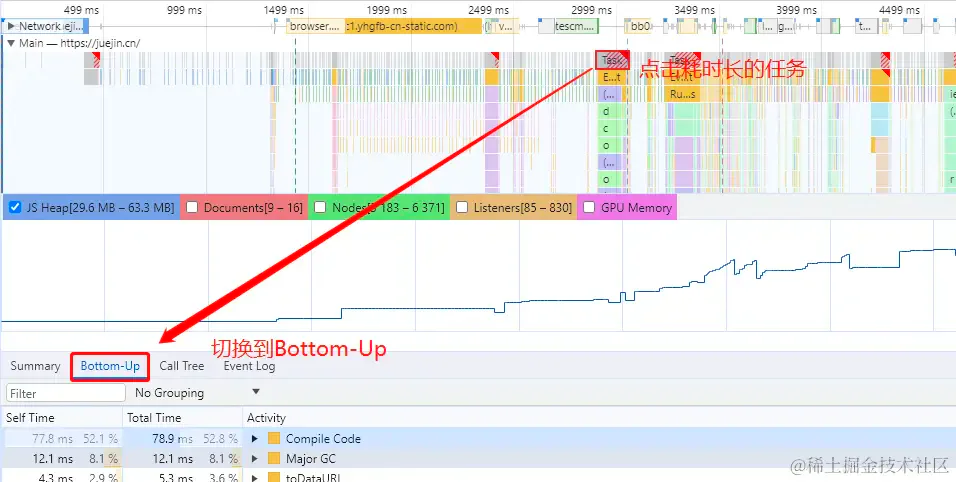
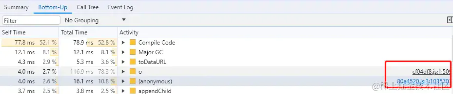
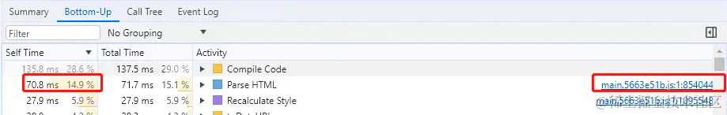
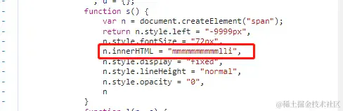
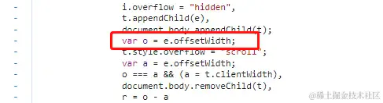
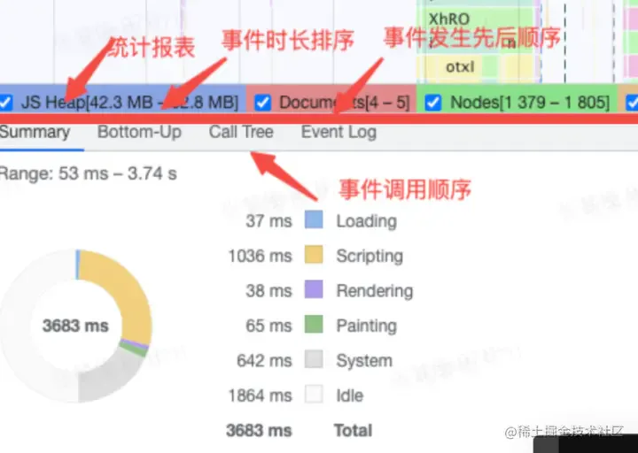

# 火焰图

记录了渲染进程中**主线程的执行记录，是我们分析具体函数耗时最常看的面板，**也是我们**常说的火焰图**

首先，面板中会有很多的 Task，如果是**耗时长的 Task（超过50ms），其右上角会标红，**这个时候，我们可以选中标红的 Task。选中后，可以**看到哪些事件耗时了多少**，**点击压缩后的文件名，可以看到具体的代码**

常见事件：

| Compile Code（黄色）           | **JavaScript代码正在被编译**  |
| -------------------------- | ---------------------- |
| Parse HTML **（蓝色**）        | Chrome执行**其HTML解析算法**  |
| Recalculate Style **（紫色）** | Chrome重**新计算了元素样式**    |
| Layout **（紫色）**            | **页面布局已被执行**           |
| **Paint（绿色）**              | **合成的图层被绘制到显示画面的一个区域** |

不同颜色代表不同的事件类型，以下对常见的事件类型进行区分

- Parse HTML（蓝色）: chrome 进行HTML解析
- Event Script（橙色）: Javascript事件（例如 mousedown）
- Layout（粉色）: 样式计算和布局，即重排
- Recalculate style（粉色）: 样式计算和布局，即重排
- Paint（绿色）: 合成的图层被绘制到显示画面的一个区域
- Composite（绿色）: Chrome的渲染引擎合成了图像层

简单示例：

（1）在一个长任务Task中，**Parse HTML占据了较大的比**重，点击源文件，定位到的内容如下所示：

（2）**Recalculate Style也占据了较大的比重**，点击源文件，定位到的内容如下所示：

**读取offsetWidth属性会导致浏览器强制进行回流操作**。回流**操作会重新计算页面的布局，导致重新计算样式的时间变长**

在火焰图中选择Task时，统计区域显示与事件相关的其他信息 &#x20;

- Summary：统计报表，展示各个事件阶段耗费的时间。 &#x20;
- Bottom-Up: 事件时长排序，可以看到各个事件消耗事件的排序。（self-time: 事件本身耗时。 total-time: 包含子事件，从开始到结束的耗时。） &#x20;
- Call-Tree: 调用栈，在Main选中一个事件，**可以看到整个事件的调用栈（从最顶层到最底层，而不是只有当前事件**） &#x20;
- Event Log: 事件日志。（多了一个start time, 指事件在多少毫秒开始触发。右边有事件描述信息）

Sumarry 统计图的颜色表示：

- Loading: **网络通信和HTML解析**
- Scripting : **JavaScript执行**
- Rendering : **样式计算和布局，即重排**
- Painting: **重绘**
- System **: 其它事件花费的时间**
- Idle: 空闲时间

**识别问题：红色三角号**
