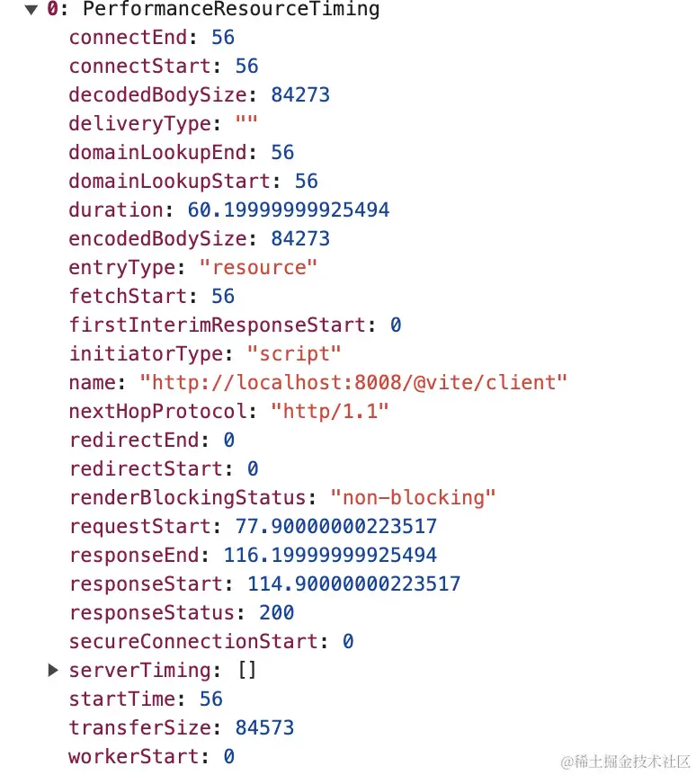
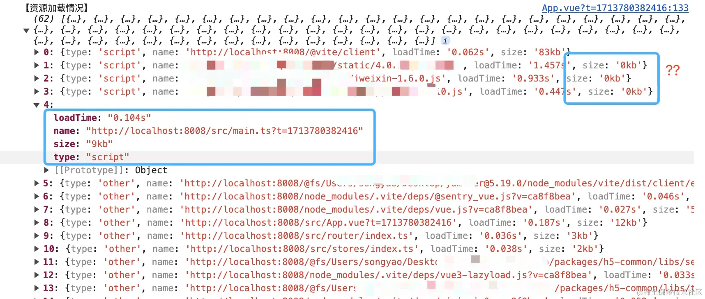
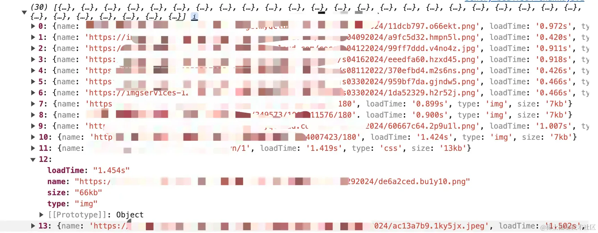

# 监测网页静态资源大小

## 目录

- [前言](#前言)
- [Performance](#Performance)
  - [getEntries](#getEntries)
  - [getEntriesByName](#getEntriesByName)
  - [getEntriesByType](#getEntriesByType)
- [尝试获取静态资源数据](#尝试获取静态资源数据)
- [监听资源加载](#监听资源加载)
  - [PerformanceObserver](#PerformanceObserver)
  - [用法](#用法)
  - [尝试获取页面图片加载信息](#尝试获取页面图片加载信息)
  - [通知](#通知)

## 前言

作为前端人员肯定经常遇到这样的场景：需求刚上线，产品拿着手机来找你，为什么页面打开这么慢呀，心想自己开发的时候也有注意性能问题呀，不可能会这么夸张。那没办法只能排查下是哪一块影响了页面的整体性能，打开浏览器控制台一看，页面上的这些配图每张都非常大，心想这些配图都这么大，页面怎么快，那么我们有没有办法监测页面上的这些静态资源大小，从而避免这种情况的发生。

## Performance

**`Performance`** 接口可以获取到当前页面中与性能相关的信息。

该对象提供许多属性及方法可以用来测量页面性能，这里介绍几个用来获取`PerformanceEntry`的方法：

### getEntries

> 该方法获取**一组当前页面已经加载的资源PerformanceEntry**对象。接收一个可选的参数`options`进行过滤，`options`支持的属性有`name`，`entryType`，`initiatorType`。

```javascript 
const entries = window.performance.getEntries();

```


### getEntriesByName

> 该方法返回一个**给定名称和 name 和 type 属性的**`PerformanceEntry`对象数组，`name`的取值对应到资源数据中的`name`字段，`type`取值对应到资源数据中的`entryType`字段。

```javascript 
const entries = window.performance.getEntriesByName(name, type);

```


### getEntriesByType

> 该方法返回**当前存在于给定\_类型\_的性能时间线中的对象**`PerformanceEntry`对象数组。`type`取值对应到资源数据中的`entryType`字段。

```javascript 
const entries = window.performance.getEntriesByType(type);

```


## 尝试获取静态资源数据

使用`getEntriesByType`获取指定类型的性能数据，**performance entryType**中有一个值为`resource`，用来获取文档中资源的计时信息。该类型包括有：`script`、`link`、`img`、`css`、`xmlhttprequest`、`beacon`、`fetch`、`other`等。

```javascript 
const resource = performance.getEntriesByType('resource')
console.log('resource', resource)

```


这样可以获取到非常多关于资源加载的数据：



为了方便查看，我们来稍微处理下数据

```javascript 
const resourceList = []
const resource = performance.getEntriesByType('resource')
console.log('resource', resource)
resource.forEach((item) => {
  resourceList.push({
    type: item.initiatorType, // 资源类型
    name: item.name, // 资源名称
    loadTime: `${(item.duration / 1000).toFixed(3)}s`, // 资源加载时间
    size: `${(item.transferSize / 1024).toFixed(0)}kb`, // 资源大小
  })
})

```




这样对于每个资源的类型、名称、加载时长以及大小，都非常清晰

但是有些资源的大小为什么会是0呢？以及还有很多页面上的资源貌似没有统计到，这是为啥呢？🤔

**这是因为页面上的资源****请求并不是一次性加载完****的，比如一些****资源的懒加载，这里就有可能会统计不到****，或者资源大小统计会有问题，所以我们需要监听资源的动态加载**

## 监听资源加载

以上介绍的3个API都无法做到对**资源动态加载的监听**，这里就需要用到`PerformanceObserver`来处理动态加载的资源了

### PerformanceObserver

> `PerformanceObserver` 主要用于监测性能度量事件，在浏览器的性能时间轴记录新的 performanceEntry 时会被通知。
> 通过使用 `PerformanceObserver()` 构造函数我们可以创建并返回一个新的 `PerformanceObserver` 对象，从而进行性能的监测。

### 用法

`PerformanceObserver` 与其它几个 `Observer` 类似，使用前需要先进行实例化，然后使用 `observe` 监听相应的事件

```javascript 
function perf_observer(list, observer) {
  // ...
}
var observer = new PerformanceObserver(perf_observer);
observer.observe({ entryTypes: ["resource"] });


```


它主要有以下实例方法：

- observe：指定监测的 `entry `\*\*`types`\*\*的集合。当 `performance entry` 被记录并且是指定的 `entryTypes` 之一的时候，性能观察者对象的回调函数会被调用。
- disconnect：性能监测回调停止接收PerformanceEntry。
- takeRecords：返回当前存储在性能观察器的 `performance entry`列表，并将其清空。

### 尝试获取页面图片加载信息

```javascript 
new PerformanceObserver((list) => {
  list
    .getEntries()
    .filter(
    (entry) =>
    entry.initiatorType === 'img' || entry.initiatorType === 'css',
  )
    .forEach((entry) => {
    resourceList.push({
      name: entry.name, // 资源名称
      loadTime: `${(entry.duration / 1000).toFixed(3)}s`, // 资源加载时间
      type: entry.initiatorType, // 资源类型
      size: `${(entry.transferSize / 1024).toFixed(0)}kb`, // 资源大小
    })
    console.log('--', resourceList)
  })
}).observe({ entryTypes: ['resource'] })

```


**这里需要注意的是，获取类型除了**\*\*`img`****还得加上****`css`****，因为CSS中可能会有通过****`url()`\*\***加载的背景图。**



这样，页面上的图片大小以及加载时长一目了然了

### 通知

我们自己是知道问题了，但是还要将这些信息推送给产品及运营，这个可以通过企业微信提供的API来进行操作，不满足条件的资源将进行推送通知：

```javascript 
setTimeout(() => {
  axios.get('http://127.0.0.1:3000/jjapi/user/pushMessage', {
    params: {
      msgtype: 'markdown',
      markdown: {
        content: `
          <font color="warning">H5项目资源加载异常，请注意查看</font>
          类型：<font color="comment">图片资源大小超出限制</font>
          异常数量：<font color="comment">${resourceList.length}例</font> 
          异常列表：<font color="comment">${resourceList.map(
            (item) => item.name,
          )}</font>`,
      },
    },
  })
}, 8000)

```


通知如下：


这里为了避免跨域，使用`nest`自己包了一层，这样就能够及时发现线上配置资源是否有问题，并且这个脚本也不需要所有用户都执行，因为大家的资源都是一样的，只需要配置特定白名单（比如开发、测试、产品），在页面上线后，在进行线上回归的同时执行该脚本去监测上线配置资源是否都合理...
