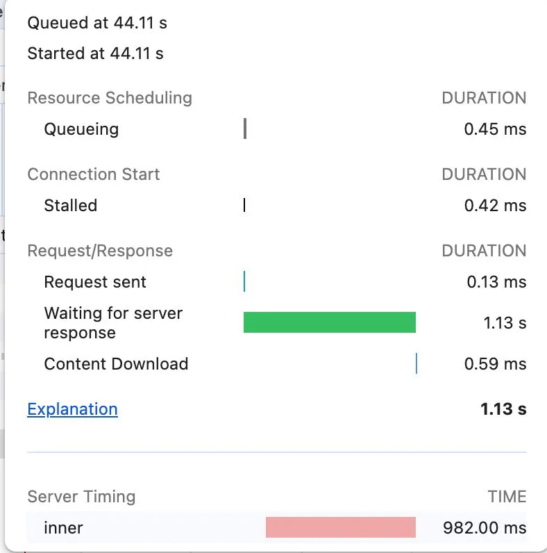
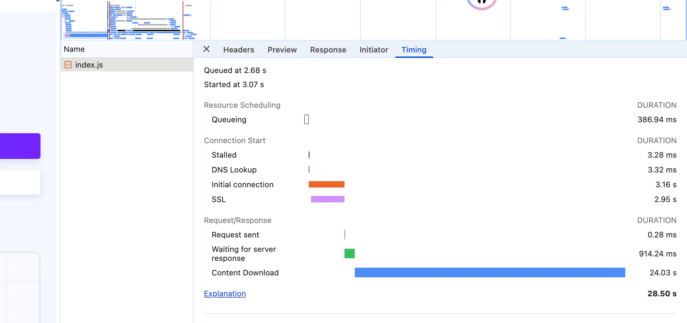

# Waterfall 分析​

## 目录

- [关键性能指标分析](#关键性能指标分析)
  - [1. 请求时间线](#1-请求时间线)
  - [2. 各阶段耗时分析](#2-各阶段耗时分析)
  - [3. 服务器端详细分析](#3-服务器端详细分析)
- [字段说明](#字段说明)
  - [​​Request sent](#Request-sent)
  - [详细解释](#详细解释)
  - [如何判断请求何时到达服务器？](#如何判断请求何时到达服务器)
- [分析](#分析)
  - [1. 第一步：用浏览器 DevTools 定位核心耗时阶段](#1-第一步用浏览器-DevTools-定位核心耗时阶段)
  - [2. 第二步：针对性分析各阶段异常的原因](#2-第二步针对性分析各阶段异常的原因)
    - [（1）Queueing/Stalled 异常（并发加载问题）](#1QueueingStalled-异常并发加载问题)
    - [（2）DNS Lookup/Initial Connection 异常](#2DNS-LookupInitial-Connection-异常)
    - [（3）Waiting (TTFB) 异常（服务器端问题）](#3Waiting-TTFB-异常服务器端问题)
    - [（4）Content Download 异常（下载速率问题）](#4Content-Download-异常下载速率问题)
    - [（5）JS 文件本身的问题（加载后解析 / 执行耗时）](#5JS-文件本身的问题加载后解析--执行耗时)
  - [3. 第三步：辅助工具（进阶分析）](#3-第三步辅助工具进阶分析)

## **关键性能指标分析**

### **1. 请求时间线**

- **Queued at 44.11s**：请求进入队列的时间
- **Started at 44.11s**：实际开始处理的时间
- **队列延迟几乎为0**，说明没有排队等待

### **2. 各阶段耗时分析**

**🚀 网络连接阶段（正常）**

- **Resource Scheduling**：0.45ms - 资源调度时间
- **Stalled**：0.42ms - TCP连接等待时间
- **Request sent**：0.13ms - 请求发送时间
- **这些阶段都很短，网络连接良好**

**⚠️ 问题所在 - 服务器响应慢**

- **Waiting for server response**：**1.13秒** ⏱️
- 这是TTFB（首字节时间），占总耗时的大部分
- 绿色长条直观显示这个阶段耗时过长

**📥 内容下载（正常）**

- **Content Download**：0.59ms - 数据下载很快

### **3. 服务器端详细分析**

- **Server Timing → inner**：**982ms** 🔴
- 这证实了服务器内部处理就花了近1秒
- 红色长条突出显示这是性能瓶颈

# 字段说明

### ​**​`Request sent`**

不是的。**`Request sent`（请求发送时间）** 并不是指请求到达服务器的时间，而是指 **浏览器从开始发送请求到完成发送的时间**。

### **详细解释**

在 Chrome DevTools 的 **Network** 面板中，`Request sent`表示：

- **浏览器将 HTTP 请求数据（如请求头、请求体）从本地发送到服务器的时间**。
- 这个阶段 **不包括网络传输时间**，只是本地发送的时间。
- 通常这个时间很短（几毫秒），如果很长，可能是客户端网络卡顿或请求体过大（如上传大文件）。

### **如何判断请求何时到达服务器？**

`Request sent`**之后**，服务器才会开始处理请求。要判断请求到达服务器的时间，可以关注：

1. **`Time to First Byte (TTFB)`**（首字节时间）：
   - 从请求发送完成到收到服务器第一个响应字节的时间。
   - **TTFB = 网络传输时间 + 服务器处理时间。**
   - 如果 TTFB 很高，可能是网络延迟或服务器处理慢。
2. **`Waiting for server response`**（等待服务器响应）：
   - 在 Chrome DevTools 的 **Waterfall** 图中，这个阶段代表 **从请求发送完成到服务器返回第一个字节的时间**。
   - 它 **包含网络往返时间（RTT）和服务器处理时间**。

# 分析

#### 1. 第一步：用浏览器 DevTools 定位核心耗时阶段

这是最直接的工具，几乎能定位 80% 的问题：

- 打开浏览器（Chrome/Firefox），按 F12 打开开发者工具 → 切换到「Network」面板；
- 勾选「Disable cache」（禁用缓存），刷新页面；
- 在筛选栏选择「JS」，找到 index.js 文件，查看其耗时分布：核心关注「Timing」列的细分阶段（以 Chrome 为例）：

| 阶段                 | 含义                                          | 异常表现                   |
| ------------------ | ------------------------------------------- | ---------------------- |
| Queueing           | 排队等待（浏览器并发限制、资源优先级等）                        | 耗时 > 1 秒               |
| Stalled            | 资源请求被阻塞（如 TCP 握手未完成、并发连接数耗尽）                | 耗时 > 5 秒               |
| DNS Lookup         | DNS 解析                                      | 耗时 > 1 秒（通常 < 100ms）   |
| Initial Connection | TCP 三次握手 + TLS 握手（HTTPS）                    | 耗时 > 3 秒（通常 < 500ms）   |
| Request Sent       | 请求发送时间                                      | 耗时极短（<10ms）            |
| Waiting (TTFB)     | 发送请求后等待服务器响应的时间（核心！TTFB=Time To First Byte） | 耗时 > 5 秒（正常 < 1 秒）     |
| Content Download   | 响应内容下载时间                                    | 1600KB 耗时 > 10 秒（速率异常） |

#### 2. 第二步：针对性分析各阶段异常的原因

##### （1）Queueing/Stalled 异常（并发加载问题）

浏览器对同一域名的并发请求数有限制（**Chrome 默认 6 个**），如果 index.js 排队等待其他资源加载完成，会导致 Stalled 时间长：

- 验证：看 Network 面板中 index.js **的「Initiator」（发起者）和「Priority」（优先级），是否有大量同域名资源先加载；**
- 解决：✅ 域名分片：把静态资源（JS/CSS/ 图片）部署到不同子域名（如[static1.xxx.com](https://static1.xxx.com/ "static1.xxx.com")、[static2.xxx.com](https://static2.xxx.com/ "static2.xxx.com")），**突破并发限制**；✅ 资源优先级：通过`<link rel="preload" href="index.js" as="script">`**提升 index.js 的加载优先级，避免排队。**

##### （2）DNS Lookup/Initial Connection 异常

- DNS 解析慢：可能是 DNS 服务器响应慢，或本地 DNS 缓存失效；验证：**用**\*\*`nslookup 你的域名`****或****`dig 你的域名`测试\*\*解析耗时；解决：配置 DNS 缓存、使用 CDN 的 DNS 解析。
- TCP/TLS 握手慢：服务器网络差、TLS 证书配置复杂（如多证书链）；验证：用`curl -w "%{time_connect}\n" -o /dev/null 你的index.js地址`测试连接耗时；解决：优化 TLS 配置（如启用 TLS 1.3）、使用 CDN 加速。

##### （3）Waiting (TTFB) 异常（服务器端问题）

TTFB 是从发送请求到收到第一个字节的时间，长 TTFB 是 30 秒耗时的**最常见原因**：

- 原因：服务器处理请求慢（如后端接口阻塞、JS 文件动态生成）、服务器网络拥塞、CDN 缓存未命中；
- 验证：✅ 直接访问 index.js 的 URL（排除页面其他逻辑影响），看 TTFB 是否仍长；✅ 用`curl -w "%{time_starttransfer}\n" -o /dev/null 你的index.js地址`测试 TTFB；
- 解决：✅ 静态资源 CDN 缓存：将 index.js 部署到 CDN，确保缓存命中；✅ 服务器优化：减少动态生成 JS 的逻辑，静态化 index.js；✅ 升级服务器带宽 / 配置：解决服务器响应慢问题。

##### （4）Content Download 异常（下载速率问题）

如果下载阶段耗时长，说明网络传输速率极低：

- 原因：服务器出口带宽不足、网络链路丢包、JS 文件未压缩；
- 验证：计算下载速率 = 文件大小 / 下载时间（1600KB/30 秒≈53KB/s，远低于正常速率）；
- 解决：✅ 开启 Gzip/Brotli 压缩：1600KB 的 JS 经压缩后通常能降到 400KB 左右，大幅减少下载时间；✅ 检查服务器带宽：确认服务器没有被限流 / 限速；✅ CDN 加速：利用 CDN 的边缘节点就近传输，提升下载速率。

##### （5）JS 文件本身的问题（加载后解析 / 执行耗时）

注意：你提到的 “加载 30 秒” 如果包含「解析 / 执行」阶段（而非仅下载），DevTools 的「Performance」面板能看到：

- 打开 Performance 面板 → 点击录制 → 刷新页面 → 停止录制；
- 看「Main」线程中是否有长时间的「Parse Script」（解析 JS）或「Evaluate Script」（执行 JS）；
- 原因：1600KB 的 JS 未拆分（大文件解析执行慢）、包含大量同步阻塞代码；
- 解决：✅ 代码拆分（Code Splitting）：用 Webpack/Vite 将 index.js 拆分为多个 chunk，按需加载；✅ 懒加载：非首屏必要的 JS 逻辑延迟加载；✅ 压缩混淆：用 Terser 压缩 JS（去除注释、空格、重命名变量），减少文件体积和解析时间。

### 3. 第三步：辅助工具（进阶分析）

如果 DevTools 定位不清晰，可借助以下工具：

- 网络层面：`ping 你的服务器IP`（测试丢包率）、`traceroute 你的服务器IP`（跟踪网络链路）；
- 性能监控：Lighthouse（Chrome 内置）→ 生成性能报告，直接指出 JS 加载的问题；
- 服务器层面：查看 Nginx/Apache 的访问日志，确认 index.js 的请求是否有超时、限流。

| 字段名称                        | 作用说明                        | 该案例耗时    | 状态判断           |
| --------------------------- | --------------------------- | -------- | -------------- |
| Queued                      | 资源等待浏览器分配请求资源的排队时间          | 386.94ms | 正常             |
| Stalled                     | 请求发送前的阻塞时间（如连接未就绪）          | 3.28ms   | 正常             |
| DNS Lookup                  | 域名解析为 IP 地址的时间              | 3.32ms   | 正常             |
| Initial connection          | TCP 三次握手建立连接的时间             | 3.16s    | 偏高（正常 < 500ms） |
| SSL                         | HTTPS 的 TLS 加密握手时间          | 2.95s    | 偏高（正常 < 1s）    |
| Request sent                | 请求数据发送到服务器的时间               | 0.28ms   | 正常             |
| Waiting for server response | 发送请求后，等待服务器返回第一个字节的时间（TTFB） | 914.24ms | 略高（正常 < 1s）    |
| Content Download            | 服务器响应内容（JS 文件）的下载时间         | 24.03s   | 严重异常           |
| 总耗时（Explanation）            | 资源从排队到下载完成的总时间              | 28.50s   | 严重超时           |
