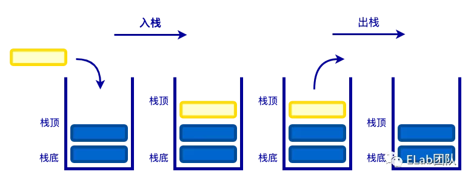

# 栈&#x20;

## 目录

- [栈 🎯 ](#栈--)
  - [定义 ](#定义-)
- [实现 ](#实现-)
- [应用 ](#应用-)
  - [判断括号是否匹配](#判断括号是否匹配)

## 栈 🎯&#x20;

### 定义&#x20;

栈又称堆叠,是一种特殊的线性表，**仅能在线性表的一端操作，****栈顶允许操作，栈底不允许操作****。**

栈的特点是：\*\*先进后出，**或者说是**后进先出（\*\*LIFO, Last In First Out），从栈顶放入元素的操作叫入栈，取出元素叫出栈；&#x20;




**适用场景**栈的结构就像一个集装箱，**越先放进去的东西越晚才能拿出来**，所以，栈常应用于实现**递归功能方面的场景**，例如斐波那契数列、**反转列表顺序**、**撤销一个或一系列**操作

## 实现&#x20;

               我们可以使用 JS 来模拟栈的功能。从数据存储的方式来看，可以使用**数组存储数据**，也可以使用链**表存储数据**。因为数组是最简单的方式，所以这里是用数组的方式来实现栈。&#x20;

栈的操作包括**入栈、出栈、清空、获取栈顶元素、获取栈**的大小等。&#x20;

```typescript 
class Stack {
    constructor() {
        // 存储数据
        this.items = [];
    }
    push(item) {
        // 入栈
        this.items.push(item);
    }
    pop() {
        // 出栈
        return this.items.pop();
    }
    top() {
        // 获取栈顶元素
        return this.items[this.items.length - 1];
    }
    clear() {
        // 清空栈
        this.items = [];
    }
    size() {
        // 获取栈的大小
        return this.items.length;
    }
    isEmpty() {
        // 判断栈是否为空
        return this.items.length === 0;
    }
}

```


## 应用&#x20;

### 判断括号是否匹配

方法一思路分析：&#x20;

- 首先从头到尾遍历整个字符串；
- 当遇到字符"("则入栈，遇到字符")"则出栈；
- **出栈时，如果栈已经为空，则返回 false；**
- 当字符串遍历完毕以后，判断栈是否为空。

方法二思路分析：&#x20;

- 声明变量 num 为 0，并从头到尾遍历整个字符串；
- 当遇到字符"("则 num 加 1，遇到字符")"num 减 1；
- 在遍历的过程中，当 num 减 1 时，**num 的值已经为 0 则返回 false；**
- 当字符串遍历完毕以后，判断 num 是否为 0。

```typescript 
// 方式一：栈
function isPairing(str = '') {
    const stack = new Stack();
    for(let i of str) {
        if (i === '(') {
            stack.push(i);
        } else if (i === ')') {
            if (stack.isEmpty()) {
                return false;
            } else {
                stack.pop();
            }
        }
    }
    return stack.size() === 0;
}


// 方式二：计数
function isPairing(str = '') {
    let num = 0;
    for(let i of str) {
        if (i === '(') {
            num++;
        } else if (i === ')') {
            if (num === 0) {
                return false;
            } else {
                num--;
            }
        }
    }
    return num === 0;
}

```
