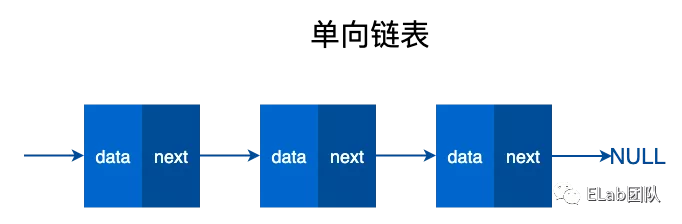
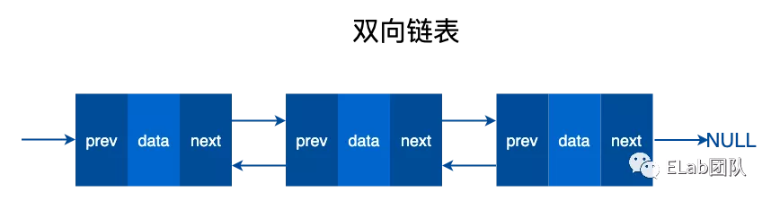
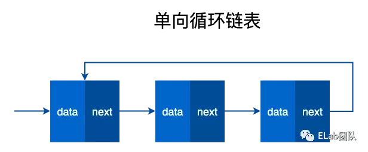
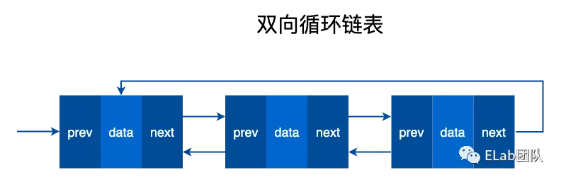

# 链表

## 目录

- [链表](#链表)
  - [链表和数组的区别](#链表和数组的区别)
  - [分类 ](#分类-)
    - [单向链表](#单向链表)
    - [双向链表](#双向链表)
    - [单向循环链表](#单向循环链表)
    - [双向循环链表](#双向循环链表)
- [实现](#实现)
  - [链表队列](#链表队列)

# 链表

- 由若干个结点链结成一个链表，称之为链式存储结构。&#x20;
- 在计算机科学中, 一个 **链表** 是数据元素的**线性集合,** 元素的线性顺序**不是由它们在内存中的物理位置给**出的。 相反, **每个元素指向下一个元素**。它是由一组节点组成的数据结构,**这些节点一起,表示序列**。
- 在最简单的形式下，每个节点由**数据和到序列中下一个节点的引用(**换句话说，链接)组成。这种结构允许在迭代期间有效地从序列中的**任何位置插入或删除元素**。
- 更复杂的变体添加额外的链接，允许有效地插入或删除任意元素引用。链表的一个**缺点**是\*\*访问时间是线性的(而且难以管道化)。\*\***更快的访问，如随机访问，是不可行的**。与链表相比，**数组具有更好的缓存位置**。

## **链表和数组的区别**

         链表和数组都可以存储多个数据，那么链表和数组有什么区别呢？&#x20;

- 数组需要一块**连续的内存空间来存储数据**，对**内存的要求比较高**。而链表却相反，它并不需要一块连续的内存空间。链表是**通过指针将一组零散的内存块串联在一起**。&#x20;
- 相比数组，链表是一种稍微复杂一点的数据结构。两者没有好坏之分，各有各的优缺点。&#x20;
- 由于内存存储特性，数组可以**实现快速的查找元素**，但是在**插入和删除时就需要移动大量的元素**。原因就在于相邻元素在内存中的位置也是紧挨着的，中间没有空隙，因此就无法快速添加元素。而当删除后，内存空间中就会留出空隙，自然需要弥补。&#x20;

## 分类&#x20;

### 单向链表



### 双向链表



### 单向循环链表



### 双向循环链表



# 实现

## 链表队列

```javascript 
class Node {
    value;
    next;
    prev;
    instance;
    constructor(value) {
        this.value = value
    }
}
class  Queue {
    #head;
    #tail;
    #size;
    constructor() {
        this.clear()
    }
    enqueue(value){
        const node = new Node(value)
        node.prev= this.#tail
        node.instance = this
        if(this.#head){
            this.#tail.next = node;
            this.#tail = node
        }else{
            this.#head = node
            this.#tail = node
        }
        this.#size ++
        return node
    }
    dequeue(){
        const current = this.#head
        if(!current){
            return
        }
        current.instance = undefined
        this.#head = this.#head.next
        this.#size --
        return current.value
    }
    clear(){
        this.#tail = undefined;
        this.#head = undefined;
        this.#size = 0;
    }
    get size(){
        return this.#size
    }
    *[Symbol.iterator](){
        let current = this.#head
        while (current){
            yield current.value
            current = current.next
        }
    }
}
```


[yocto-queue 链表队列](<./yocto-queue 链表队列/index.md> "yocto-queue 链表队列")

[如何反转单链表？](./如何反转单链表？/index.md "如何反转单链表？")

[yocto-queue 链表队列](<./yocto-queue 链表队列/index.md> "yocto-queue 链表队列")

[链表队列](./链表队列/index.md "链表队列")
