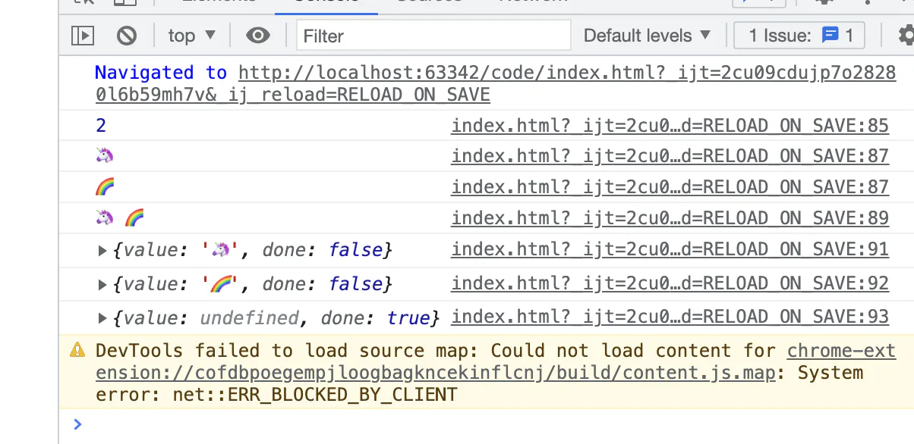

# yocto-queue 链表队列

## 目录

- [yocto-queue](#yocto-queue)
- [改为双向链表](#改为双向链表)
  - [使用](#使用)

[ GitHub - sindresorhus/yocto-queue: Tiny queue data structure Tiny queue data structure. Contribute to sindresorhus/yocto-queue development by creating an account on GitHub. https://github.com/sindresorhus/yocto-queue](https://github.com/sindresorhus/yocto-queue " GitHub - sindresorhus/yocto-queue: Tiny queue data structure Tiny queue data structure. Contribute to sindresorhus/yocto-queue development by creating an account on GitHub. https://github.com/sindresorhus/yocto-queue")

&#x20;

链表: 数组需要一块连续的内存空间来存储数据，对内存的要求比较高。而链表却相反，它并不需要**一块连续的内存空间**。链表是**通过指针**将一组**零散的内存块串联**在一起。&#x20;

队列: 队列也是一种特殊的线性表，它的特点是，只能在表的一端进行删除操作，而在表的另一点进行插入操作。先进先出

# yocto-queue

源码：

```typescript 
class Node {
        value;
        next;

        constructor(value) {
            this.value = value;
        }
    }

    class Queue {
        #head;
        #tail;
        #size;

        constructor() {
            this.clear();
        }

        enqueue(value) {
            const node = new Node(value);

            if (this.#head) {
                this.#tail.next = node;
                this.#tail = node;
            } else {
                this.#head = node;
                this.#tail = node;
            }

            this.#size++;
        }

        dequeue() {
            const current = this.#head;
            if (!current) {
                return;
            }

            this.#head = this.#head.next;
            this.#size--;
            return current.value;
        }

        clear() {
            this.#head = undefined;
            this.#tail = undefined;
            this.#size = 0;
        }

        get size() {
            return this.#size;
        }

        * [Symbol.iterator]() {
            let current = this.#head;

            while (current) {
                yield current.value;
                current = current.next;
            }
        }
    }
```


# 改为双向链表

```typescript 
class Node {
    next;
    last;
    value;
    instance;
    constructor(value) {
        this.value = value
    }
}
class Queue{
    #head;
    #tail;
    #size;
    constructor() {
        this.clear()
    }
    enqueue(value){
        const node = new Node(value)
        node.last = this.#tail
        node.instance = this;
        if(this.#head){
            this.#tail.next = node;
            this.#tail = node
        }else{
            this.#tail = node;
            this.#head = node;
        }
        this.#size ++ 
        return node
    }
    dequeue(){
        const current = this.#head
        if(!current){
            return
        }
        current.instance = undefined
        this.#head = current.next
        current.next = undefined
        this.#head.last = undefined
        this.#size --
        return current.value
    }
    clear(){
        this.#tail = undefined;
        this.#head = undefined;
        this.#size = 0 ;
    }
    get size(){
        return this.#size
    }
    *[Symbol.iterator](){
        let current = this.#head
        while (current){
            yield  current.value
            current = current.next
        }
    }
}

```


### 使用

```typescript 
const queue = new Queue();

    queue.enqueue('🦄');
    queue.enqueue('🌈');
    console.log(queue.size)
    for(let val of queue){
        console.log(val)
    }
    console.log(...queue)
    const map = queue[Symbol.iterator]()
    console.log(map.next())
    console.log(map.next())
    console.log(map.next())
```




[异步控制器](./异步控制器/index.md "异步控制器")
