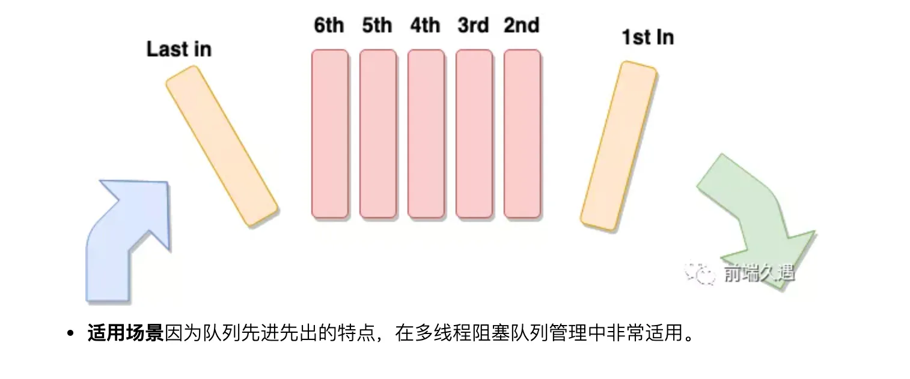
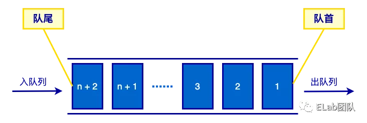
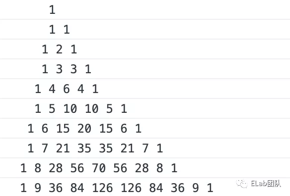

# 队列&#x20;

## 目录

- [队列 ✍ ](#队列--)
  - [定义 ](#定义-)
- [实现 ](#实现-)
- [应用 ](#应用-)
  - [约瑟夫环问题](#约瑟夫环问题)
  - [斐波那契数列](#斐波那契数列)
  - [打印杨辉三角](#打印杨辉三角)

## 队列 ✍&#x20;

### 定义&#x20;

队列也是一种**特殊的线性表**，它的特点是，只能在表的**一端进行删除操作**，而在表的**另一点进行插入操作**。

队列与栈一样，也是一种线性表，不同的是，队列可以**在一端添加元素，在另一端取出元素**，也就是：**先进先出**。从一端放入元素的操作称为入队，取出元素为出队&#x20;





生活中的例子：排队买东西。

## 实现&#x20;

我们也可以使用 JS 来模拟队列的功能。从数据存储的方式来看，可以使用**数组存储数据，也可以使用链表存储数**据。因为数组是最简单的方式，所以这里是用数组的方式来实现队列。&#x20;

队列的操作包括入队、出队、清空队列、获取队头元素、获取队列的长度等。&#x20;

```typescript 
class Queue {
  constructor() {
    // 存储数据
    this.items = [];
  }
  enqueue(item) {
    // 入队
    this.items.push(item);
  }
  dequeue() {
    // 出队
    return this.items.shift();
  }
  head() {
    // 获取队首的元素
    return this.items[0];
  }
  tail() {
    // 获取队尾的元素
    return this.items[this.items.length - 1];
  }
  clear() {
    // 清空队列
    this.items = [];
  }
  size() {
    // 获取队列的长度
    return this.items.length;
  }
  isEmpty() {
    // 判断队列是否为空
    return this.items.length === 0;
  }
}           
```


## 应用&#x20;

### 约瑟夫环问题

有一个数组存放了 100 个数据 0-99，要求每隔两个数删除一个数，到末尾时再循环至开头继续进行，求最后一个被删除的数字。&#x20;

**思路分析**

- 创建队列，将 0 到 99 的数字入队；
- 循环队列，依次出列队列中的数字，对当前出队的数字进行计数 index + 1；
- 判断当前出列的 index % 3 是否等于 0，如果不等于 0 则入队；
- 直到队列的长度为 1，退出循环，返回队列中的数字。

```typescript 
function ring(arr) {
    const queue = new Queue();
    arr.forEach(v => queue.enqueue(v));
    let index = 0;
    while(queue.size() > 1) {
        const item = queue.dequeue();
        if (++index % 3 !== 0) {
            queue.enqueue(item);
        }
    }
    return queue.head();
}
```


### 斐波那契数列

斐波那契数列（Fibonacci sequence），又称黄金分割数列，因数学家莱昂纳多·斐波那契（Leonardoda Fibonacci）以兔子繁殖为例子而引入，故又称为“兔子数列”，指的是这样一个数列：0、1、1、2、3、5、8、13、21、34、……在数学上，斐波那契数列以如下被以递推的方法定义：*F*(0)=0，*F*(1)=1, *F*(n)=*F*(n - 1)+*F*(n - 2)（*n*≥ 2，*n*∈ N \*）

```javascript 
function fiboSequence(num) {
    if (num < 2) return num;
    const queue = [];
    queue.push(0);
    queue.push(1);
    for(let i = 2; i < num; i++) {
        const len = queue.length;
        queue.push(queue[len - 2] + queue[len  - 1]);
    }
    return queue;
}

```


### 打印杨辉三角



思路分析：&#x20;

- 通过观察发现，三角中的每一行数据**都依赖于上一行的数据；**
- 我们首先创建队列 queue，用**于存储每一行的数据，供下一行数据使用；**
- 然后初始化第一行的数据 1 入队，这里需要两个 for 循环嵌套，外层的 for 循环决定最终打印的总行数，内层的 for 循环生成每行的数据；
- 在生成当前行的数据时，将**队列中的数据源依次出队，然后将新生成的数据入队**；并记录当**前出队的数据，供生成新数据使用**。
