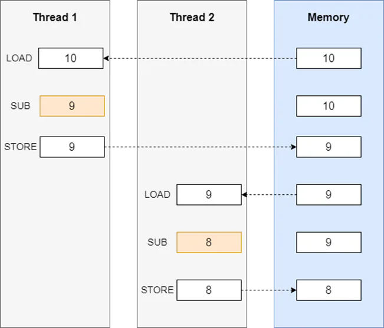
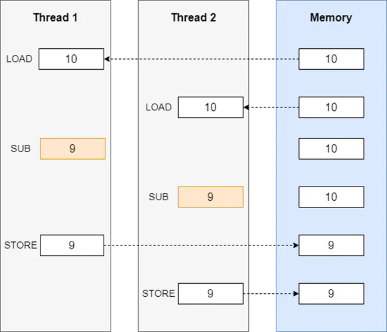
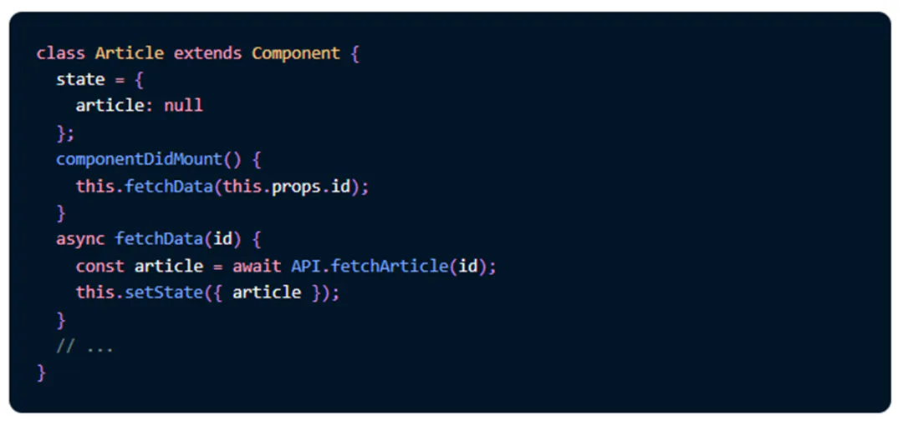
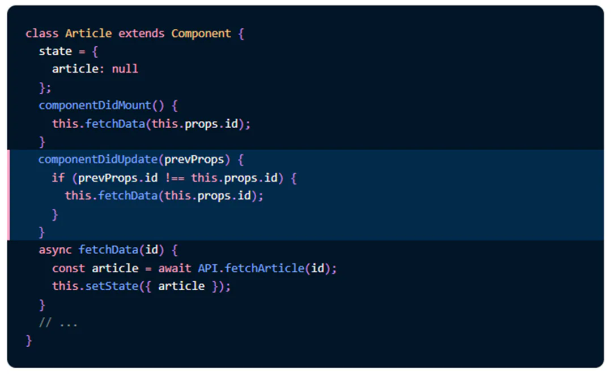
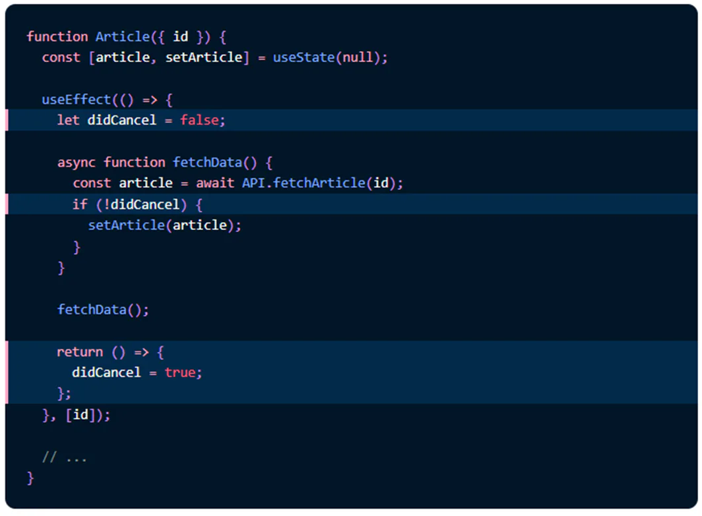

初识

## 目录

- [一、问题描述](#一问题描述)
- [二、常见场景](#二常见场景)
- [三、解决方案](#三解决方案)
  - [借助 useEffect](#借助-useEffect)

&#x20;      `race conditions `常被翻译为 “**竞争条件**”/“**竞态问题**”/“**竞争冒险**” 等，在多线程、分布式场景中较为常见。在前端日常开发工作中，请求也会遇到竞态的问题。本文就前**端网络请求竞态的问题**分析若干种解决方法，主要以 React 技术栈为背景。

# 一、问题描述

> &#x20;     A race condition or race hazard is the condition of an electronics, software, or other system where the system's substantive behavior is dependent on the sequence or timing of other uncontrollable events. It becomes a bug when one or more of the possible behaviors is undesirable. &#x20;
> &#x20;    Race conditions can occur especially in logic circuits, multithreaded, or distributed software programs. &#x20;
> —— Wikipedia
>
> \*\*       竞争条件**或者又叫竞争冒险问题，有些翻译也叫竞态条件，是指在电子 / 软件系统中出现的一种特定情况：该系统实质上的运行结果依赖于其他不可控事件的执行顺序或者时间。从软件开发的角度来讲，这就会让我们的**程序运行结果变得不可预测 \*\*，极易出现问题，而且通常是难复现的。（注：**不可控指不是由开发者控制，可能是操作系统或其它第三程序等**）

`race conditions `经常出现在逻辑电路、多线程或分布式软件程序中，比如文件系统、分布式网络（存在延迟情况下）、还有计算机安全等方面；产生这种现象的过程，从操作系统层面看是这样的：

&#x20;     我们知道，在操作系统中，操作系统会为每个线程分配单独的寄存器。如下图中所示，第一 / 二列分别表示线程 1/2 的操作过程，写着数字的小方块代表了该线程所用的寄存器。第三列表示内存中的一个存储单元，存放了经两个线程操作后的结果。

&#x20;          开始时，数据都是放在内存中的，通过 LOAD 指令，把数据加载到寄存器里，再执行相应的操作指令，这里 SUB 表示指令减。指令执行结束后，结果是存储在寄存器里的，这时候内存里的数值是没有改变的。最后再执行 STORE 指令后，寄存器中的数值被存储到内存中。（注：Load/Store 指令用于寄存器和内存间数据的传送）

&#x20;         但如果两个线程在没有任何约束的情况下，稍微改变读写的顺序，就会出现意想不到的错误。如下图所示，线程 2 会覆盖线程 1 的执行结果，这也就是两个线程抢占使用临界区资源而带来的数据不一致问题。

具体在生活中的例子，就比如火车站售票系统，同一时刻有两个人各买了一张车票，这时候余票的数量就会发生错误。

主要的预防手段有**信号量、锁、乐观 / 悲观并发控制**等，大部分可用于并发场景的语言也会内置加锁的能力。同时，也有一些工具是可以静态或动态分析是否存在 `race condition` 的，gcc 里就有这样的内存和线程检查调试工具。

总而言之，要阻止出现 `race condition` 的关键就是不能让**多个线程或者进程同时访问那块共享内存**，所有的解决方法都是围绕这个临界区来设计的。

# 二、常见场景

&#x20;            **对于前端来说，js 引擎执行 js 时只分了一个线程**，高并发和分布式的场景也不太常见。但在网络通信的时候，可能会出现` race condition`。比如下面这个例子，它是来源于 Redux 作者 Dan 的一篇介绍 useEffect 的文章，里面也有提及 `race condition` 及解决方案，代码片段如下：&#x20;

&#x20;          首先，这是一个经典的用 `react `**类组件**方式写的发请求的代码片段（因为这篇文章是在对比 react hooks 写法对于类组件写法的优势，所以用的类组件写法作为示例）。state 里面存了一个 article 变量，另外定义了一个 fetchData 的方法，里面做了异步的发送请求和 setState 两个操作，并在 componentDidMound 中调用这个 fetchData 方法。

&#x20;      细心的朋友们肯定已经发现了，这显然是有问题的。这段逻辑只会在第一次初始化完后发送一次请求，如果 id 有更新就没法处理了。于是，又有了下面这段也很经典的代码，在 componentDidUpdate 里面比较上一次和本次的 id 再决定是否需要发送请求更新 state 中的数据。这样就显得非常合理了。

&#x20;       然而，这段代码还是隐藏着 bug 的。因为网络请求过程是复杂的，响应时间并不确定。访问一个目的地址，受各种外部因素的影响，**先发出的请求不一定会先响应。但如果前端以先发请求先响应的规则来开发的话，可能会导致数据的错误使用**。比如现在已经发送了 id:10 的请求，但还没收到响应。切换到 id:20，又发了一次请求。这次 id:20 的请求先返回，之后 id:10 的请求结果才返回来。这样先发送而后收到的请求响应会把 state 里的值错误地覆盖掉。也就是说在等待 asnyc/await 异步返回的过程中，state 或者 props 是可以被改变的，就会产**生竞态问题**。

# 三、解决方案

&#x20;     解决的办法有很多种，最容易想到的是可以在类组件的基础上给**每次操作加一个 index 编号，**但如果处理不当的话可能造成**内存泄漏**，即组件销毁后还在 setState。以下介绍几种比较推荐的方案。

#### 借助 useEffect

&#x20;      比较推荐的第一种解决方法是，借助 useEffect 来实现。首先我们看一下 react hooks 的执行流程，可以发现**在每次 Update 阶段，都会先执行一次 cleanUp Effects，再执行 Effects 函数。** （**这个地方也是借助于闭包**）

所以借助这个效果，我们可以对数据做取舍。

&#x20;      仍然以开篇的代码片段为例，具体操作是定义一个**变量 didCancel**，在每次切换 id 获取新文章时，执行 `useEffect `返回的函数，`didCancel `设置为 `true`，`setArticle `的时候判断 `didCancel `如果为 `true`，就不更新了。

