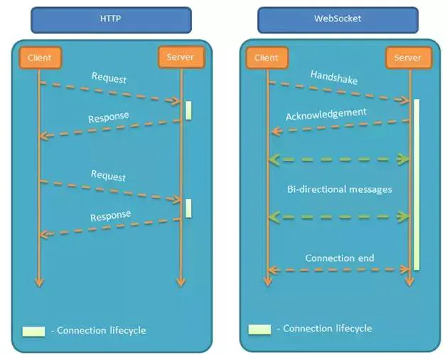

# 实时推送

## 目录

- [前言](#前言)
- [一、双向通信](#一双向通信)
  - [1.轮询（polling）](#1轮询polling)
  - [2.长轮询（long-polling）](#2长轮询long-polling)
  - [3.iframe流（streaming）](#3iframe流streaming)
- [二、WebSocket](#二WebSocket)
  - [1.什么是websocket](#1什么是websocket)
  - [2.HTTP的局限性](#2HTTP的局限性)
  - [3.WebSocket的特点](#3WebSocket的特点)
- [三、Web 实时推送技术的比较](#三Web-实时推送技术的比较)

## 前言

随着 Web 的发展，用户对于 Web 的实时推送要求也越来越高 ，比如，工业运行监控、Web 在线通讯、即时报价系统、在线游戏等，**都需要将后台发生的变化主动地、实时地传送到浏览器端，而不需要用户手动地刷新页面。** 本文对过去和现在流行的 Web 实时推送技术进行了比较与总结。

**本文完整的源代码请猛戳Github博客(**[**https://github.com/ljianshu/Blog**](https://github.com/ljianshu/Blog "https://github.com/ljianshu/Blog")**)，纸上得来终觉浅，建议大家动手敲敲代码。**

## 一、双向通信

HTTP 协议有一个缺陷：**通信只能由客户端发起**。举例来说，我们想了解今天的天气，只能是客户端向服务器发出请求，服务器返回查询结果。HTTP 协议做不到服务器主动向客户端推送信息。这种单向请求的特点，注定了如果服务器有连续的状态变化，客户端要获知就非常麻烦。**在WebSocket协议之前，有三种实现双向通信的方式：轮询（polling）、长轮询（long-polling）和iframe流（streaming）**。

### 1.轮询（polling）


轮询是客户端和服务器之间会一直进行连接，每隔一段时间就询问一次。其缺点也很明显：连接数会很多，一个接受，一个发送。而且**每次发送请求都会有Http的Header，会很耗流量，也会消耗CPU的利用率**。

- 优点：实现简单，无需做过多的更改
- 缺点：轮询的间隔过长，会导致用户不能及时接收到更新的数据；轮询的间隔过短，会导致查询请求过多，增加服务器端的负担

```javascript 
// 1.html
    <div id="clock"></div>
    <script>
        let clockDiv = document.getElementById('clock');
        setInterval(function(){
            let xhr = new XMLHttpRequest;
            xhr.open('GET','/clock',true);
            xhr.onreadystatechange = function(){
                if(xhr.readyState == 4 && xhr.status == 200){
                    console.log(xhr.responseText);
                    clockDiv.innerHTML = xhr.responseText;
                }
            }
            xhr.send();
        },1000);
    </script>
    
    
    //轮询 服务端

let express = require('express');
let app = express();
app.use(express.static(__dirname));
app.get('/clock',function(req,res){
  res.end(new Date().toLocaleString());
});
app.listen(8080);

```


启动本地服务，打开http\://localhost:8080/1.html,得到如下结果：


### 2.长轮询（long-polling）

- HTTP keep-alive 开启后虽然 TCP 可以复用，但是 Header 重复的问题并没有解决
- 同时 HTTP keep-alive 还有一个有效期，有效期结束后服务端会发侦查帧探查 TCP 是否有效

> 题外话：

> **HTTP keep-alive 的作用是，告知服务端持久化当前的** **TCP** **连接，不要立即断开，以便后续的 HTTP 请求复用它，也就是我们所说的「长连接」**

> HTTP 的 keep-alive 是为了让 TCP 活久一点，而 TCP 本身也有一个 keepalive（注意没有横杠哦）机制。这是 TCP 的一种检测连接状况的保活机制，keepalive 是 TCP 保活定时器：TCP 建立后，如果闲置没用，服务器不可能白等下去，闲置一段时间\[可设置]后，服务器就会尝试向客户端发送侦测包，来判断 TCP 连接状况，如果没有收到对方的回答（ACK包），就会过一会\[可设置]再侦测一次，如果多次\[可设置]都没回答，就会丢弃这个 TCP 连接


```javascript 
// 2.html 服务端代码同上
    <div id="clock"></div>
    <script>
    let clockDiv = document.getElementById('clock')
    function send() {
      let xhr = new XMLHttpRequest()
      xhr.open('GET', '/clock', true)
      xhr.timeout = 2000 // 超时时间，单位是毫秒
      xhr.onreadystatechange = function() {
        if (xhr.readyState == 4) {
          if (xhr.status == 200) {
            //如果返回成功了，则显示结果
            clockDiv.innerHTML = xhr.responseText
          }
          send() //不管成功还是失败都会发下一次请求
        }
      }
      xhr.ontimeout = function() {
        send()
      }
      xhr.send()
    }
    send()
    </script>
```


### 3.iframe流（streaming）


iframe流方式是在页面中插入一个隐藏的iframe，利用其src属性在服务器和客户端之间创建一条长连接，服务器向iframe传输数据（通常是HTML，内有负责插入信息的javascript），来实时更新页面。

- 优点：消息能够实时到达；浏览器兼容好
- 缺点：服务器维护一个长连接会增加开销；IE、chrome、Firefox会显示加载没有完成，图标会不停旋转。

```javascript 
// 3.html
    <body>
        <div id="clock"></div>
        <iframe src="/clock" style="display:none"></iframe>
    </body>
    
    
    //iframe流
let express = require('express')
let app = express()
app.use(express.static(__dirname))
app.get('/clock', function(req, res) {
  setInterval(function() {
    let date = new Date().toLocaleString()
    res.write(`
       <script type="text/javascript">
         parent.document.getElementById('clock').innerHTML = "${date}";//改变父窗口dom元素
       </script>
     `)
  }, 1000)
})
app.listen(8080)


```


启动本地服务，打开http\://localhost:8080/3.html,得到如下结果：


上述代码中，**客户端只请求一次，然而服务端却是源源不断向客户端发送数据，这样服务器维护一个长连接会增加开销。**

以上我们介绍了三种实时推送技术，然而各自的缺点很明显，使用起来并不理想，接下来我们着重介绍另一种技术--websocket,它是比较理想的双向通信技术。

## 二、WebSocket

### 1.什么是websocket

WebSocket是一种全新的协议，随着HTML5草案的不断完善，越来越多的现代浏览器开始全面支持WebSocket技术了，**它将TCP的Socket（套接字）应用在了webpage上，从而使通信双方建立起一个保持在活动状态连接通道。**

一旦Web服务器与客户端之间建立起WebSocket协议的通信连接，之后所有的通信都依靠这个专用协议进行。通信过程中可互相发送JSON、XML、HTML或图片等任意格式的数据。**由于是建立在HTTP基础上的协议，因此连接的发起方仍是客户端，而一旦确立WebSocket通信连接，不论服务器还是客户端，任意一方都可直接向对方发送报文**。

初次接触 WebSocket 的人，都会问同样的问题：我们已经有了 HTTP 协议，为什么还需要另一个协议？

### 2.HTTP的局限性

- HTTP是半双工协议，也就是说，在同一时刻数据只能单向流动，客户端向服务器发送请求(单向的)，然后服务器响应请求(单向的)。
- 服务器不能主动推送数据给浏览器。这就会导致一些高级功能难以实现，诸如聊天室场景就没法实现。

### 3.WebSocket的特点

- 支持双向通信，实时性更强
- 可以发送文本，也可以发送二进制数据
- 减少通信量：只要建立起WebSocket连接，就希望一直保持连接状态。和HTTP相比，**不但每次连接时的总开销减少，而且由于WebSocket的首部信息很小，通信量也相应减少了**



相对于传统的HTTP每次请求-应答都需要客户端与服务端建立连接的模式，WebSocket是类似Socket的TCP长连接的通讯模式，一旦WebSocket连接建立后，后续数据都以帧序列的形式传输。在客户端断开WebSocket连接或Server端断掉连接前，不需要客户端和服务端重新发起连接请求。**在****海量并发和客户端与服务器交互负载流量大的情况下，极大的节省了网络带宽资源的消耗****，有明显的性能优势，且客户端发送和接受消息是在同一个持久连接上发起，实时性优势明显**。

接下来我看下websocket如何实现客户端与服务端双向通信：

```javascript 
// websocket.html
    <div id="clock"></div>
    <script>
    let clockDiv = document.getElementById('clock'
    let socket = new WebSocket('ws://localhost:9999')
    //当连接成功之后就会执行回调函数
    socket.onopen = function() {
      console.log('客户端连接成功')
      //再向服务 器发送一个消息
      socket.send('hello') //客户端发的消息内容 为hello
    }
    //绑定事件是用加属性的方式
    socket.onmessage = function(event) {
      clockDiv.innerHTML = event.data
      console.log('收到服务器端的响应', event.data)
    }
    </script>
```


```javascript 
// websocket.js
let express = require('express')
let app = express()
app.use(express.static(__dirname))
//http服务器
app.listen(3000)
let WebSocketServer = require('ws').Server
//用ws模块启动一个websocket服务器,监听了9999端口
let wsServer = new WebSocketServer({ port: 9999 })
//监听客户端的连接请求 当客户端连接服务器的时候，就会触发connection事件
//socket代表一个客户端,不是所有客户端共享的，而是每个客户端都有一个socket
wsServer.on('connection', function(socket) {
  //每一个socket都有一个唯一的ID属性
  console.log(socket)
  console.log('客户端连接成功')
  //监听对方发过来的消息
  socket.on('message', function(message) {
    console.log('接收到客户端的消息', message)
    socket.send('服务器回应:' + message)
  })
})
```


启动本地服务，打开http\://localhost:3000/websocket.html,得到如下结果：


## 三、Web 实时推送技术的比较

| 方式              | 类型            | 技术实现                                                                 | 优点                               | 缺点                                                     | 适用场景                    |
| --------------- | ------------- | -------------------------------------------------------------------- | -------------------------------- | ------------------------------------------------------ | ----------------------- |
| 轮询Polling       | client→server | 客户端循环请求                                                              | 1、实现简单 2、 支持跨域                   | 1、浪费带宽和服务器资源 2、 一次请求信息大半是无用（完整http头信息） 3、有延迟 4、大部分无效请求 | 适于小型应用                  |
| 长轮询Long-Polling | client→server | 服务器hold住连接，一直到有数据或者超时才返回，减少重复请求次数                                    | 1、实现简单 2、不会频繁发请求 3、节省流量 4、延迟低    | 1、服务器hold住连接，会消耗资源 2、一次请求信息大半是无用                       | WebQQ、Hi网页版、Facebook IM |
| 长连接iframe       | client→server | 在页面里嵌入一个隐蔵iframe，将这个 iframe 的 src 属性设为对一个长连接的请求，服务器端就能源源不断地往客户端输入数据。 | 1、数据实时送达 2、不发无用请求，一次链接，多次“推送”    | 1、服务器增加开销 2、无法准确知道连接状态 3、IE、chrome等一直会处于loading状态      | Gmail聊天                 |
| WebSocket       | server⇌client | new WebSocket()                                                      | 1、支持双向通信，实时性更强 2、可发送二进制文件3、减少通信量 | 1、浏览器支持程度不一致 2、不支持断开重连                                 | 网络游戏、银行交互和支付            |

综上所述：Websocket协议不仅解决了HTTP协议中服务端的被动性，即通信只能由客户端发起，也解决了数据同步有延迟的问题，同时还带来了明显的性能优势，所以websocket 是Web 实时推送技术的比较理想的方案，但如果要兼容低版本浏览器，可以考虑用轮询来实现。
